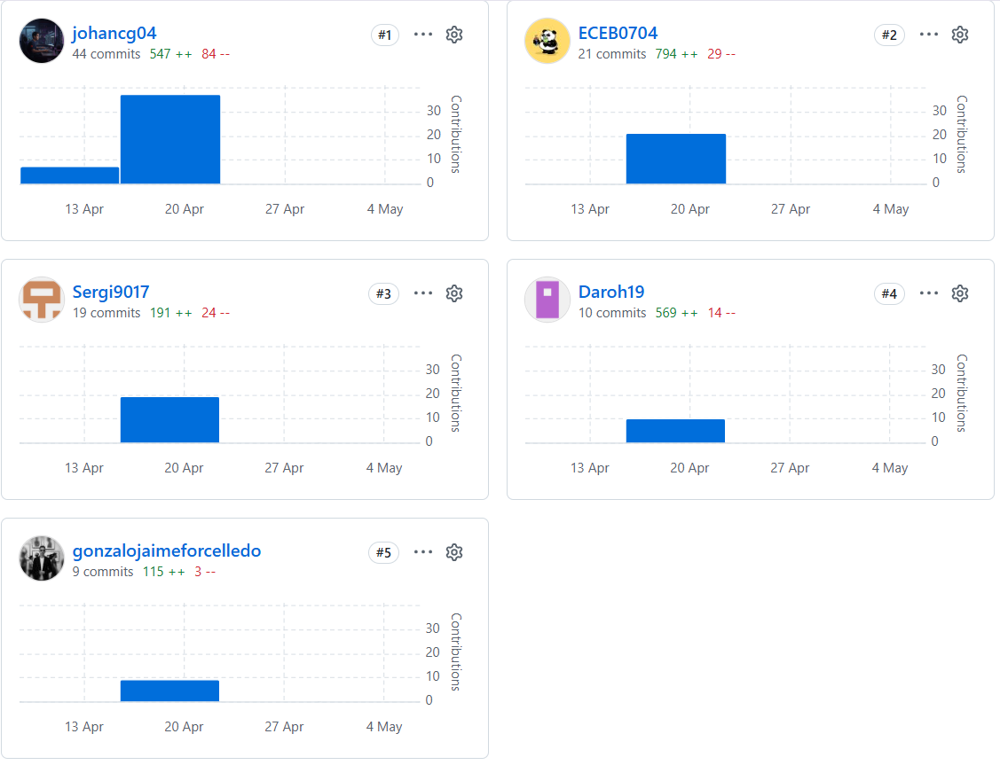

# Project Report Collaboration Insights

El repositorio público del informe se encuentra organizado bajo la organización de GitHub del equipo, siguiendo la convención de nomenclatura establecida en el enunciado del trabajo final. El informe está redactado en formato **Markdown** (`README.md` como archivo principal), con estructura de carpetas por capítulo.

**Repositorio del informe:**  
<https://github.com/upc-pre-202610-1asi0730-12242-DevsTeam/fruitlogix-report>

El repositorio aplica **GitFlow** como workflow de control de versiones y **Conventional Commits** para los mensajes de commit.

Los commits reflejados en esta tabla corresponden únicamente al repositorio del informe (**fruitlogix-report**). Los commits de código de los repositorios de **Landing Page**, **Frontend** y **Web Services** se registran en sus respectivos repositorios.

---

# AV1 – Sprint Review (Semana 4)

Durante la elaboración de la entrega **AV1**, el equipo se organizó asignando a cada integrante capítulos y secciones específicas del informe. Se realizaron sesiones de revisión conjunta vía Discord y se utilizó la rama **main** para consolidar el informe antes de la exportación a PDF. Cada integrante creó su propia **feature branch** siguiendo la convención establecida.

| Integrantes | Actividades realizadas en el informe |
|-------------|--------------------------------------|
| **Contreras Granados, Johan Alexis** | Elaboró la Carátula, Registro de Versiones del Informe, Project Report Collaboration Insights y la sección Student Outcome. Coordinó la integración de todos los capítulos en la rama `develop` y realizó el merge final a `main`. |
| **Chavez Bardales, Esteban Eduardo** | Redactó el Capítulo I (Startup Profile, Solution Profile y Segmentos Objetivo), incluyendo la descripción de la startup FruitLogix, los perfiles de integrantes y el proceso Lean UX completo con Problem Statements, Assumptions, Hypothesis Statements y Lean UX Canvas. |
| **Evangelista Ygnacio, Sergio Joaquín** | Desarrolló el Capítulo II (Requirements Elicitation & Analysis): diseñó y registró las entrevistas de needfinding, elaboró los User Personas, User Task Matrix, User Journey Mapping, Empathy Maps y Big Picture EventStorming. Redactó el Ubiquitous Language del dominio agrícola. |
| **Jaime Forcelledo, Gonzalo Alexander** | Desarrolló el Capítulo III (Requirements Specification) con los User Stories y Epics completos con Acceptance Criteria en formato Gherkin, el Impact Mapping y el Product Backlog priorizado. Adicionalmente elaboró las secciones de Style Guidelines y gran parte del Capítulo IV. |
| **Palomino Vilcañaupa, Daril Johan** | Completó el Capítulo IV (Product Design) con la propuesta de Information Architecture, Landing Page Wireframes y Mockups, Web Application Wireframes, Wireflow Diagrams y Mockups. Configuró el repositorio de la Landing Page e implementó el Sprint 1 completo (sección 5.2.1). |

---

# TB1 – Stage Review (Semana 7)

En la entrega **TB1**, el equipo incorporó las correcciones y mejoras indicadas por el docente sobre la AV1, actualizó el Registro de Versiones y extendió la sección Student Outcome con las acciones de la nueva entrega. La principal adición fue la documentación del **Sprint 2**, incluyendo el planning, backlog, evidencias de desarrollo y despliegue de la primera versión de la Frontend Web Application.

| Integrantes | Actividades realizadas en el informe |
|-------------|--------------------------------------|
| **Contreras Granados, Johan Alexis** | Actualizó el Registro de Versiones (V2.0.0), la sección Project Report Collaboration Insights con evidencias de TB1 y las conclusiones del Student Outcome. Realizó el merge de todas las ramas en `develop` y el tag de versión en GitHub. |
| **Chavez Bardales, Esteban Eduardo** | Implementó y documentó el Sprint Backlog 2 para los módulos Infrastructure & IoT y Profiles & Vehicles. Actualizó el Aspect Leaders and Collaborators Matrix y registró los commits de implementación en la tabla de Development Evidence del Sprint 2. |
| **Evangelista Ygnacio, Sergio Joaquín** | Corrigió las secciones de needfinding según la retroalimentación del docente. Implementó y documentó el Sprint Backlog 2 para los módulos Quality Control y Payment Management. Elaboró la sección de Validation Interviews de TB1. |
| **Jaime Forcelledo, Gonzalo Alexander** | Actualizó los User Stories y el Product Backlog incorporando nuevas historias identificadas durante el Sprint 2. Completó la sección de Domain-Driven Software Architecture con los diagramas C4 actualizados (Context, Container y Components). |
| **Palomino Vilcañaupa, Daril Johan** | Documentó el Sprint Planning 2, elaboró las secciones Execution Evidence for Sprint Review y Software Deployment Evidence for Sprint Review del Sprint 2. Registró los Team Collaboration Insights incluyendo capturas de GitHub del repositorio Frontend. |

---

# AV2 – Sprint Review (Semana 12)

Para la entrega **AV2**, el equipo completó el ciclo de implementación del **Sprint 3**, incorporando los Web Services (RESTful API con ASP.NET Core), la nueva versión de la Web Application integrada con el backend y las Validation Interviews. Además, se publicaron las primeras versiones del Video About-the-Product y Video About-the-Team. El informe fue actualizado por todos los integrantes con las evidencias correspondientes.

| Integrantes | Actividades realizadas en el informe |
|-------------|--------------------------------------|
| **Chavez Bardales, Esteban Eduardo** | Documentó el Sprint Planning 3, el Aspect Leaders and Collaborators Matrix para el Sprint 3 y el Sprint Backlog 3. Registró los commits del backend (Infrastructure & IoT y Profiles & Vehicles) en la tabla de Development Evidence. Capturó y documentó evidencias de despliegue en Azure/Railway. Lideró la revisión del Student Outcome con las conclusiones del Sprint 3 y coordinó el merge final y la exportación a PDF. |
| **Evangelista Ygnacio, Sergio Joaquín** | Documentó la sección 5.3 Validation Interviews completa: diseño de entrevistas, registro de sesiones con usuarios reales y evaluaciones según las heurísticas de Nielsen. Elaboró la tabla de Services Documentation Evidence con los endpoints de Orders y Messaging documentados en Swagger. |
| **Jaime Forcelledo, Gonzalo Alexander** | Actualizó los diagramas de arquitectura (Context, Container y Component) para reflejar la integración real del sistema desplegado. Documentó los User Flow Diagrams actualizados y las secciones de Web Applications Prototyping. Elaboró la sección 5.4 Video About-the-Product. |
| **Palomino Vilcañaupa, Daril Johan** | Documentó la sección Execution Evidence for Sprint Review 3 con capturas de las vistas implementadas y el enlace al video de navegación. Registró el Software Deployment Evidence for Sprint Review 3 con los pasos de CI/CD y capturas del entorno en producción. Documentó Team Collaboration Insights del Sprint 3. |

---

# TB2 – Release Review (Semana 15)

En la entrega **TB2**, el equipo consolidó la versión final del informe incorporando las observaciones realizadas por el docente durante la evaluación AV2. Se actualizó el **Registro de Versiones (V4.0.0)**, se documentó el **Sprint 4**, se revisó la consistencia de todas las evidencias del proyecto y se registraron los analíticos de colaboración de GitHub correspondientes al período de las semanas 13–15.

| Integrantes | Actividades realizadas en el informe |
|-------------|--------------------------------------|
| **Chavez Bardales, Esteban Eduardo** | Actualizó la documentación del Sprint 4, incluyendo las secciones **Development Evidence for Sprint Review**, **Execution Evidence for Sprint Review** y **Services Documentation Evidence**. Verificó la consistencia de las referencias, enlaces y evidencias del repositorio, además de consolidar la documentación final para la entrega TB2. |
| **Jaime Forcelledo, Gonzalo Alexander** | Actualizó la documentación funcional y técnica del proyecto incorporando las observaciones finales del docente. Revisó y corrigió las secciones de arquitectura, backlog y documentación de soporte. Registró las evidencias de colaboración del repositorio del informe y actualizó la sección **Project Report Collaboration Insights**, incluyendo la tabla de commits y la organización de la documentación final. |
| **Palomino Vilcañaupa, Daril Johan** | Documentó la sección **Software Deployment Evidence for Sprint Review 4**, verificando el despliegue de los productos desarrollados y actualizando las evidencias correspondientes. Revisó la estructura general del informe, actualizó el **Registro de Versiones (V4.0.0)**, consolidó las conclusiones finales y apoyó en la revisión y validación del documento previo a su entrega. |

