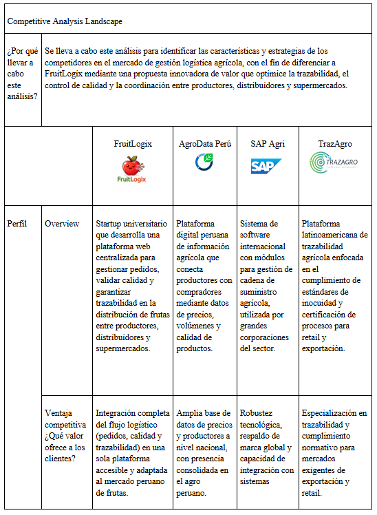
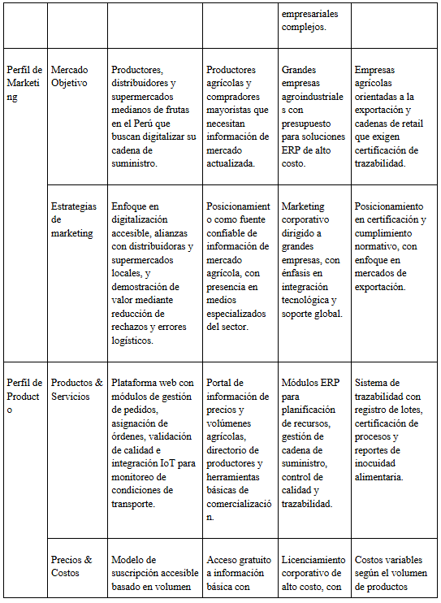
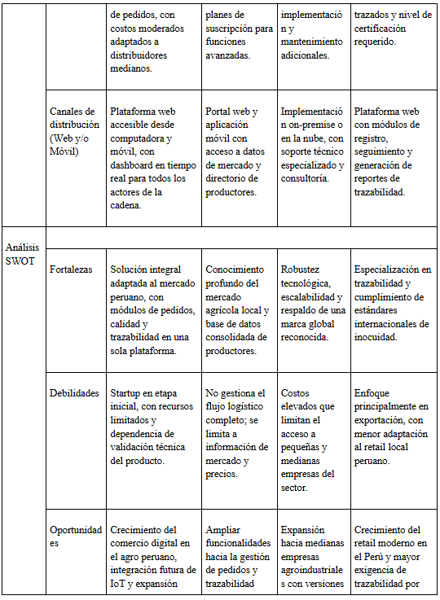
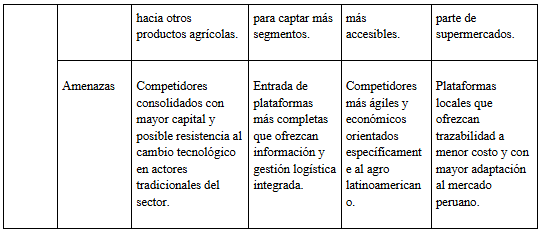

## Capítulo II: Requirements Elicitation & Analysis
### 2.1. Competidores
 En el mercado peruano existen varias empresas que ofrecen soluciones relacionadas con la gestión logística y distribución de productos agrícolas, que se consideran competidores directos o indirectos del proyecto FruitLogix. A continuación se identifican y describen tres de ellas:

* AgroData Perú: Plataforma digital peruana orientada a la trazabilidad y comercialización de productos agrícolas. Conecta a productores con compradores ofreciendo información sobre precios, volúmenes y calidad de productos del campo, siendo un referente en la digitalización del agro peruano.

* SAP Agri: Solución ERP internacional con módulos especializados en gestión de cadena de suministro agrícola. Utilizada por grandes empresas del sector para automatizar procesos logísticos, control de calidad y trazabilidad de productos desde el campo hasta el punto de venta.

* TrazAgro: Plataforma latinoamericana de trazabilidad agrícola que permite el seguimiento de productos desde su origen hasta el consumidor final. Se enfoca en el cumplimiento de estándares de inocuidad alimentaria y la certificación de procesos para exportación y retail.

#### 2.1.1. Análisis competitivo

#### 2.1.2. Estrategias y tácticas frente a competidores
#### Estrategias:
#### Diferenciación mediante integración completa del flujo logístico
* Objetivo: Posicionar a FruitLogix como la única solución que gestiona de forma integral el ciclo completo de distribución de frutas: desde el registro del pedido hasta la entrega final con validación de calidad.
* Acciones: Desarrollar módulos interconectados de gestión de pedidos, asignación de órdenes, control de calidad e integración IoT para monitoreo de condiciones de transporte.
* Resultados esperados: Destacar frente a competidores que solo cubren partes del proceso, ofreciendo una experiencia unificada y eficiente para todos los actores de la cadena.

#### Tácticas:
#### Alianzas estratégicas con supermercados y programas agrícolas
* Objetivo: Generar credibilidad y visibilidad en el mercado desde etapas tempranas.
* Acciones: Establecer alianzas con programas como Perú Pasión y acercarse a cadenas de retail como Plaza Vea para implementar proyectos piloto que demuestren el valor de la plataforma.
* Resultados esperados: Mayor adopción del sistema y generación de casos de éxito que sirvan como referencia para nuevos clientes.

#### Modelo de precios accesible y escalable
* Objetivo: Reducir la barrera de entrada para distribuidores medianos que no pueden asumir el costo de soluciones ERP tradicionales.
* Acciones: Ofrecer un modelo de suscripción basado en volumen de pedidos procesados, con una versión básica gratuita para el primer mes de uso.
* Resultados esperados: Mayor tasa de adopción inicial y fidelización progresiva a medida que los usuarios comprueban el valor de la plataforma. 