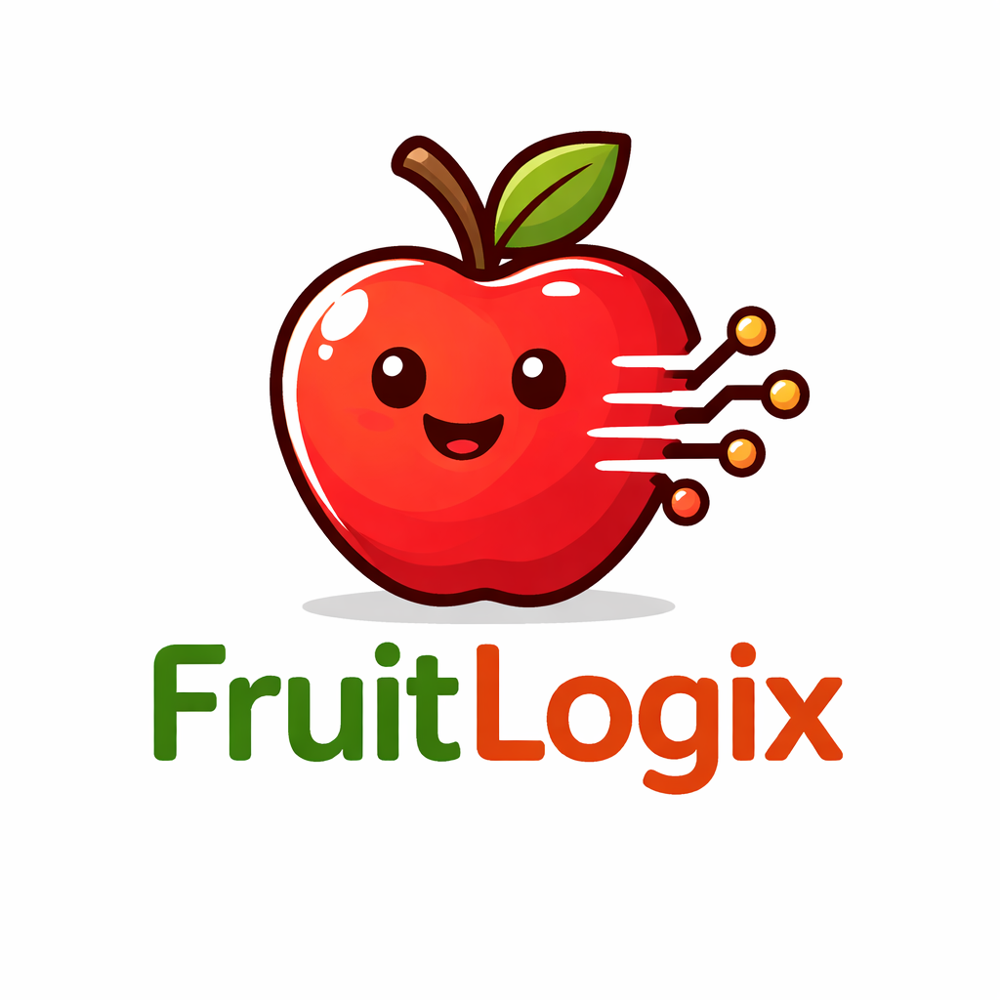
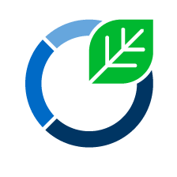
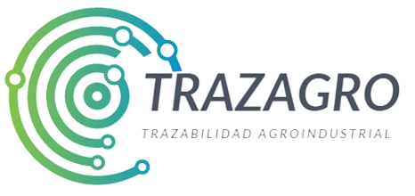

## Capítulo II: Requirements Elicitation & Analysis
### 2.1. Competidores
 En el mercado peruano existen varias empresas que ofrecen soluciones relacionadas con la gestión logística y distribución de productos agrícolas, que se consideran competidores directos o indirectos del proyecto FruitLogix. A continuación se identifican y describen tres de ellas:

* AgroData Perú: Plataforma digital peruana orientada a la trazabilidad y comercialización de productos agrícolas. Conecta a productores con compradores ofreciendo información sobre precios, volúmenes y calidad de productos del campo, siendo un referente en la digitalización del agro peruano.

* SAP Agri: Solución ERP internacional con módulos especializados en gestión de cadena de suministro agrícola. Utilizada por grandes empresas del sector para automatizar procesos logísticos, control de calidad y trazabilidad de productos desde el campo hasta el punto de venta.

* TrazAgro: Plataforma latinoamericana de trazabilidad agrícola que permite el seguimiento de productos desde su origen hasta el consumidor final. Se enfoca en el cumplimiento de estándares de inocuidad alimentaria y la certificación de procesos para exportación y retail.

#### 2.1.1. Análisis competitivo

## Competitive Analysis Landscape

**¿Por qué llevar a cabo este análisis?**
Se lleva a cabo este análisis para identificar las características y estrategias de los competidores en el mercado de gestión logística agrícola, con el fin de diferenciar a FruitLogix mediante una propuesta innovadora de valor que optimice la trazabilidad, el control de calidad y la coordinación entre productores, distribuidores y supermercados.

|  |  |  **FruitLogix**|  **AgroData Perú**|  **SAP Agri**|  **TrazAgro**|
|---|---|------------------------------------------------------------------------------------------------------------------------------------------------------------------------------------------------------------------|---------------------------------------------------------------------------------------------------------------------------------------------------------|----------------------------------------------------------------------------------------------------------|-------------------------------------------------------------------------------------------------------------------------------------------------------------------|
| **Perfil** | **Overview** | Startup universitario que desarrolla una plataforma web centralizada para gestionar pedidos, validar calidad y garantizar trazabilidad en la distribución de frutas entre productores, distribuidores y supermercados. | Plataforma digital peruana de información agrícola que conecta productores con compradores mediante datos de precios, volúmenes y calidad de productos. | Sistema de software internacional con módulos para gestión de cadena de suministro agrícola, utilizada por grandes corporaciones del sector. | Plataforma latinoamericana de trazabilidad agrícola enfocada en el cumplimiento de estándares de inocuidad y certificación de procesos para retail y exportación. |
| | **Ventaja competitiva** | Integración completa del flujo logístico (pedidos, calidad y trazabilidad) en una sola plataforma accesible y adaptada al mercado peruano de frutas.                                                             | Amplia base de datos de precios y productores a nivel nacional, con presencia consolidada en el agro peruano.                                           | Robustez tecnológica, respaldo de marca global y capacidad de integración con sistemas empresariales complejos. | Especialización en trazabilidad y cumplimiento normativo para mercados exigentes de exportación y retail.                                                         |
| **Perfil de Marketing** | **Mercado Objetivo** | Productores, distribuidores y supermercados medianos de frutas en el Perú que buscan digitalizar su cadena de suministro.                                                                                        | Productores agrícolas y compradores mayoristas que necesitan información de mercado actualizada.                                                        | Grandes empresas agroindustriales con presupuesto para soluciones ERP de alto costo.                     | Empresas agrícolas orientadas a la exportación y cadenas de retail que exigen certificación de trazabilidad.                                                      |
| | **Estrategias de marketing** | Enfoque en digitalización accesible, alianzas con distribuidoras y supermercados locales, y demostración de valor mediante reducción de rechazos y errores logísticos.                                           | Posicionamiento como fuente confiable de información de mercado agrícola, con presencia en medios especializados del sector.                            | Marketing corporativo dirigido a grandes empresas, con énfasis en integración tecnológica y soporte global. | Posicionamiento en certificación y cumplimiento normativo, con enfoque en mercados de exportación.                                                                |
| **Perfil de Producto** | **Productos & Servicios** | Plataforma web con módulos de gestión de pedidos, asignación de órdenes, validación de calidad e integración IoT para monitoreo de condiciones de transporte.                                                    | Portal de información de precios y volúmenes agrícolas, directorio de productores y herramientas básicas de comercialización.                           | Módulos ERP para planificación de recursos, gestión de cadena de suministro, control de calidad y trazabilidad. | Sistema de trazabilidad con registro de lotes, certificación de procesos y reportes de inocuidad alimentaria.                                                     |
| | **Precios & Costos** | Modelo de suscripción accesible basado en volumen de pedidos, con costos moderados adaptados a distribuidores medianos.                                                                                          | Acceso gratuito a información básica con planes de suscripción para funciones avanzadas.                                                                | Licenciamiento corporativo de alto costo, con implementación y mantenimiento adicionales.                | Costos variables según el volumen de productos trazados y nivel de certificación requerido.                                                                       |
| | **Canales de distribución** | Plataforma web accesible desde computadora y móvil, con dashboard en tiempo real para todos los actores de la cadena.                                                                                            | Portal web y aplicación móvil con acceso a datos de mercado y directorio de productores.                                                                | Implementación on-premise o en la nube, con soporte técnico especializado y consultoría.                 | Plataforma web con módulos de registro, seguimiento y generación de reportes de trazabilidad.                                                                     |
| **Análisis SWOT** | **Fortalezas** | Solución integral adaptada al mercado peruano, con módulos de pedidos, calidad y trazabilidad en una sola plataforma.                                                                                            | Conocimiento profundo del mercado agrícola local y base de datos consolidada de productores.                                                            | Robustez tecnológica, escalabilidad y respaldo de una marca global reconocida.                           | Especialización en trazabilidad y cumplimiento de estándares internacionales de inocuidad.                                                                        |
| | **Debilidades** | Startup en etapa inicial, con recursos limitados y dependencia de validación técnica del producto.                                                                                                               | No gestiona el flujo logístico completo; se limita a información de mercado y precios.                                                                  | Costos elevados que limitan el acceso a pequeñas y medianas empresas del sector.                         | Enfoque principalmente en exportación, con menor adaptación al retail local peruano.                                                                              |
| | **Oportunidades** | Crecimiento del comercio digital en el agro peruano, integración futura de IoT y expansión hacia otros productos agrícolas.                                                                                      | Ampliar funcionalidades hacia la gestión de pedidos y trazabilidad para captar más segmentos.                                                           | Expansión hacia medianas empresas agroindustriales con versiones más accesibles.                         | Crecimiento del retail moderno en el Perú y mayor exigencia de trazabilidad por parte de supermercados.                                                           |
| | **Amenazas** | Competidores consolidados con mayor capital y posible resistencia al cambio tecnológico en actores tradicionales del sector.                                                                                     | Entrada de plataformas más completas que ofrezcan información y gestión logística integrada.                                                            | Competidores más ágiles y económicos orientados específicamente al agro latinoamericano.                 | Plataformas locales que ofrezcan trazabilidad a menor costo y con mayor adaptación al mercado peruano.                                                            |

#### 2.1.2. Estrategias y tácticas frente a competidores
#### Estrategias:
#### Diferenciación mediante integración completa del flujo logístico
* Objetivo: Posicionar a FruitLogix como la única solución que gestiona de forma integral el ciclo completo de distribución de frutas: desde el registro del pedido hasta la entrega final con validación de calidad.
* Acciones: Desarrollar módulos interconectados de gestión de pedidos, asignación de órdenes, control de calidad e integración IoT para monitoreo de condiciones de transporte.
* Resultados esperados: Destacar frente a competidores que solo cubren partes del proceso, ofreciendo una experiencia unificada y eficiente para todos los actores de la cadena.

#### Tácticas:
#### Alianzas estratégicas con supermercados y programas agrícolas
* Objetivo: Generar credibilidad y visibilidad en el mercado desde etapas tempranas.
* Acciones: Establecer alianzas con programas como Perú Pasión y acercarse a cadenas de retail como Plaza Vea para implementar proyectos piloto que demuestren el valor de la plataforma.
* Resultados esperados: Mayor adopción del sistema y generación de casos de éxito que sirvan como referencia para nuevos clientes.

#### Modelo de precios accesible y escalable
* Objetivo: Reducir la barrera de entrada para distribuidores medianos que no pueden asumir el costo de soluciones ERP tradicionales.
* Acciones: Ofrecer un modelo de suscripción basado en volumen de pedidos procesados, con una versión básica gratuita para el primer mes de uso.
* Resultados esperados: Mayor tasa de adopción inicial y fidelización progresiva a medida que los usuarios comprueban el valor de la plataforma. 