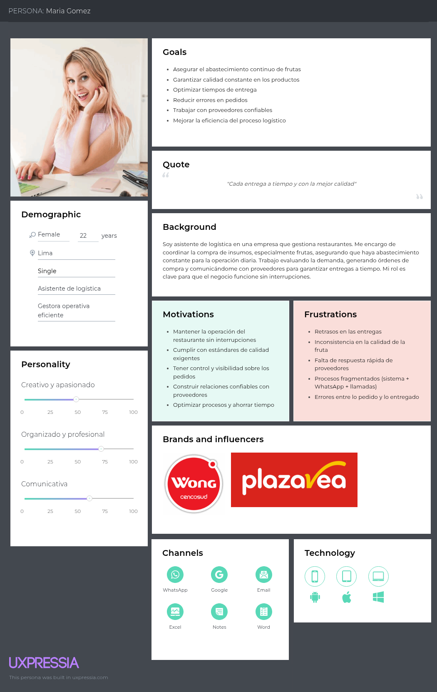
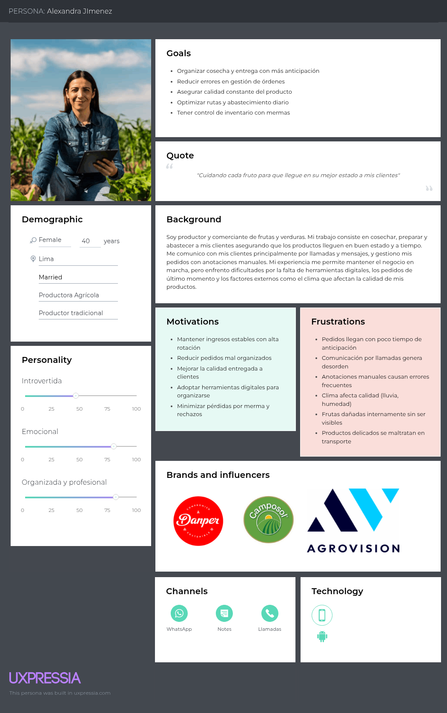
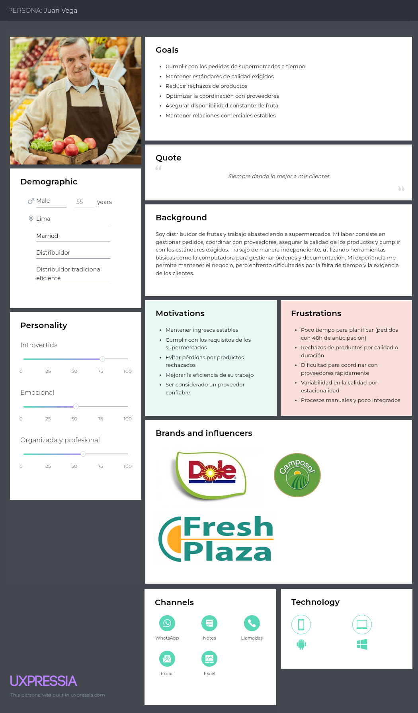
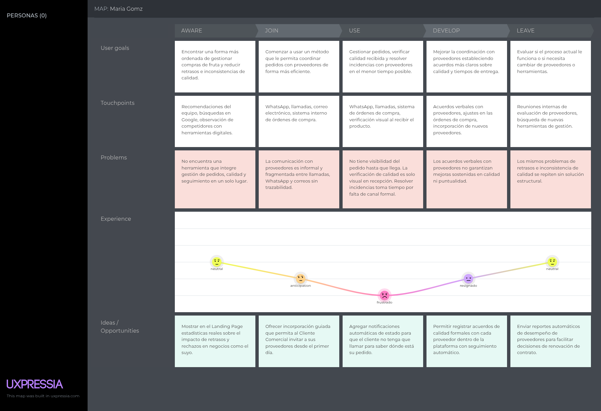
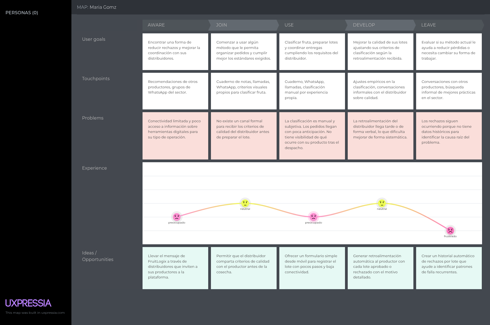
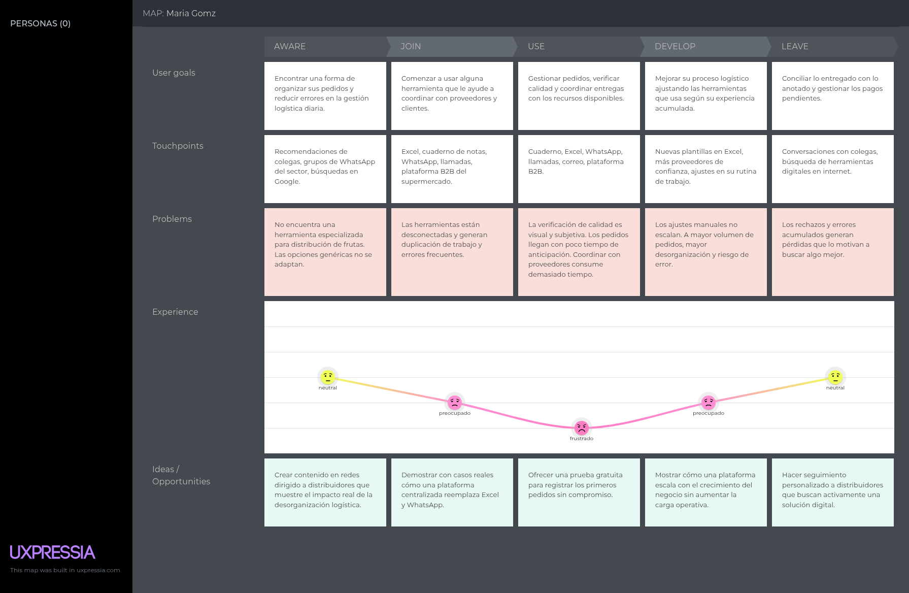
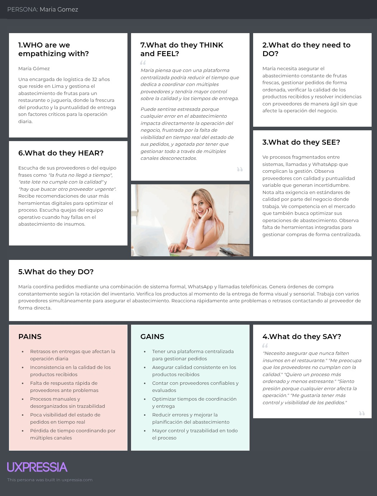
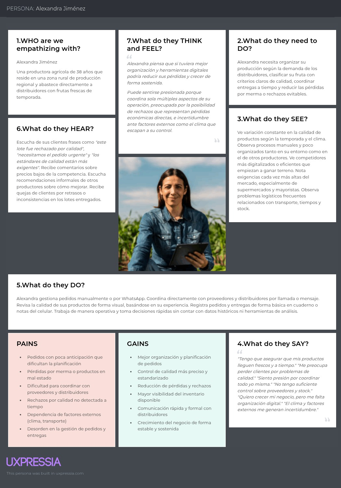
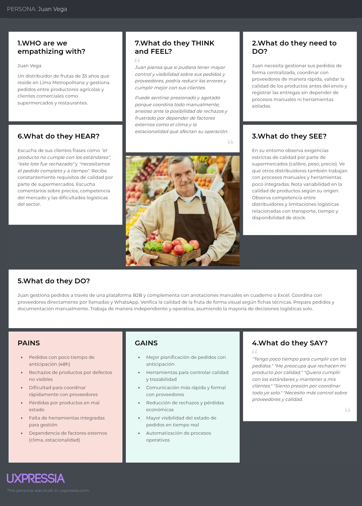

### 2.3. Needfinding
#### 2.3.1. User Personas
En esta sección se presentan los User Personas de los segmentos objetivo de FruitLogix, construidos a partir del análisis de entrevistas y del contexto del mercado. Estos arquetipos reflejan las principales necesidades, comportamientos y problemas de los usuarios, y sirven como base para orientar el diseño de la solución.
#### User Persona del 1er segmento objetivo – Clientes Comerciales

María Gómez representa al segmento de clientes comerciales, construido a partir de las entrevistas a Bianzel Noriega, Luciana Breña y Rosa Arana Medina. Se definió como una mujer de 22 años, soltera y ubicada en Lima, reflejando el perfil de encargadas de logística en negocios del rubro gastronómico como restaurantes y juguerías que gestionan el abastecimiento de frutas de forma operativa y diaria. Sus goals de asegurar abastecimiento continuo, garantizar calidad constante y reducir errores en pedidos responden directamente a lo expresado por el 100% de las entrevistadas, quienes señalaron la calidad, la puntualidad y la confiabilidad del proveedor como sus prioridades principales. Sus frustraciones de retrasos en entregas, inconsistencia en la calidad, falta de respuesta rápida y procesos fragmentados entre sistema, WhatsApp y llamadas fueron mencionadas de forma unánime en las tres entrevistas. Se eligieron Wong y Plaza Vea como marcas e influencias porque son las cadenas con las que este segmento interactúa directamente como cliente final o referente de estándares de calidad en el abastecimiento. Sus canales incluyen WhatsApp, Google, email, Excel, notas y Word porque el 66% de los entrevistados dependía de métodos tradicionales y el 33% complementaba con sistemas formales, reflejando un perfil más digitalizado que el productor pero aún sin herramientas integradas de gestión.
#### User Persona del 2do segmento objetivo – Productores

Alexandra Jiménez representa al segmento de productores agrícolas, construido a partir de las entrevistas a Renato Navarro, Karen Forcelledo y Jessica. Se definió como una mujer de 40 años, casada y ubicada en Lima, dado que el segmento incluye tanto productores rurales como comerciantes con experiencia en abastos que abastecen directamente a distribuidores. Sus goals de organizar cosechas con anticipación, reducir errores en órdenes y asegurar calidad constante responden al 100% de los entrevistados que manifestaron necesitar mejores herramientas para planificar y controlar su producción. Sus frustraciones como los pedidos de último momento, las anotaciones manuales que causan errores, el impacto del clima en la calidad y los productos que se dañan durante el transporte fueron mencionados de forma recurrente en los tres casos entrevistados. Se eligieron Danper, Camposol y Agrovision como marcas e influencias porque son referentes del sector agrícola formal con los que los productores interactúan o hacia los que aspiran en términos de estándares de calidad y buenas prácticas. Sus canales se limitaron a WhatsApp, notas y llamadas porque el 100% de los entrevistados en este segmento operaba exclusivamente con medios informales y su tecnología se redujo al celular con Android, reflejando la realidad de un segmento con acceso tecnológico básico y sin herramientas digitales integradas.
#### User Persona del 3er segmento objetivo - Distribuidores de Frutas

Juan Vega representa al segmento de distribuidores de frutas, construido a partir de los patrones identificados en las entrevistas realizadas a Jorge Contreras, Paola Jiménez y Edwin Lozano. Se definió como un hombre de 55 años, casado y ubicado en Lima, debido a que el perfil predominante en este segmento corresponde a personas con experiencia en el sector que operan de forma independiente abasteciendo a supermercados y clientes comerciales. Sus goals reflejan directamente lo expresado por los entrevistados: cumplir pedidos a tiempo, mantener estándares de calidad y reducir rechazos son las prioridades constantes en su operación diaria. Sus frustraciones surgen de la evidencia recogida, donde el 100% de los entrevistados mencionó problemas con la variabilidad del stock, la exigencia de calidad y la poca anticipación en los pedidos, mientras que el 66% destacó dificultades de coordinación con proveedores. Se eligieron Dole, Camposol y Fresh Plaza como marcas e influencias porque representan los estándares de calidad y las referencias del sector con las que Juan interactúa o aspira a alinearse. Sus canales de WhatsApp, llamadas, email y Excel responden al 100% de los entrevistados que usaban medios directos e informales, y al uso extendido de herramientas ofimáticas básicas para organizar su operación.

#### 2.3.2. User Task Matrix

Para diseñar una solución que optimice la cadena de suministro de frutas, se identificaron tres tipos de usuarios clave: los productores, que se encargan de la producción y selección del producto; los distribuidores, responsables de la logística y cumplimiento de los pedidos; y los clientes comerciales, que necesitan abastecer sus operaciones de manera constante. El diseño de la plataforma se enfoca en facilitar la interacción entre estos tres actores para asegurar calidad, disponibilidad y eficiencia en todo el proceso.

## Tasks vs User Personas

| Tasks                                   | Productores (Frecuencia) | Productores (Importancia) | Distribuidores (Frecuencia) | Distribuidores (Importancia) | Clientes Comerciales (Frecuencia) | Clientes Comerciales (Importancia) |
|----------------------------------------|--------------------------|----------------------------|------------------------------|------------------------------|-----------------------------------|-----------------------------------|
| Producir / seleccionar fruta           | Muy frecuente           | Alta                       | Frecuente                    | Alta                         | No aplica                         | No aplica                         |
| Buscar compradores / proveedores       | Frecuente               | Alta                       | Frecuente                    | Alta                         | Frecuente                         | Alta                              |
| Evaluar demanda                        | Frecuente               | Media                      | Frecuente                    | Alta                         | Frecuente                         | Alta                              |
| Generar pedidos / ventas               | Frecuente               | Alta                       | Muy frecuente                | Alta                         | Muy frecuente                     | Alta                              |
| Coordinar entregas                     | Frecuente               | Alta                       | Muy frecuente                | Alta                         | Muy frecuente                     | Alta                              |
| Comunicarse con otros actores          | Frecuente               | Media                      | Muy frecuente                | Alta                         | Muy frecuente                     | Alta                              |
| Verificar calidad del producto         | Muy frecuente           | Alta                       | Muy frecuente                | Alta                         | Muy frecuente                     | Alta                              |
| Cumplir estándares / requisitos        | Muy frecuente           | Alta                       | Muy frecuente                | Alta                         | Muy frecuente                     | Alta                              |
| Gestionar documentación                | Ocasional               | Media                      | Frecuente                    | Alta                         | Frecuente                         | Media                             |
| Resolver problemas (rechazos, retrasos)| Ocasional               | Media                      | Frecuente                    | Alta                         | Frecuente                         | Alta                              |
| Manejar devoluciones                   | Ocasional               | Media                      | Frecuente                    | Alta                         | Ocasional                         | Media                             |
| Planificar producción / abastecimiento | Frecuente               | Alta                       | Frecuente                    | Alta                         | Frecuente                         | Alta                              |

---

La tabla muestra que los tres segmentos coinciden en considerar de alta importancia tareas como la verificación de calidad, la coordinación de entregas y la comunicación entre actores, aunque los distribuidores y clientes comerciales las realizan con mayor frecuencia debido a su rol operativo diario. Asimismo, las tareas más relevantes para los productores están relacionadas con la producción y cumplimiento de estándares, mientras que los distribuidores se enfocan en la gestión logística y resolución de problemas, y los clientes comerciales en la planificación de la demanda y evaluación de proveedores. Estas diferencias reflejan sus roles dentro del sistema: el productor busca garantizar calidad desde el origen, el distribuidor asegurar la entrega eficiente y el cliente comercial mantener la continuidad de su operación mediante un abastecimiento confiable.

#### 2.3.3. User Journey Mapping
 El User Journey Mapping es una herramienta que permite visualizar de forma estructurada la experiencia del usuario a lo largo de su interacción con un producto o servicio. En el caso de FruitLogix, realizamos los User Journey Maps en su versión As-Is para los tres segmentos objetivos.
#### User Journey Map del 1er segmento objetivo – Clientes Comerciales

El User Journey Map de María Gómez ilustra la experiencia actual del segmento de clientes comerciales a lo largo de las cinco etapas. En Aware, María sabe que su proceso tiene margen de mejora pero no encuentra una herramienta que integre gestión de pedidos, calidad y seguimiento en un solo lugar, lo que refleja la brecha identificada en el 100% de los entrevistados que usaban procesos fragmentados. En Join, comienza a coordinar con proveedores a través de WhatsApp, llamadas y correos sin trazabilidad formal, evidenciando la dependencia de canales informales señalada por la totalidad del segmento. Durante el Use, no tiene visibilidad del estado de su pedido hasta que llega físicamente, y la verificación de calidad se realiza solo al momento de la recepción, lo que genera tensión operativa especialmente en rubros donde el producto es altamente perecible como restaurantes y juguerías. En Develop, los acuerdos verbales con proveedores no generan cambios sostenidos en calidad ni puntualidad, y los mismos problemas se repiten ciclo tras ciclo, situación mencionada por el 100% de los entrevistados en este segmento. Finalmente en Leave, la acumulación de retrasos e inconsistencias de calidad sin una solución estructural motiva la búsqueda de herramientas digitales que centralicen y formalicen el proceso de abastecimiento, siendo este el punto de entrada natural para FruitLogix en este segmento.
#### User Journey Map del 2do segmento objetivo – Productores

El User Journey Map de Alexandra Jiménez refleja la experiencia actual del segmento de productores agrícolas en sus cinco etapas. En Aware, Alexandra tiene conectividad limitada y poco acceso a información sobre herramientas digitales, por lo que solo llega a conocer nuevas opciones a través de recomendaciones de otros productores o ferias del sector, evidenciando una baja exposición a soluciones tecnológicas. En Join, comienza a trabajar con cuadernos, llamadas y WhatsApp como sus únicas herramientas, sin recibir criterios claros de calidad por parte del distribuidor antes de preparar el lote, lo que genera incertidumbre desde el inicio del proceso. Durante el Use, clasifica la fruta con criterios visuales propios y despacha sin visibilidad de lo que ocurre con el producto después, situación identificada en el 100% de los productores entrevistados que realizaban control de calidad de forma manual y subjetiva. En Develop, la retroalimentación del distribuidor llega tarde o de forma verbal, lo que impide que Alexandra mejore de forma sistemática a pesar de sus intentos. En Leave, los rechazos siguen ocurriendo sin datos históricos que le permitan identificar la causa raíz, generando pérdidas económicas directas que justifican la necesidad de una solución como FruitLogix que estandarice el proceso desde el origen.
#### User Journey Map del 3er segmento objetivo - Distribuidores de Frutas

El User Journey Map de Juan Vega representa la experiencia actual del segmento de distribuidores de frutas a lo largo de las cinco etapas definidas: Aware, Join, Use, Develop y Leave. En la etapa Aware, Juan no encuentra herramientas especializadas para su tipo de negocio y depende de recomendaciones informales de colegas y búsquedas generales en internet, lo que refleja la baja visibilidad de soluciones digitales especializadas en el sector. En la etapa Join, comienza a usar herramientas desconectadas como Excel, cuadernos y WhatsApp que generan duplicación de trabajo, evidenciando la transición incompleta hacia la digitalización identificada en el 100% de los entrevistados. Durante el Use, gestiona pedidos de forma manual y realiza la verificación de calidad con criterio visual, enfrentando la variabilidad del stock y la poca anticipación de los pedidos, problemas mencionados por la totalidad del segmento entrevistado. En Develop, sus intentos de mejora son parciales porque los ajustes manuales no escalan con el crecimiento del volumen de pedidos, manteniéndose los mismos errores. Finalmente en Leave, los rechazos y pérdidas acumuladas lo motivan a buscar una solución más eficiente, representando la oportunidad directa de entrada de FruitLogix como alternativa especializada para su operación.

#### 2.3.4. Empathy Mapping

El Empathy Mapping es una herramienta que nos permite profundizar en la experiencia emocional y cognitiva del usuario. A través de categorías como lo que el usuario piensa, siente, dice y hace, se busca comprender su contexto, así como sus principales miedos, frustraciones y motivaciones.

Para FruitLogix, elaborar un Empathy Mapping para cada segmento objetivo fue clave para entender no solo cómo gestionan la compra y distribución de frutas, sino también cómo enfrentan los retos de calidad, tiempos y coordinación en su día a día. Esta comprensión más empática nos permite diseñar una solución que responda a sus necesidades reales y reduzca los puntos de dolor presentes en sus procesos actuales.

**Empathy Mapping del 1er segmento objetivo – Clientes Comerciales** 

El Empathy Map de María Gómez refleja la experiencia emocional de una encargada de logística donde la frescura del producto y la puntualidad de entrega son factores críticos para la operación diaria. En Think and Feel reconoce que con una plataforma centralizada podría reducir el tiempo de coordinación y tener mayor control sobre calidad y entregas, aunque se siente estresada porque cualquier error en el abastecimiento impacta directamente el negocio y agotada por gestionar todo en múltiples canales desconectados. En See observa procesos fragmentados entre sistemas, llamadas y WhatsApp, proveedores con calidad variable y ausencia de herramientas integradas para gestionar compras. En Hear recibe reclamos del equipo sobre frutas que no llegaron a tiempo, lotes con calidad deficiente y la necesidad urgente de buscar nuevos proveedores. En Say and Do coordina pedidos mediante sistema formal, WhatsApp y llamadas, verifica productos visualmente al momento de la recepción y trabaja con varios proveedores simultáneamente para asegurar el abastecimiento. Sus Pains más críticos son los retrasos, la inconsistencia en calidad y la poca visibilidad del estado de pedidos, mientras que sus Gains apuntan a una plataforma centralizada, proveedores confiables y mayor trazabilidad en todo el proceso.

**Empathy Map del 2do segmento objetivo – Productores**

El Empathy Map de Alexandra Jiménez revela la experiencia emocional de una productora que abastece directamente a distribuidores con frutas frescas de temporada. En Think and Feel reconoce que con mejor organización y herramientas digitales podría reducir pérdidas y crecer de forma sostenida, pero se siente presionada por coordinar sola su operación y preocupada por los rechazos que representan pérdidas económicas directas. En See observa variación constante en la calidad según la temporada, procesos manuales poco organizados y competidores más digitalizados que empiezan a ganar terreno. En Hear recibe reclamos frecuentes por lotes rechazados, pedidos urgentes y exigencias de calidad cada vez más altas que generan tensión en sus relaciones comerciales. En Say and Do gestiona pedidos manualmente o por WhatsApp, revisa calidad de forma visual y toma decisiones rápidas sin datos históricos que la respalden. Sus Pains incluyen pedidos con poca anticipación, pérdidas por merma y dependencia del clima, mientras que sus Gains apuntan a mejor organización, control de calidad estandarizado y crecimiento sostenido del negocio.

**Empathy Map del 3er segmento objetivo - Distribuidores de Frutas**

El Empathy Map de Juan Vega profundiza en la dimensión emocional del distribuidor como actor central de la cadena logística. En Think and Feel reconoce que con mayor control y visibilidad podría reducir errores y cumplir mejor con sus clientes, aunque se siente presionado por coordinar todo manualmente y frustrado por depender de factores externos como el clima y la estacionalidad. En See observa exigencias estrictas de calidad por parte de supermercados, variabilidad en los productos y competencia entre distribuidores con herramientas poco integradas. En Hear recibe constantemente reclamos sobre estándares incumplidos, rechazos de lotes y pedidos incompletos que generan presión adicional en su operación. En Say and Do gestiona pedidos combinando plataforma B2B con anotaciones manuales, coordina con proveedores por llamadas y WhatsApp y verifica calidad con fichas técnicas trabajando de forma independiente. Sus Pains más críticos son los pedidos con poca anticipación, rechazos por defectos no visibles y la falta de herramientas integradas, mientras que sus Gains apuntan a mejor planificación, trazabilidad y automatización de procesos.

#### 2.3.5. As-Is Scenario Maps
El “As-is Scenario Mapping” será un componente clave de nuestro enfoque de trabajo, ya que nos ayudará a entender la situación actual de nuestros procesos, detectar oportunidades de mejora y definir las acciones necesarias para lograr nuestros objetivos. 
#### As-Is Scenario Map del 1er segmento objetivo – Clientes Comerciales

#### As-Is Scenario Map del 2do segmento objetivo – Productores

#### As-Is Scenario Map del 3er segmento objetivo - Distribuidores de Frutas

