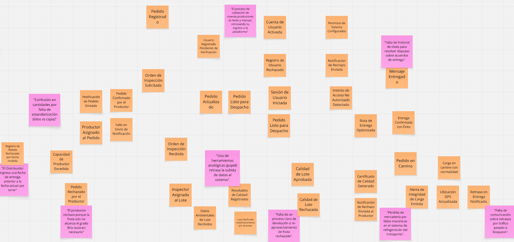
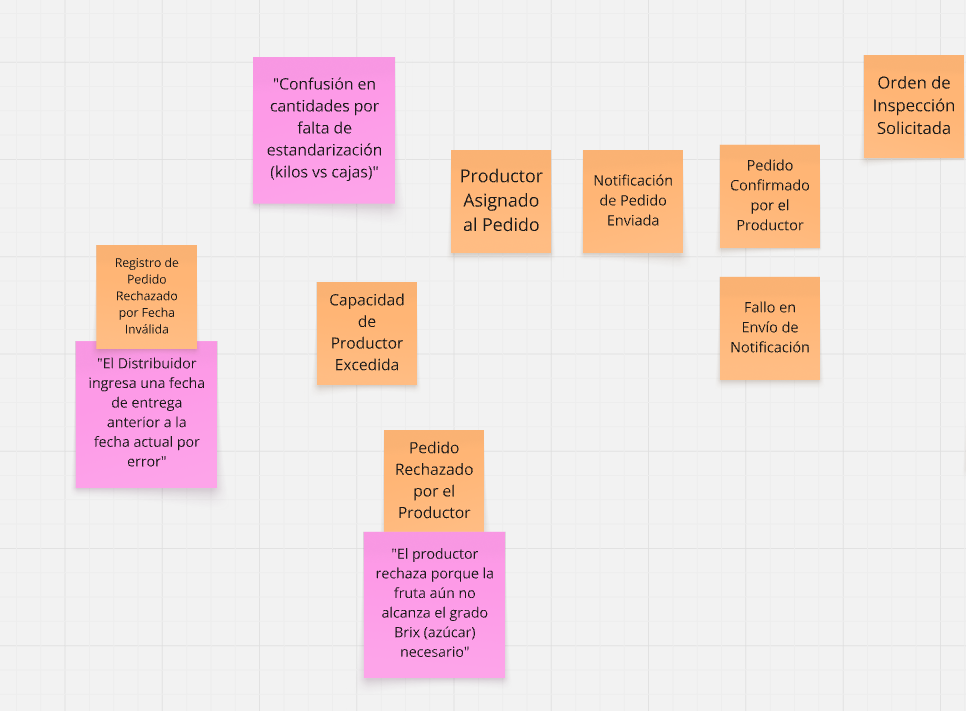
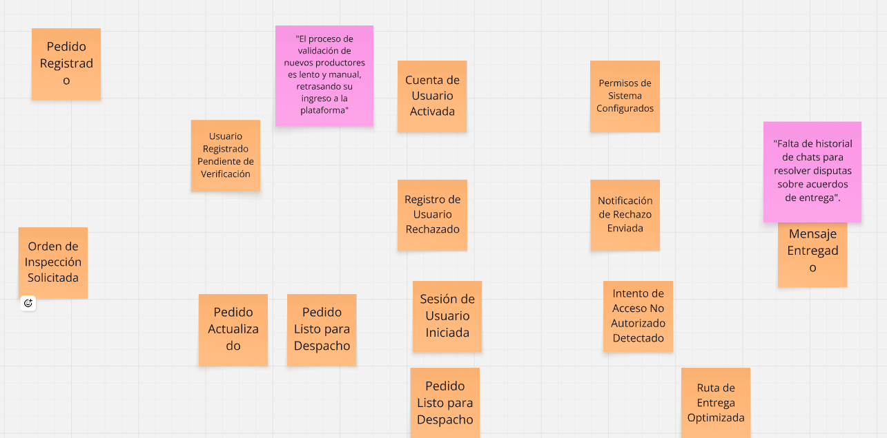
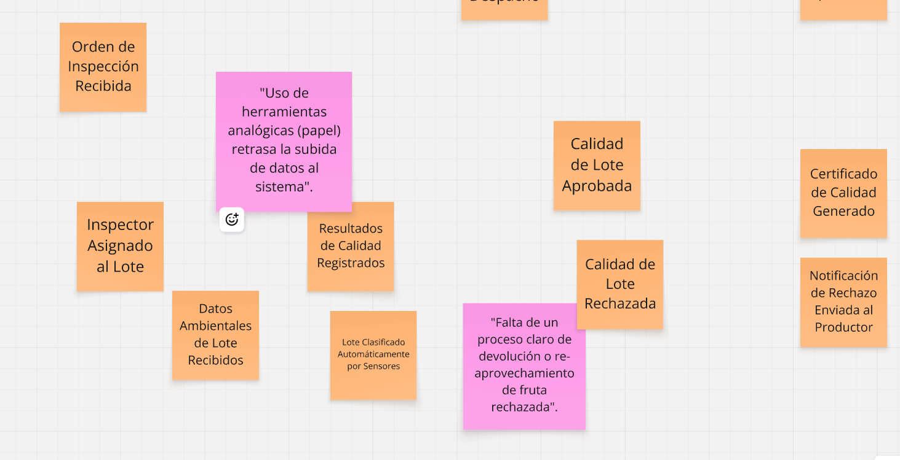
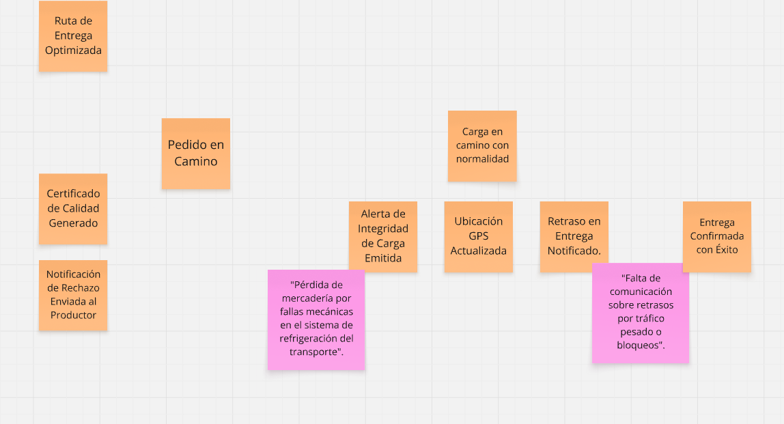
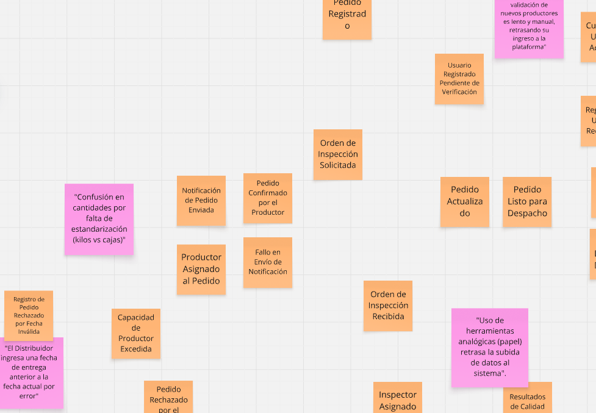

### 2.4. Big Picture EventStorming

### Introducción y Proceso:

Para iniciar el modelado de la arquitectura de FruitLogix, el equipo realizó una sesión de Big Picture Event Storming. El objetivo principal fue explorar el dominio del negocio de manera holística, identificando los eventos significativos que ocurren a lo largo de toda la cadena de suministro de fruta, desde la generación del pedido hasta la entrega final y el análisis de datos.

Durante esta etapa, nos enfocamos en una narrativa cronológica, permitiendo que todos los integrantes del equipo aportaran su visión sobre los hitos del sistema. No se buscaron restricciones técnicas en este punto, sino una comprensión profunda del flujo de trabajo y la terminología del negocio (Ubiquitous Language).

### Resultados y Hallazgos:

A través de este proceso, logramos identificar los siguientes elementos clave:

* **Eventos del Dominio (Naranja):** Se mapearon eventos críticos como "Pedido Registrado", "Lote Inspeccionado", "Ruta de Entrega Iniciada" y "Pedido Entregado".

* **Puntos de Dolor (Rosado):** Se detectaron cuellos de botella importantes, principalmente en la falta de digitalización de las pruebas de calidad y la escasa trazabilidad en tiempo real durante el transporte, lo cual genera incertidumbre en el cliente comercial.

