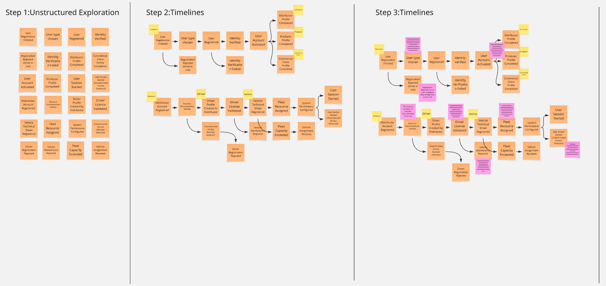
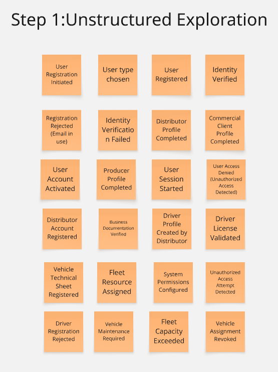
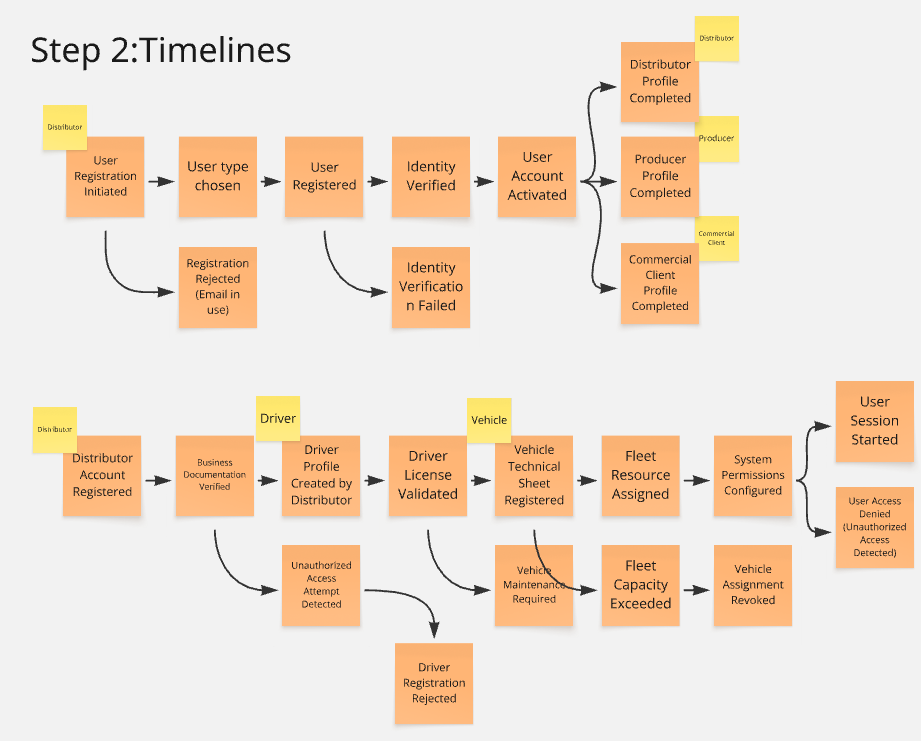
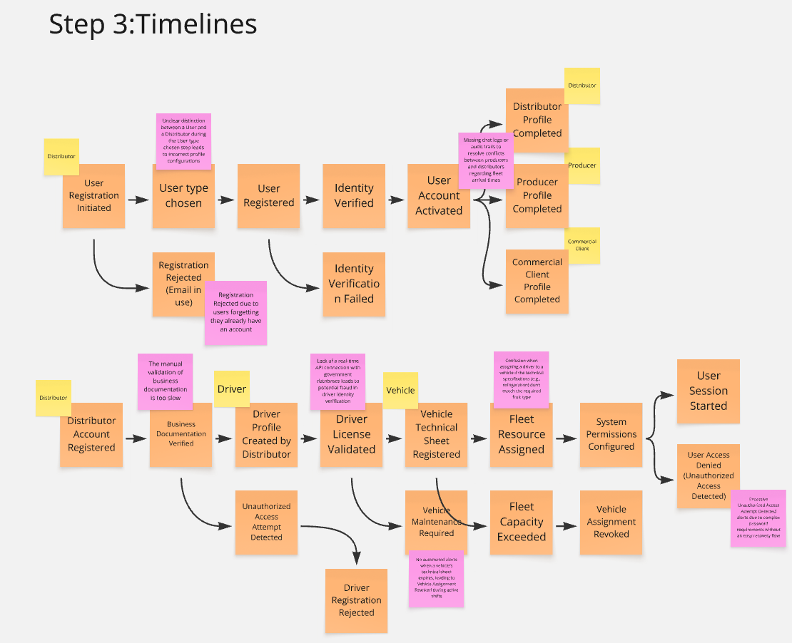

### 2.4. Big Picture EventStorming

### Introducción y Proceso:

Para iniciar el modelado de la arquitectura de FruitLogix, el equipo realizó una sesión de Big Picture Event Storming. El objetivo principal fue explorar el dominio del negocio de manera holística, identificando los eventos significativos que ocurren a lo largo de toda la cadena de suministro de fruta, desde la generación del pedido hasta la entrega final y el análisis de datos.

Durante esta etapa, nos enfocamos en una narrativa cronológica, permitiendo que todos los integrantes del equipo aportaran su visión sobre los hitos del sistema. No se buscaron restricciones técnicas en este punto, sino una comprensión profunda del flujo de trabajo y la terminología del negocio (Ubiquitous Language).

### Resultados y Hallazgos:

A través de este proceso, logramos identificar los siguientes elementos clave:

* **Eventos del Dominio (Naranja):** Se mapearon eventos críticos como "Pedido Registrado", "Lote Inspeccionado", "Ruta de Entrega Iniciada" y "Pedido Entregado".

* **Puntos de Dolor (Rosado):** Se detectaron cuellos de botella importantes, principalmente en la falta de digitalización de las pruebas de calidad y la escasa trazabilidad en tiempo real durante el transporte, lo cual genera incertidumbre en el cliente comercial.

### Paso 1: Exploración Desestructurada (Unstructured Exploration)

Esta fase inicial consistió en una sesión de "lluvia de ideas" para identificar todos los **Eventos de Dominio** significativos dentro del contexto de *Profiles & Fleet Management*. El equipo mapeó eventos que cubren todo el ciclo de vida de los interesados y activos, incluyendo:

* **Incorporación de Usuarios:** Eventos como `User Registration Initiated`, `Identity Verified` y `User Account Activated`.
* **Completitud de Perfiles Específicos:** Hitos como `Distributor Profile Completed`, `Producer Profile Completed` y `Commercial Client Profile Completed`.
* **Gestión de Flota:** Eventos críticos para la cadena logística, incluyendo `Driver License Validated`, `Vehicle Technical Sheet Registered` y `Fleet Resource Assigned`.
* **Manejo de Excepciones:** Identificación preliminar de estados de falla como `Driver Registration Rejected` y `Vehicle Maintenance Required`.

* 

### Paso 2: Líneas de Tiempo (Timelines)

En este paso, los eventos desestructurados se organizaron en un flujo cronológico para definir el **Happy Path** (camino ideal) y las ramas principales.

* **Lógica Secuencial:** La línea de tiempo establece una dependencia clara donde la elección del tipo de usuario (*User type chosen*) conduce a la completitud de perfiles específicos para Distribuidores, Productores o Clientes Comerciales.
* **Prerrequisitos Operativos:** Para el segmento logístico, se ilustra que el registro de la cuenta del distribuidor (*Distributor Account Registered*) debe preceder a la creación de perfiles de conductores y al registro de vehículos.
* **Acceso al Sistema:** El flujo culmina en un inicio de sesión exitoso (*User Session Started*) o en una denegación de acceso por motivos de seguridad (*User Access Denied*).

### Paso 3: Líneas de Tiempo con Puntos Críticos (Timelines with Hotspots)

El refinamiento final de la línea de tiempo incorpora **Hotspots** (representados en púrpura), que identifican "puntos de dolor", riesgos o áreas que requieren mayor definición de políticas arquitectónicas. Las observaciones clave incluyen:

* **Cuellos de Botella en Verificación:** Se identifica que la validación manual de la documentación empresarial es actualmente demasiado lenta.
* **Riesgos de Integridad de Datos:** Se señala la falta de una conexión API en tiempo real con bases de datos gubernamentales para la verificación de identidad y licencias.
* **Fricción Operativa y de UX:** Se resalta la confusión durante la selección del rol (*User type chosen*) y la dificultad para resolver conflictos entre productores y distribuidores respecto a los tiempos de llegada debido a la falta de registros de auditoría.
* **Limitaciones Técnicas:** Se aborda la falta de alertas automatizadas para las fichas técnicas de vehículos que vencen, lo que puede provocar eventos abruptos de revocación de asignación de vehículos (*Vehicle Assignment Revoked*).

