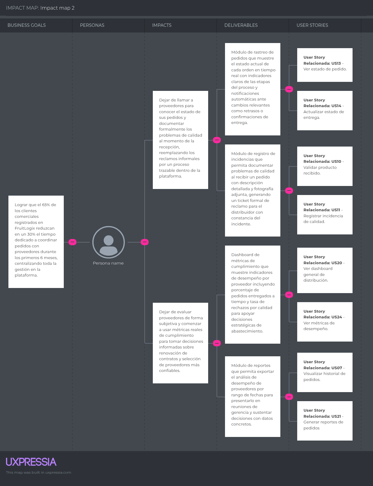
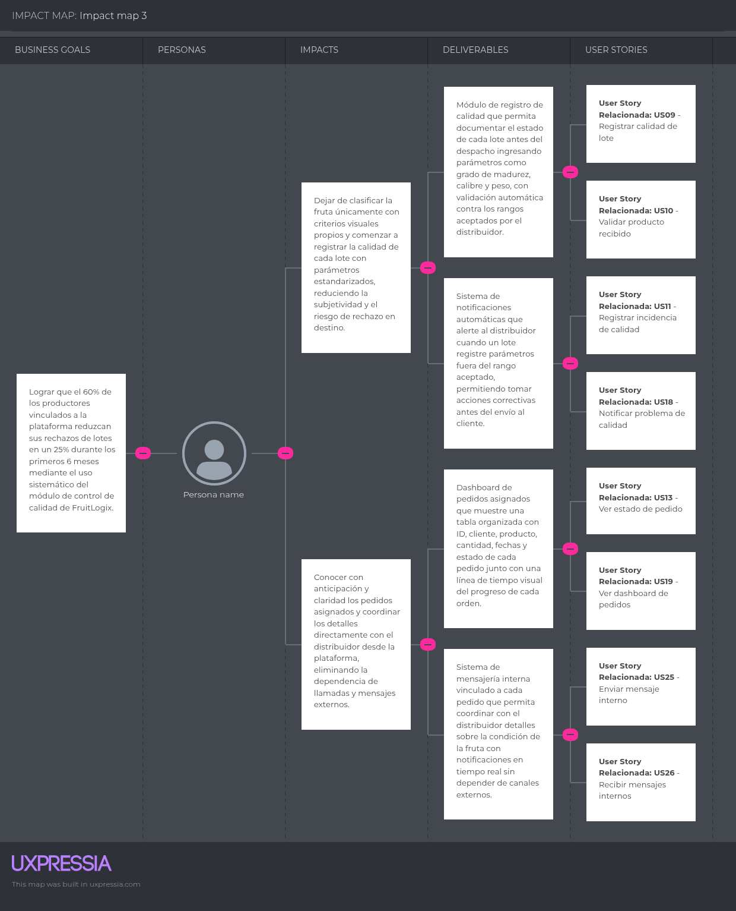
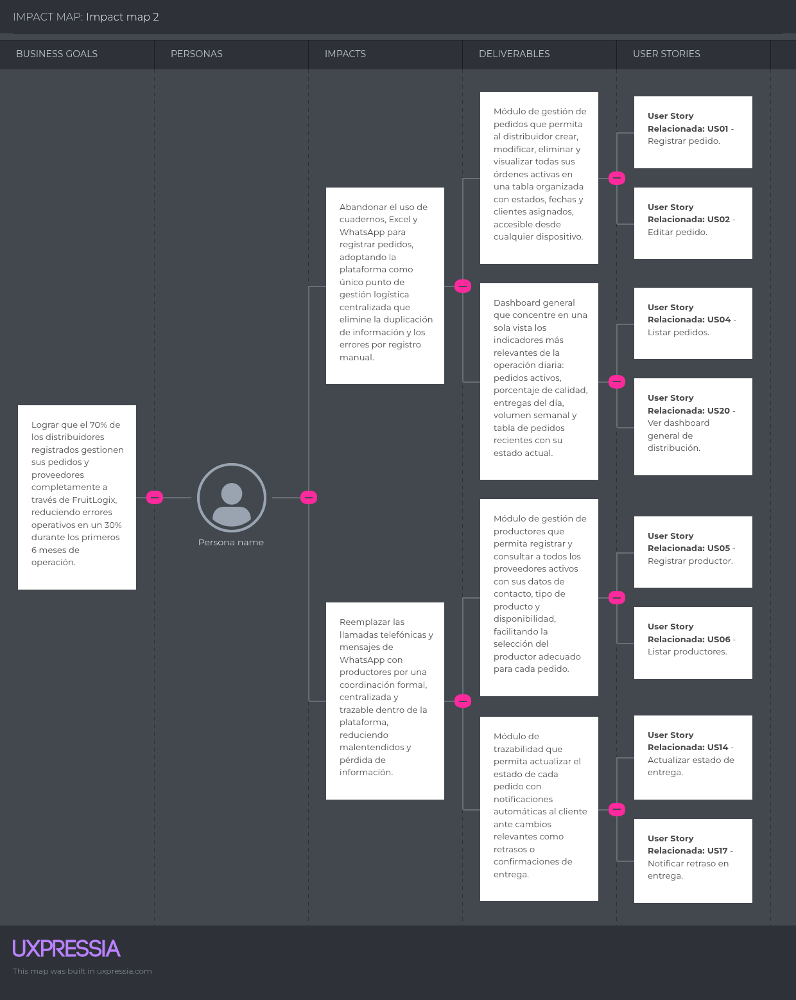

### 3.2. Impact Mapping
 El Impact Mapping es una herramienta de planificación estrategica que nos permite conectar los objetivos de negocio de FruitLogix con los comportamientos de cada segmento objetivo.
 
#### Impact Map - Segmento 1: Cliente Comercial

#### Impact Map - Segmento 2: Productor

#### Impact Map - Segmento 3: Distribuidor de Frutas
