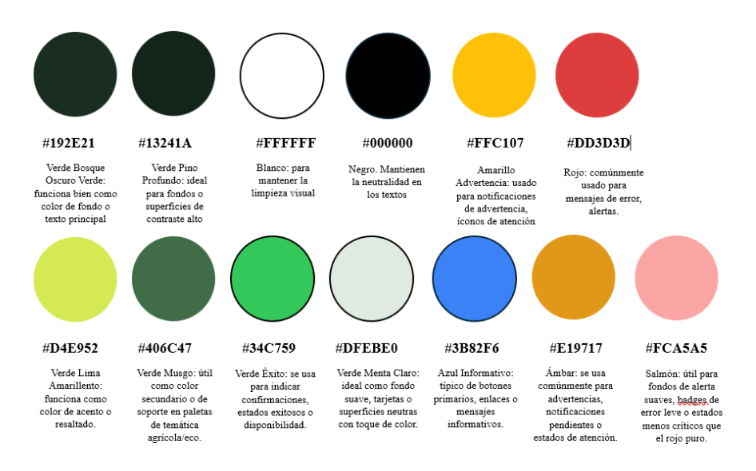

## Capítulo IV: Product Design
### 4.1. Style Guidelines
#### 4.1.1. General Style Guidelines

### El estilo visual de FruitLogix

El estilo visual de FruitLogix se fundamenta en los principios de simplicidad, eficiencia operativa y claridad visual, considerando que los usuarios principales (productores, distribuidores y clientes comerciales) operan en entornos dinámicos donde el tiempo y la precisión son críticos.

Asimismo, se prioriza una interfaz intuitiva y de rápida comprensión, orientada a usuarios con distintos niveles de alfabetización digital, especialmente aquellos que actualmente utilizan herramientas informales como WhatsApp, Excel o registros manuales.

### Principios de diseño:

**Simplicidad**
Se priorizan interfaces limpias y con baja carga cognitiva, reduciendo la cantidad de elementos visibles para facilitar la toma de decisiones rápidas en contextos operativos.

**Consistencia**
Se mantiene un uso uniforme de colores, tipografías y componentes para reducir la curva de aprendizaje y evitar confusión entre diferentes módulos del sistema.

**Jerarquía visual**
La información se organiza según su importancia, destacando estados críticos como retrasos, incidencias o rechazos, permitiendo una rápida interpretación visual.

**Accesibilidad**
Se utilizan contrastes adecuados, tamaños de texto legibles y etiquetas claras para garantizar que todos los usuarios puedan interactuar con la plataforma sin dificultad.

### Paleta de colores:

La selección de los colores transmitirá al usuario la confianza y eficacia, alineando al sector agrícola:

#### Tipografía:

Se seleccionan las tipografías Poppins y Roboto por su alta legibilidad en pantallas digitales y su uso frecuente en aplicaciones modernas, lo que facilita la familiaridad del usuario.

**Fuentes:** Poppins, Roboto

##### Jerarquía tipográfica:

Se establece una jerarquía clara para guiar la atención del usuario.

# Heading 1, Titulo Principales, Poppins, Normal, 28 - 36px

## Heading 2, Subtítulos de sección, Poppins, Normal, 22 – 30 px

### Heading 3, Encabezados de tarjetas o tablas, Poppins, Normal, 18 - 24px

#### Text Roboto, Texto Principal, Normal, 14 - 16px

##### Text Roboto, Texto Secundario, Normal, 12 - 14px

**Spacing:**

Se define un sistema de espaciado basado en múltiplos de 8px para mantener consistencia visual:

* **8px** → separación mínima
* **16px** → separación estándar
* **24px** → separación entre secciones
* **32px+** → separación de bloques principales

**Tono:**

El tono de comunicación de FruitLogix es:

* Serio pero accesible por ser un sistema operativo/logístico
* Formal pero claro evitando tecnicismos innecesarios
* Respetuoso considerando diversidad de usuarios
* Sereno y funcional enfocado en eficiencia más que emoción

Como referencia, se toman principios de sistemas de diseño como Material Design, especialmente en el uso de componentes, jerarquía visual y consistencia en la interacción, adaptándolos al contexto del sector logístico agrícola.

***
#### 4.1.2. Web Style Guidelines

### 1. Layout y estructura

La interfaz de FruitLogix sigue una estructura basada en dashboards, orientada a facilitar la gestión operativa de los usuarios.

* Se utiliza un layout con sidebar lateral para navegación principal.
* El contenido se organiza en una zona central jerárquica, priorizando la información crítica.
* Se emplean cards (tarjetas) para agrupar información relacionada, como pedidos, métricas o incidencias.

**Justificación:**
Este enfoque permite una navegación rápida y familiar, especialmente en sistemas de gestión logística.

### 2. Sistema de grillas (Grid System)

* Se utiliza un sistema de grillas basado en 12 columnas.
* Espaciado consistente basado en múltiplos de 8px.
* Contenedores responsivos que se adaptan a diferentes resoluciones.

**Justificación:**
Facilita la escalabilidad del diseño y la correcta distribución de elementos en distintos dispositivos.

### 3. Componentes UI principales

**Tablas:**
Usadas para listar pedidos, productores e incidencias.

Incluyen:
* Paginación
* Filtros
* Ordenamiento

**Justificación:**
Permiten manejar grandes volúmenes de información de forma clara.

**Botones**

Tipos:
* **Primario:** acciones principales (Guardar, Confirmar)
* **Secundario:** acciones alternativas
* **Peligro:** eliminar o rechazar

Estados:
* Hover
* Activo
* Deshabilitado

**Badges (etiquetas de estado)**
Uso de colores para identificación rápida.

Representan estados del sistema:
* Pendiente
* En proceso
* Entregado
* Rechazado

**Formularios**
* Inputs claros con labels visibles
* Validaciones en tiempo real
* Mensajes de error específicos

Ejemplo: “Cantidad es obligatoria”

**Notificaciones**
Alertas visuales para:
* Errores
* Confirmaciones
* Retrasos

Tipos:
* Toasts (mensajes flotantes)
* Alertas dentro de la interfaz

### 4. Interacción (UX behavior)

**Feedback inmediato**
El sistema proporciona retroalimentación inmediata ante cada acción:

* Guardado exitoso
* Error en formulario
* Cambio de estado

**Justificación:**
Reduce incertidumbre del usuario.

**Restricciones de acciones**
* No se permite editar pedidos en estado “Enviado”
* No se puede marcar como entregado sin estar “En camino”

**Visualización de estado**
Uso de:
* Colores
* Íconos
* Timeline de progreso

### 5. Responsive Design

**Adaptación a dispositivos**
FruitLogix está diseñado para ser accesible desde:

* Desktop (principal)
* Tablet
* Mobile

**Desktop**
* Sidebar visible
* Tablas completas

**Mobile**
* Sidebar colapsable
* Tablas: convertidas a cards
* Botones más grandes
* Prioridad a acciones clave

### 6. Navegación
* Sidebar persistente (desktop)
* Breadcrumbs para ubicación
* Menú claro y jerárquico

### 7. Iconografía
Uso de iconos simples y universales.

Ejemplo:
* Eliminar
* Editar
* Pedidos