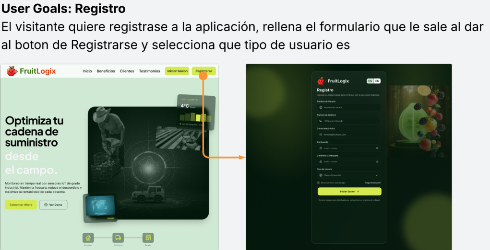
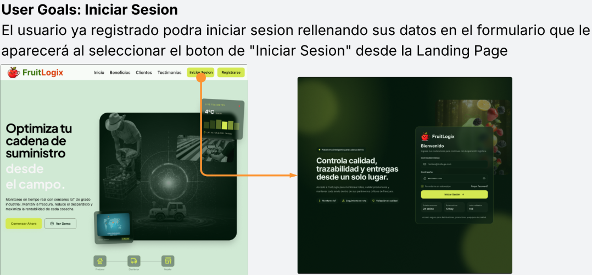

### 4.4. Web Applications UX/UI Design

---
#### 4.4.1. Web Applications Wireframes

### Web Applications Wireframes

En esta sección se presentan los esquemas visuales de baja fidelidad (wireframes) de la aplicación web **FruitLogix**. El objetivo de estos diseños es definir la estructura de la información, la jerarquía de los elementos y el flujo de navegación de los distintos módulos (gestión de pedidos, inventario y monitoreo de calidad).

Estos prototipos permiten validar la usabilidad y la disposición de los componentes funcionales sin la distracción de elementos estéticos, asegurando que la interfaz sea intuitiva para los tres segmentos de usuario identificados.

---

---
#### 4.4.2. Web Applications Wireflow Diagrams

En esta sección se presentan los wireflows de la aplicación web, los cuales combinan la estructura de los wireframes con diagramas de flujo de interacción. El propósito es visualizar el recorrido del usuario a través de los diferentes módulos del sistema, detallando cómo cada acción desencadena una respuesta o un cambio de vista.

Este análisis permite anticipar posibles fricciones en la experiencia de usuario y garantizar que procesos críticos, como el registro de inspecciones de calidad o el seguimiento de rutas, sean lógicos y eficientes.

---

#### 4.4.3. Web Applications Mock-ups

---

* Inicio Sesion

---

* Distribuidor

---

* Productor

---

* Cliente Comercial

  
---
#### 4.4.4. Web Applications User Flow Diagrams

##### User Goals: Registro
El visitante quiere registrase a la aplicación, rellena el formulario que le sale al dar al boton de Registrarse y selecciona que tipo de usuario es

##### User Goals: Iniciar Sesion
El usuario ya registrado podra iniciar sesion rellenando sus datos en el formulario que le aparecerá al seleccionar el boton de "Iniciar Sesion" desde la Landing Page

---

### Distribuidor

User Goals: Acceder al Dashboard
El usuario quiere seleccionar su perfil de rol específico para ingresar al panel de control principal y visualizar las métricas, pedidos y reportes correspondientes a su operación.

User Goals: Gestión y Creación de Pedidos
El usuario Distribuidor desea generar una nueva orden de distribución completando los detalles de logística y productos, con el fin de registrar exitosamente un pedido en el sistema y mantener el flujo operativo.

User Goals: Monitoreo Operativo y Análisis de Datos
El usuario quiere navegar a través de los módulos especializados de Calidad, Inventario, Gestión de Productores y Reportes para auditar el estado de los lotes y optimizar la toma de decisiones basada en datos en tiempo real.

### Productor
User Goals: Registro de Calidad y Seguimiento de Cosecha
El usuario productor desea gestionar sus pedidos asignados y registrar los estándares de calidad de su mercancía, con el fin de mantener un historial transparente y asegurar que los lotes cumplen con los requisitos de exportación o distribución.

### Cliente Comercial
User Goals: Supervisión de Pedidos y Alertas de Stock
El usuario cliente comercial desea monitorear el estatus de sus pedidos asignados y recibir alertas críticas sobre el inventario, con el fin de asegurar el abastecimiento oportuno y reaccionar rápidamente ante cualquier retraso en la cadena de suministro.

