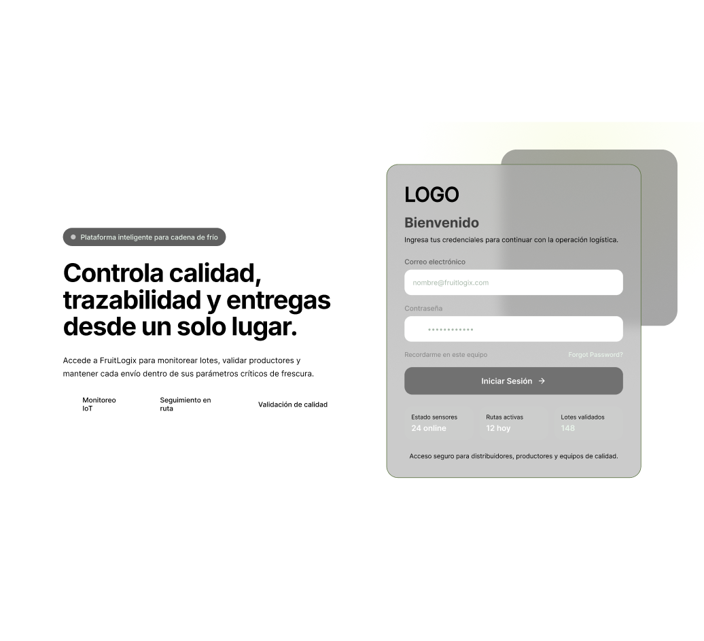

### 4.4. Web Applications UX/UI Design

---
#### 4.4.1. Web Applications Wireframes

### Web Applications Wireframes

En esta sección se presentan los esquemas visuales de baja fidelidad (wireframes) de la aplicación web **FruitLogix**. El objetivo de estos diseños es definir la estructura de la información, la jerarquía de los elementos y el flujo de navegación de los distintos módulos (gestión de pedidos, inventario y monitoreo de calidad).

Estos prototipos permiten validar la usabilidad y la disposición de los componentes funcionales sin la distracción de elementos estéticos, asegurando que la interfaz sea intuitiva para los tres segmentos de usuario identificados.

---

#### 4.4.2. Web Applications Wireflow Diagrams
#### 4.4.3. Web Applications Mock-ups
#### 4.4.4. Web Applications User Flow Diagrams