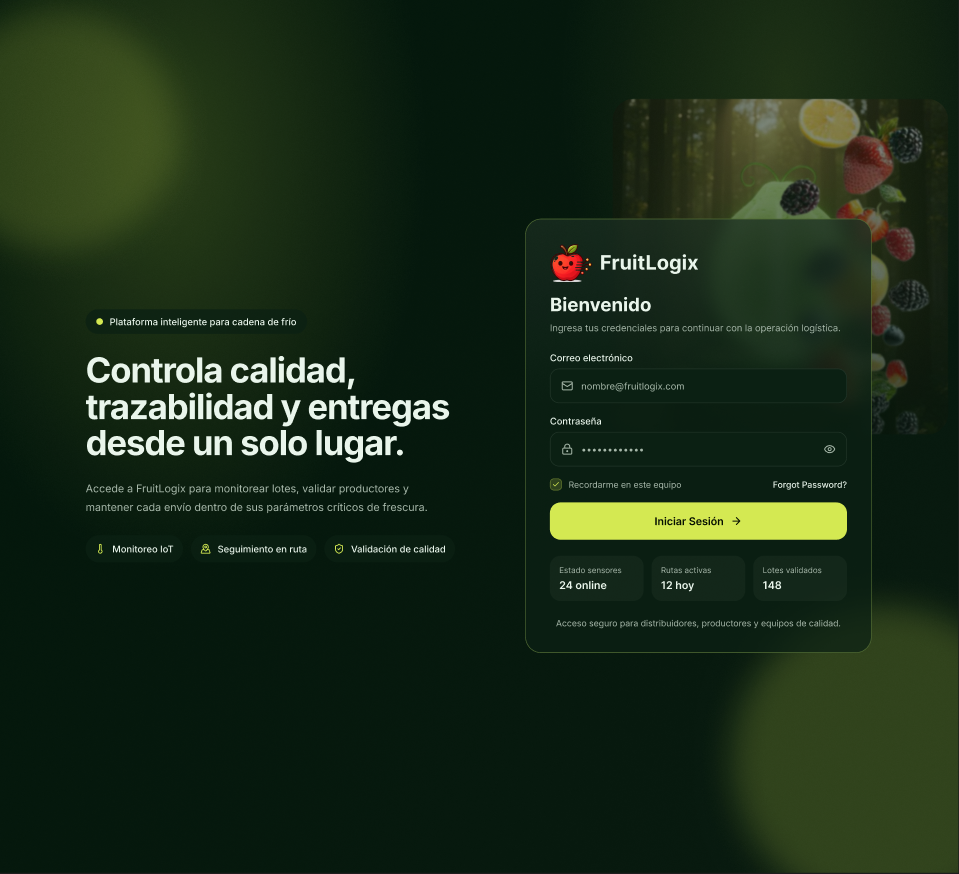
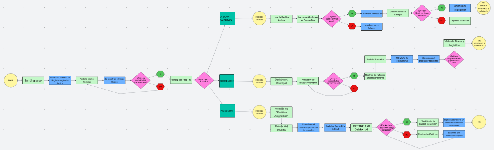
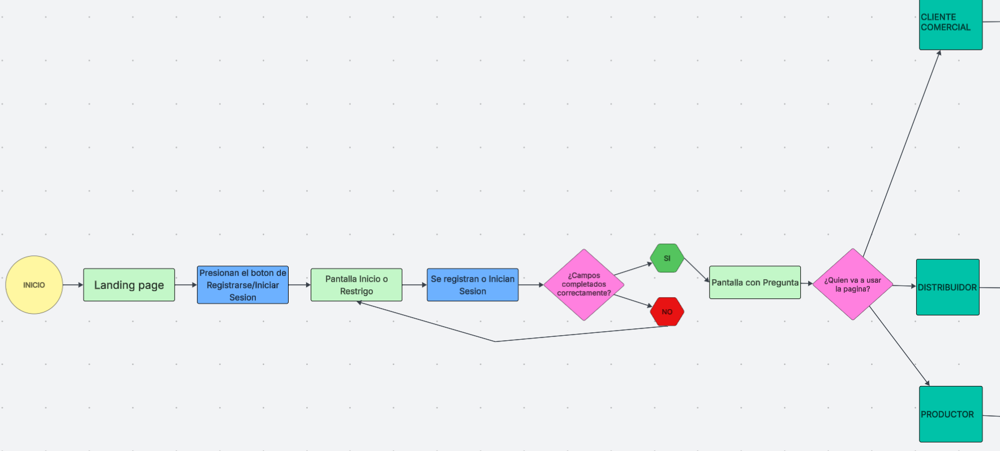
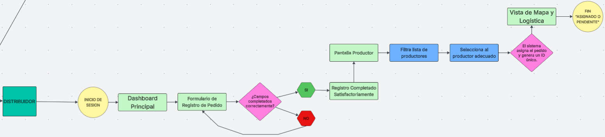
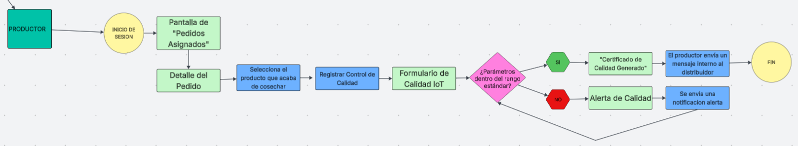
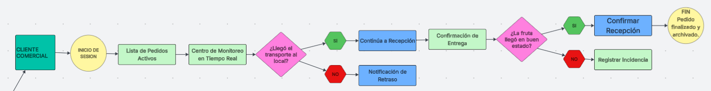

### 4.4. Web Applications UX/UI Design

---
#### 4.4.1. Web Applications Wireframes

### Web Applications Wireframes

En esta sección se presentan los esquemas visuales de baja fidelidad (wireframes) de la aplicación web **FruitLogix**. El objetivo de estos diseños es definir la estructura de la información, la jerarquía de los elementos y el flujo de navegación de los distintos módulos (gestión de pedidos, inventario y monitoreo de calidad).

Estos prototipos permiten validar la usabilidad y la disposición de los componentes funcionales sin la distracción de elementos estéticos, asegurando que la interfaz sea intuitiva para los tres segmentos de usuario identificados.

---

---
#### 4.4.2. Web Applications Wireflow Diagrams

En esta sección se presentan los wireflows de la aplicación web, los cuales combinan la estructura de los wireframes con diagramas de flujo de interacción. El propósito es visualizar el recorrido del usuario a través de los diferentes módulos del sistema, detallando cómo cada acción desencadena una respuesta o un cambio de vista.

Este análisis permite anticipar posibles fricciones en la experiencia de usuario y garantizar que procesos críticos, como el registro de inspecciones de calidad o el seguimiento de rutas, sean lógicos y eficientes.

---

#### 4.4.3. Web Applications Mock-ups

---
* Inicio Sesion

---
* Inicio Sesion

---
* Productor

* Cliente Comercial

---
#### 4.4.4. Web Applications User Flow Diagrams

En esta sección se presentan los User Flows de FruitLogix, los cuales detallan la ruta lógica que siguen los distintos segmentos objetivos para alcanzar sus metas dentro de la plataforma.

A diferencia de los wireflows estructurales, estos diagramas integran los Mock-ups de alta fidelidad, permitiendo visualizar la interacción real del usuario con la interfaz. Se han diseñado flujos que cubren tanto el camino ideal (Happy Path) como las rutas alternativas o de error (Unhappy Paths), garantizando que el sistema responda de manera eficiente ante datos inválidos o fallos en la cadena de suministro.

---

### Distribuidor

**User Goal:** Registrar, asignar y supervisar el ciclo de vida de un pedido logístico.

**Descripción del flujo:** Este diagrama ilustra el proceso central del Distribuidor. El flujo comienza en el Dashboard principal, donde se inicia el registro de un nuevo pedido (US01). Se observa un rombo de decisión crítico: si los datos ingresados son incompletos, el sistema aplica reglas de validación en tiempo real para evitar registros erróneos.

Una vez validado, el flujo avanza hacia la asignación de un Productor Agrícola (US05/US06), culminando con la visualización de la ruta de entrega mediante la integración con la API de Google Maps (US15). Este flujo asegura que la información esté centralizada y disponible para todos los actores desde el primer momento.

---

### Productor

**User Goal:** Registrar parámetros de calidad IoT y habilitar el lote para despacho.

**Descripción del flujo:** El flujo del Productor se centra en la integridad del producto. Tras recibir una notificación de pedido asignado (US19), el usuario procede a registrar los resultados del control de calidad (US09).

El diagrama destaca una ruta alternativa fundamental: si los valores de madurez o temperatura recolectados por los sensores exceden los rangos permitidos, el sistema bloquea el despacho y dispara una notificación de alerta al distribuidor (US18). Si los parámetros son óptimos, el flujo finaliza con la generación del certificado de calidad, habilitando el lote para el transporte.

---

### Cliente Comercial

**User Goal:** Realizar seguimiento en tiempo real y confirmar la recepción conforme del pedido.

**Descripción del flujo:** Este proceso está diseñado para brindar transparencia total al Cliente Comercial. El usuario accede al rastreo de su orden de compra (US13) para visualizar la ubicación y estado de los sensores IoT.

El flujo contempla una bifurcación de decisión al momento de la entrega: si el cliente detecta anomalías físicas en la fruta, el flujo deriva hacia el registro formal de una incidencia (US11), adjuntando evidencia fotográfica. En caso de conformidad, el flujo sigue hacia la confirmación de recepción y el procesamiento del pago mediante la pasarela externa (US30), cerrando el ciclo comercial de forma segura.

