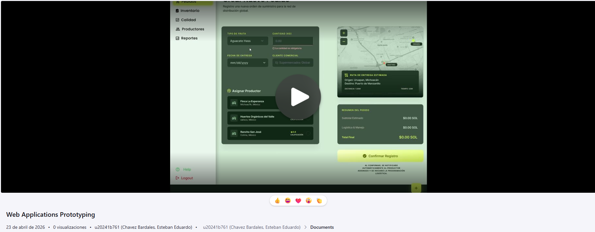

### 4.5. Web Applications Prototyping

### Introducción y Criterios de Interacción

El prototipado de las aplicaciones web de FruitLogix se ha desarrollado con el objetivo de validar la experiencia de usuario (UX) y la eficiencia de los flujos operativos definidos previamente. Las decisiones de diseño e interacción se fundamentan en los siguientes criterios principales:

* **Consistencia Visual y de Navegación:** Se ha implementado un sistema de navegación híbrido que utiliza un *Sidebar* persistente para la versión Desktop y un *Tab bar* inferior para Mobile, asegurando que las funciones críticas (Dashboard, Pedidos y Calidad) estén siempre a un clic de distancia, de acuerdo con la arquitectura de información propuesta.

* **Diseño Basado en Material Design:** Utilizando la biblioteca PrimeVue, se adoptaron componentes de diseño atómicos que garantizan una interfaz limpia, predictiva y profesional, facilitando la curva de aprendizaje para los productores y distribuidores.

* **Interactividad y Feedback:** El prototipo simula estados activos, transiciones suaves entre vistas y mensajes de retroalimentación inmediata (*toasts* y modales de confirmación) para acciones críticas como el registro de parámetros IoT o la asignación de pedidos.

* **Adaptabilidad (Responsive Design):** Se ha priorizado la legibilidad de datos complejos (gráficas de sensores y tablas de trazabilidad) tanto en navegadores de escritorio como en dispositivos móviles, permitiendo que el Distribuidor en campo opere con la misma eficacia que en la oficina.

A continuación, se presentan las evidencias de la simulación de interacción de los prototipos de alta fidelidad, los cuales cubren los *Happy Paths* y rutas alternativas detalladas en los User Flows.

---

### Evidencias de Prototipado
**Aplicación Web:** FruitLogix (Módulos de Distribuidor, Productor y Cliente)

**Screenshot de la simulación:**

**Enlace al video demostrativo:**

* https://upcedupe-my.sharepoint.com/:v:/g/personal/u20241b761_upc_edu_pe/IQAAwvMyhcynSoI195piEL-_AZg78pgpSLDJNtyKFuwk2yM?nav=eyJyZWZlcnJhbEluZm8iOnsicmVmZXJyYWxBcHAiOiJTdHJlYW1XZWJBcHAiLCJyZWZlcnJhbFZpZXciOiJTaGFyZURpYWxvZy1MaW5rIiwicmVmZXJyYWxBcHBQbGF0Zm9ybSI6IldlYiIsInJlZmVycmFsTW9kZSI6InZpZXcifX0%3D&e=HZp1R1
