### 4.6. Domain-Driven Software Architecture
#### 4.6.1. Design-Level EventStorming

#### General
En esta vista general se representó el dominio completo del sistema **FruitLogix**, organizando los procesos en distintos *Bounded Contexts*. Se identificaron las áreas principales del negocio y la interacción entre ellas mediante eventos.

Los contextos definidos fueron:

- Infrastructure & IoT
- Order Management
- Quality Control Context
- Logistics and Monitoring
- Payment Management

Esta representación permite visualizar cómo fluye la información entre módulos desde el registro de fruta, control de calidad, monitoreo, logística y finalmente la gestión de pagos.

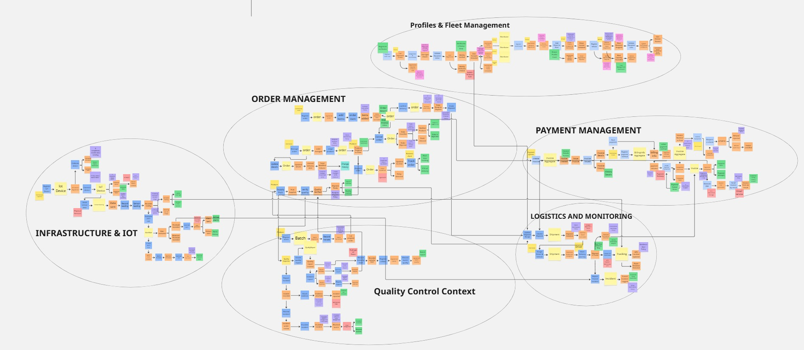

#### Profiles Fleet Management
Este bounded context se encarga de administrar la base de usuarios y los recursos operativos necesarios para el funcionamiento de la plataforma FruitLogix. Su propósito principal es gestionar tanto la identidad de los actores del sistema como los activos logísticos asociados a la operación de distribución.

El flujo inicia con el registro de usuarios, quienes pueden pertenecer a distintos roles dentro del negocio, tales como **Distribuidor**, **Productor** o **Cliente Comercial**. Durante este proceso, el sistema valida la identidad del usuario mediante servicios externos de autenticación, como Auth0 o Firebase, garantizando la seguridad y confiabilidad de los accesos.

Adicionalmente, este contexto contempla la gestión de la flota operativa del distribuidor, permitiendo registrar y validar recursos como conductores y vehículos. Para los conductores, se verifica la vigencia de sus licencias y datos personales antes de su incorporación. En el caso de los vehículos, se revisa su ficha técnica, capacidad de carga, documentación y estado de mantenimiento, asegurando que cumplan con los requisitos necesarios para el transporte de productos.

En conjunto, este módulo establece la base organizacional y operativa del sistema, garantizando una correcta administración de usuarios y recursos logísticos.

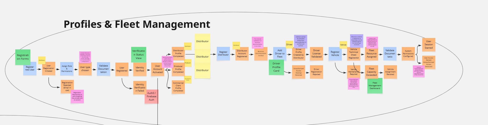

#### Order Management
Este bounded context representa el núcleo comercial de la plataforma, ya que gestiona la relación entre clientes, distribuidores y productores dentro del proceso de comercialización de frutas.

El flujo comienza cuando un cliente comercial registra un pedido en el sistema y añade los productos requeridos. A medida que se incorporan los ítems, el sistema ejecuta políticas de negocio para calcular automáticamente subtotales, cantidades y costos asociados.

Posteriormente, los distribuidores gestionan estas órdenes asignándolas a los productores más adecuados según disponibilidad de stock y capacidad de abastecimiento. Durante este proceso, el sistema verifica la existencia de inventario y el cumplimiento de las condiciones necesarias para atender el pedido.

El contexto también contempla el ciclo de vida completo del pedido, permitiendo realizar modificaciones como actualización de volúmenes, cambio de fechas de entrega o ajustes de información. Asimismo, se gestionan escenarios de cancelación o rechazo, en los cuales el sistema libera automáticamente el inventario comprometido y actualiza el estado de la orden.

Antes de proceder al despacho, el pedido pasa por una validación final de calidad del producto, garantizando que solo los lotes aprobados puedan ser enviados. De esta manera, este módulo asegura una gestión integral del pedido desde su creación hasta su preparación para la distribución.

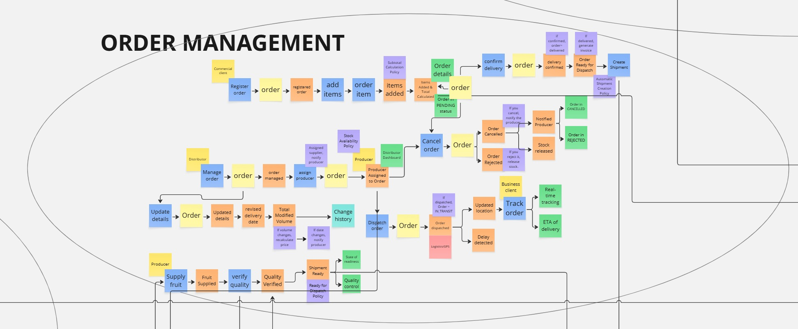

#### Payment Management
Este bounded context se encarga de administrar los procesos financieros, de facturación y cobranza dentro de la plataforma FruitLogix, asegurando la correcta gestión de los pagos asociados a las órdenes realizadas por los clientes comerciales.

El flujo inicia con la recepción de la información proveniente de los pedidos aprobados, a partir de la cual el sistema genera las facturas correspondientes. Posteriormente, el cliente registra o selecciona su método de pago y procede a realizar la transacción mediante una pasarela de pagos integrada.

El sistema contempla distintos escenarios durante este proceso. En caso de pagos exitosos, se registra la operación, se actualiza el historial de facturación y se genera automáticamente el comprobante en formato PDF, el cual puede almacenarse en servicios en la nube y enviarse por correo electrónico al cliente para su consulta.

Asimismo, se gestionan situaciones excepcionales como pagos fallidos o interrumpidos, permitiendo reintentos automáticos o manuales para completar la transacción. También se consideran procesos de devolución y reembolso, donde el sistema interactúa con la pasarela de pagos para revertir cobros, actualizar el estado de la factura y mantener trazabilidad de todas las operaciones financieras realizadas.

En conjunto, este módulo garantiza una administración segura, automatizada y trazable de todas las transacciones económicas dentro de la plataforma.

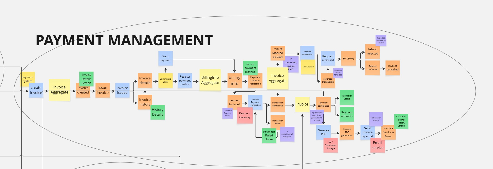

#### Infrastructure IOT
Este bounded context se encarga de la gestión de dispositivos IoT y sensores que permiten monitorear variables físicas y ambientales dentro de la plataforma FruitLogix.El flujo contempla el registro, conexión y calibración de los dispositivos por parte de técnicos o administradores, asegurando su correcto funcionamiento y estado operativo. 
Una vez activos, los sensores envían lecturas en tiempo real, las cuales son procesadas y validadas automáticamente por el sistema.
Además, estas lecturas son evaluadas frente a reglas de monitoreo previamente definidas. Cuando se detecta que algún valor supera los umbrales establecidos, el sistema genera alertas automáticas y envía notificaciones por canales como correo electrónico o SMS. Asimismo, permite configurar y ajustar dinámicamente las reglas de control para cada tipo de dispositivo, garantizando un monitoreo continuo y trazable.
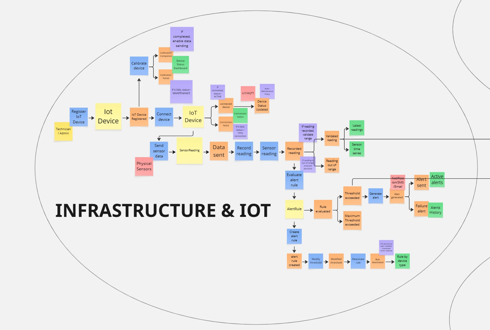

#### Logistics And Monitoring
Este bounded context se encarga de gestionar el proceso de transporte y seguimiento de los envíos dentro de la plataforma FruitLogix.

El flujo inicia con la preparación del envío, donde se calculan rutas óptimas y se asignan los recursos necesarios, como conductor y vehículo. Una vez iniciado el traslado, el sistema realiza un monitoreo en tiempo real mediante GPS, permitiendo visualizar la ubicación del vehículo y controlar el cumplimiento de la ruta establecida.

Además, el sistema detecta automáticamente posibles desvíos, retrasos o incidentes durante el trayecto, facilitando su registro y seguimiento. Finalmente, se confirma la entrega del pedido y se actualiza el estado logístico correspondiente.

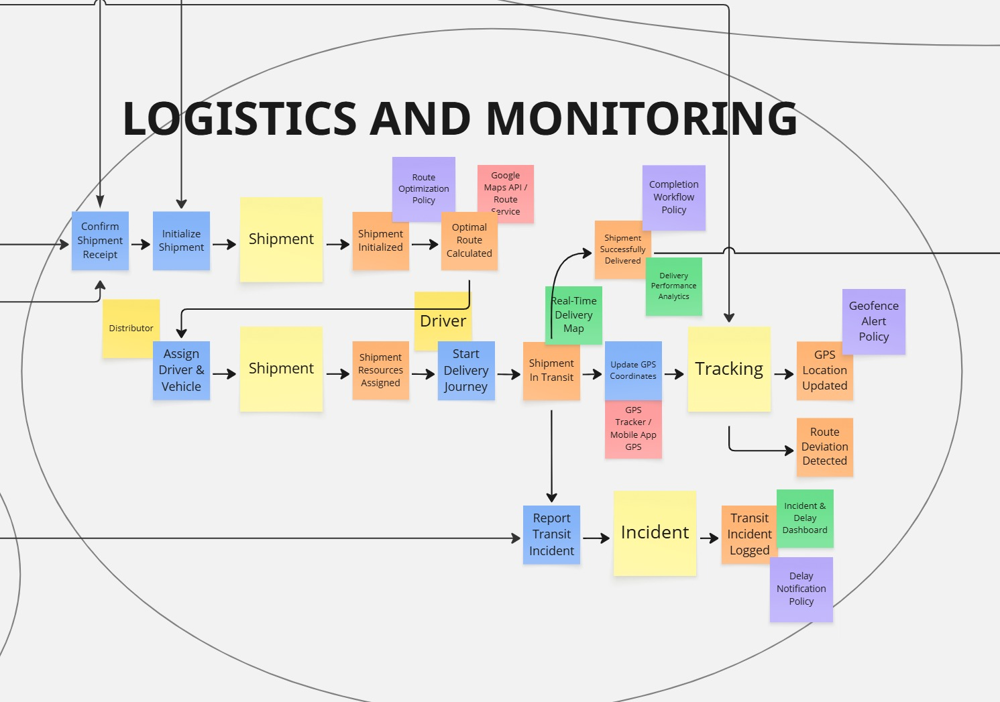

#### Quality Control Context
Este bounded context se enfoca en supervisar la calidad y trazabilidad de los lotes de fruta desde su origen hasta su aprobación para distribución.El proceso comienza con el registro de lotes y la documentación de la cosecha por parte de los productores. 
A partir de ello, se recopilan datos relevantes como madurez, calibre y condiciones del producto, que son evaluados por inspectores mediante reportes de calidad.Si el lote cumple con los estándares establecidos, se aprueba para su envío. En caso contrario, el sistema activa un flujo de gestión de incidentes que permite registrar observaciones, adjuntar evidencias y escalar casos, pudiendo incluso bloquear temporalmente el lote hasta su revisión.

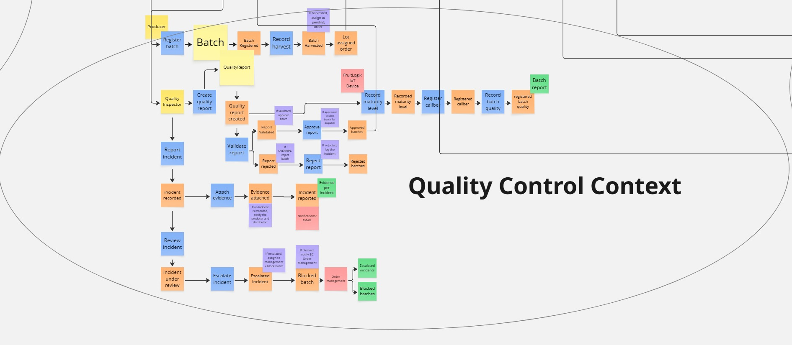

#### 4.6.2. Software Architecture Context Diagram

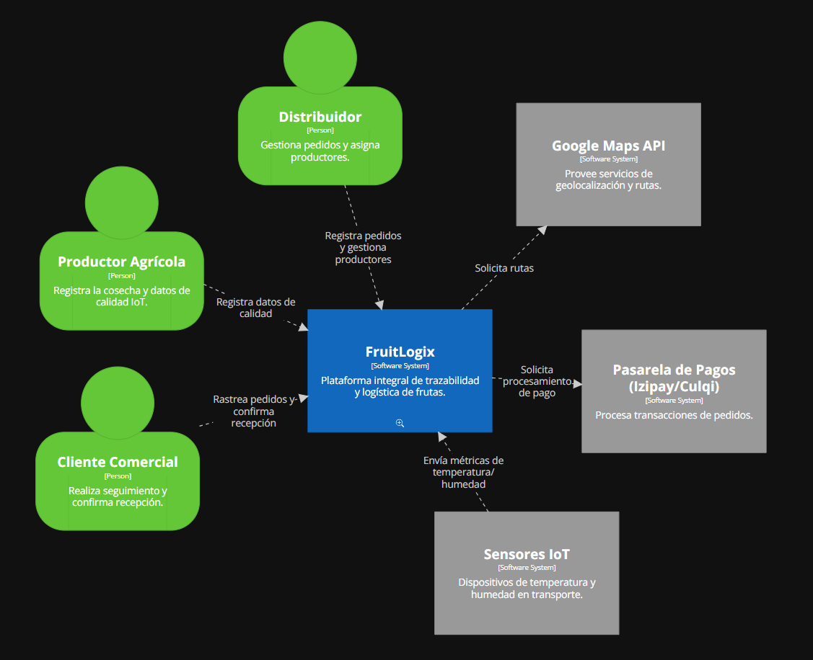

**Nota:** Elaboración propia en Structurizr.

#### 4.6.3. Software Architecture Container Diagrams

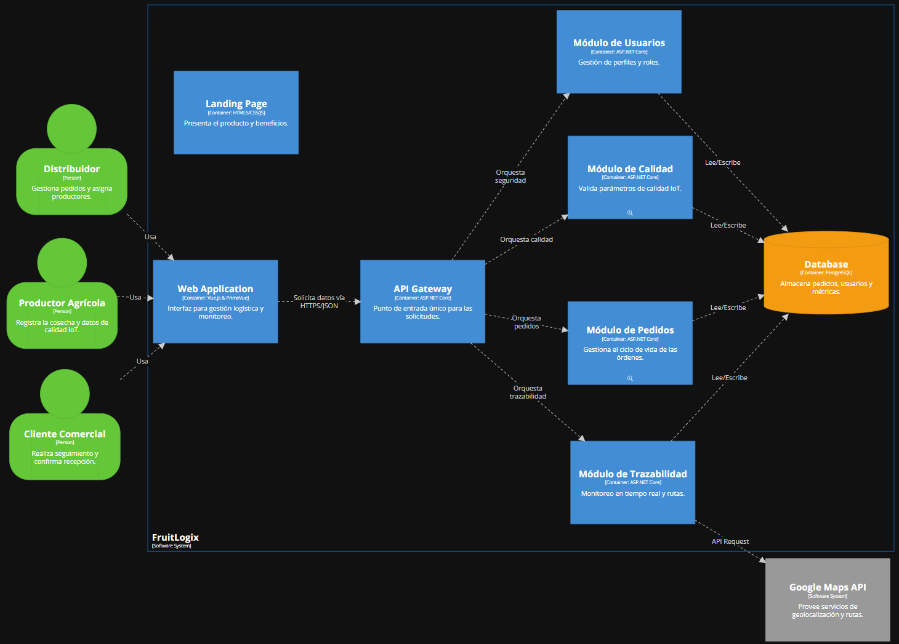
**Nota:** Elaboración propia en Structurizr.

#### 4.6.4. Software Architecture Components Diagrams

* Diagrama de Componentes Pedidos

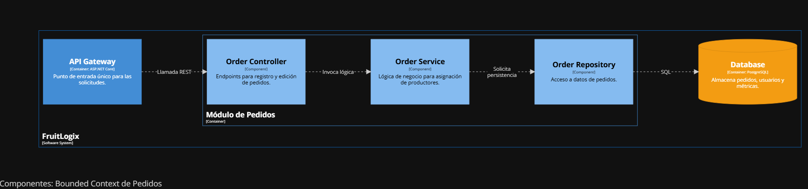

**Nota:** Elaboración propia en Structurizr.

* Diagrama de Componentes Calidad

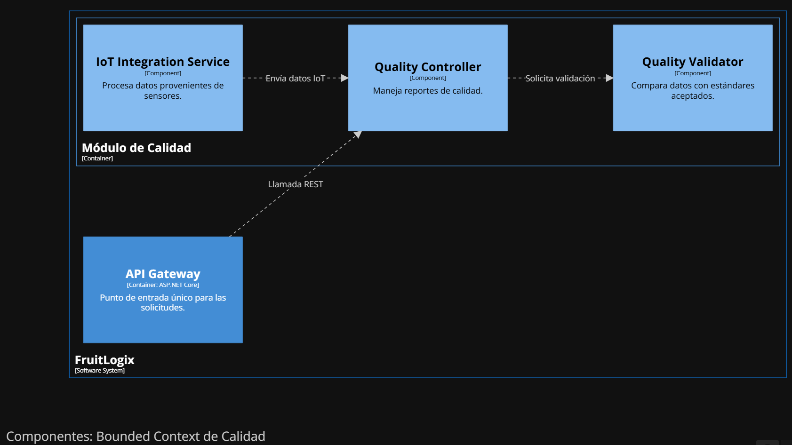

**Nota:** Elaboración propia en Structurizr.