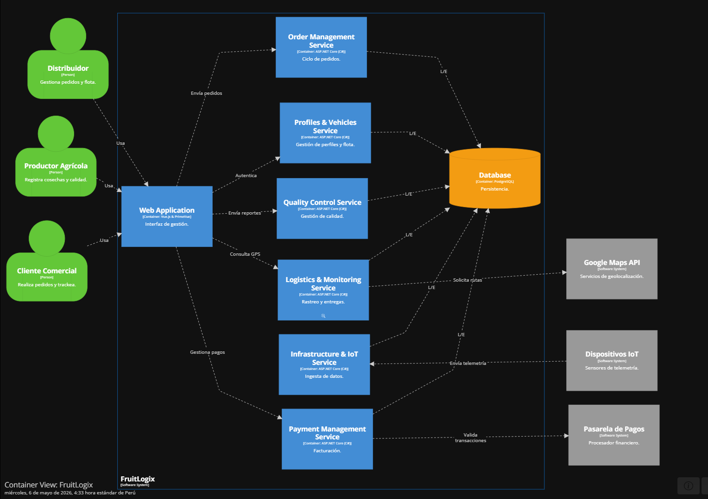

### 4.6. Domain-Driven Software Architecture
#### 4.6.1. Design-Level EventStorming

#### General
En esta vista general se representó el dominio completo del sistema **FruitLogix**, organizando los procesos en distintos *Bounded Contexts*. Se identificaron las áreas principales del negocio y la interacción entre ellas mediante eventos.

Los contextos definidos fueron:

- Infrastructure & IoT
- Profiles Fleet Management
- Order Management
- Quality Control Context
- Logistics and Monitoring
- Payment Management

Esta representación permite visualizar cómo fluye la información entre módulos desde el registro de fruta, control de calidad, monitoreo, logística y finalmente la gestión de pagos.

#### Profiles Fleet Management
Este bounded context se encarga de administrar la base de usuarios y los recursos operativos necesarios para el funcionamiento de la plataforma FruitLogix. Su propósito principal es gestionar tanto la identidad de los actores del sistema como los activos logísticos asociados a la operación de distribución.

El flujo inicia con el registro de usuarios, quienes pueden pertenecer a distintos roles dentro del negocio, tales como **Distribuidor**, **Productor** o **Cliente Comercial**. Durante este proceso, el sistema valida la identidad del usuario mediante servicios externos de autenticación, como Auth0 o Firebase, garantizando la seguridad y confiabilidad de los accesos.

Adicionalmente, este contexto contempla la gestión de la flota operativa del distribuidor, permitiendo registrar y validar recursos como conductores y vehículos. Para los conductores, se verifica la vigencia de sus licencias y datos personales antes de su incorporación. En el caso de los vehículos, se revisa su ficha técnica, capacidad de carga, documentación y estado de mantenimiento, asegurando que cumplan con los requisitos necesarios para el transporte de productos.

En conjunto, este módulo establece la base organizacional y operativa del sistema, garantizando una correcta administración de usuarios y recursos logísticos.

#### Order Management
Este bounded context representa el núcleo comercial de la plataforma, ya que gestiona la relación entre clientes, distribuidores y productores dentro del proceso de comercialización de frutas.

El flujo comienza cuando un cliente comercial registra un pedido en el sistema y añade los productos requeridos. A medida que se incorporan los ítems, el sistema ejecuta políticas de negocio para calcular automáticamente subtotales, cantidades y costos asociados.

Posteriormente, los distribuidores gestionan estas órdenes asignándolas a los productores más adecuados según disponibilidad de stock y capacidad de abastecimiento. Durante este proceso, el sistema verifica la existencia de inventario y el cumplimiento de las condiciones necesarias para atender el pedido.

El contexto también contempla el ciclo de vida completo del pedido, permitiendo realizar modificaciones como actualización de volúmenes, cambio de fechas de entrega o ajustes de información. Asimismo, se gestionan escenarios de cancelación o rechazo, en los cuales el sistema libera automáticamente el inventario comprometido y actualiza el estado de la orden.

Antes de proceder al despacho, el pedido pasa por una validación final de calidad del producto, garantizando que solo los lotes aprobados puedan ser enviados. De esta manera, este módulo asegura una gestión integral del pedido desde su creación hasta su preparación para la distribución.

#### Payment Management
Este bounded context se encarga de administrar los procesos financieros, de facturación y cobranza dentro de la plataforma FruitLogix, asegurando la correcta gestión de los pagos asociados a las órdenes realizadas por los clientes comerciales.

El flujo inicia con la recepción de la información proveniente de los pedidos aprobados, a partir de la cual el sistema genera las facturas correspondientes. Posteriormente, el cliente registra o selecciona su método de pago y procede a realizar la transacción mediante una pasarela de pagos integrada.

El sistema contempla distintos escenarios durante este proceso. En caso de pagos exitosos, se registra la operación, se actualiza el historial de facturación y se genera automáticamente el comprobante en formato PDF, el cual puede almacenarse en servicios en la nube y enviarse por correo electrónico al cliente para su consulta.

Asimismo, se gestionan situaciones excepcionales como pagos fallidos o interrumpidos, permitiendo reintentos automáticos o manuales para completar la transacción. También se consideran procesos de devolución y reembolso, donde el sistema interactúa con la pasarela de pagos para revertir cobros, actualizar el estado de la factura y mantener trazabilidad de todas las operaciones financieras realizadas.

En conjunto, este módulo garantiza una administración segura, automatizada y trazable de todas las transacciones económicas dentro de la plataforma.

#### Infrastructure IOT
Este bounded context se encarga de la gestión de dispositivos IoT y sensores que permiten monitorear variables físicas y ambientales dentro de la plataforma FruitLogix.El flujo contempla el registro, conexión y calibración de los dispositivos por parte de técnicos o administradores, asegurando su correcto funcionamiento y estado operativo. 
Una vez activos, los sensores envían lecturas en tiempo real, las cuales son procesadas y validadas automáticamente por el sistema.
Además, estas lecturas son evaluadas frente a reglas de monitoreo previamente definidas. Cuando se detecta que algún valor supera los umbrales establecidos, el sistema genera alertas automáticas y envía notificaciones por canales como correo electrónico o SMS. Asimismo, permite configurar y ajustar dinámicamente las reglas de control para cada tipo de dispositivo, garantizando un monitoreo continuo y trazable.

#### Logistics And Monitoring
Este bounded context se encarga de gestionar el proceso de transporte y seguimiento de los envíos dentro de la plataforma FruitLogix.

El flujo inicia con la preparación del envío, donde se calculan rutas óptimas y se asignan los recursos necesarios, como conductor y vehículo. Una vez iniciado el traslado, el sistema realiza un monitoreo en tiempo real mediante GPS, permitiendo visualizar la ubicación del vehículo y controlar el cumplimiento de la ruta establecida.

Además, el sistema detecta automáticamente posibles desvíos, retrasos o incidentes durante el trayecto, facilitando su registro y seguimiento. Finalmente, se confirma la entrega del pedido y se actualiza el estado logístico correspondiente.

#### Quality Control Context
Este bounded context se enfoca en supervisar la calidad y trazabilidad de los lotes de fruta desde su origen hasta su aprobación para distribución.El proceso comienza con el registro de lotes y la documentación de la cosecha por parte de los productores. 
A partir de ello, se recopilan datos relevantes como madurez, calibre y condiciones del producto, que son evaluados por inspectores mediante reportes de calidad.Si el lote cumple con los estándares establecidos, se aprueba para su envío. En caso contrario, el sistema activa un flujo de gestión de incidentes que permite registrar observaciones, adjuntar evidencias y escalar casos, pudiendo incluso bloquear temporalmente el lote hasta su revisión.

#### 4.6.2. Software Architecture Context Diagram

El *Context Diagram* es el nivel más alto de abstracción del C4 Model. Su objetivo es mostrar a **FruitLogix** como una “caja negra” en el centro del ecosistema, identificando los actores que interactúan con el sistema y los sistemas externos con los que se integra, sin detallar aún su arquitectura interna o tecnología.

El diagrama fue elaborado en Structurizr siguiendo la notación estándar del C4 Model.

---

## Actores

**Distribuidor:**  
Es el actor central del negocio. Registra pedidos, gestiona la relación con los productores y asigna las órdenes según disponibilidad y calidad. Es el usuario con mayor interacción diaria con el sistema.

**Productor Agrícola:**  
Registra la cosecha disponible y reporta los datos de calidad de cada lote. Puede incluir información capturada por sensores IoT (temperatura y humedad) durante el almacenamiento y transporte inicial.

**Cliente Comercial:**  
Incluye supermercados, restaurantes y juguerías. Su principal interacción es el seguimiento de pedidos en tiempo real y la confirmación de recepción de los productos, cerrando el ciclo de trazabilidad.

---

## Sistemas externos

**Google Maps API:**  
Provee servicios de geolocalización y cálculo de rutas óptimas entre productores, centros de distribución y clientes finales. FruitLogix la utiliza para optimizar tiempos de entrega y reducir el kilometraje en el transporte de productos perecederos.

**Pasarela de Pagos:**  
Proveedores externos que procesan pagos de forma segura mediante tarjetas de crédito, débito y transferencias. Permiten a FruitLogix evitar el manejo directo de datos sensibles, cumpliendo estándares de seguridad como PCI-DSS.

**Sensores IoT:**  
Dispositivos instalados en unidades de transporte y almacenes que monitorean temperatura y humedad en tiempo real. Envían telemetría a FruitLogix, permitiendo generar alertas ante desviaciones en la cadena de frío.

---

## Interacciones principales

El sistema presenta tres tipos de flujos de información:

- **Flujos operativos:** interacción entre actores humanos y FruitLogix para la gestión de pedidos, registro de calidad, seguimiento y confirmación de entregas.
- **Flujos hacia servicios externos:** solicitudes a servicios como Google Maps para cálculo de rutas y optimización logística.
- **Flujos de datos externos:** ingreso de telemetría desde sensores IoT y comunicación con pasarelas de pago para procesar transacciones.

---

## Propósito del sistema

El sistema busca optimizar la toma de decisiones en la cadena de suministro agrícola mediante la integración de información en tiempo real, permitiendo reducir pérdidas por rutas ineficientes o fallas en la cadena de frío.

Asimismo, promueve la reacción temprana ante alertas generadas por sensores IoT, mejorando la eficiencia operativa de distribuidores y productores.

Desde una perspectiva comercial, FruitLogix busca formalizar y asegurar las transacciones en el sector agrícola, generando confianza entre productores, distribuidores y clientes comerciales. La integración de pagos seguros y confirmaciones de entrega permite construir un ecosistema más transparente, eficiente y profesional entre el campo y la ciudad.

**Nota:** Elaboración propia en Structurizr.

#### 4.6.3. Software Architecture Container Diagrams
El Container Diagram profundiza un nivel respecto al Context Diagram: descompone a FruitLogix en sus unidades desplegables (containers), como aplicaciones, servicios y almacenes de datos, y muestra la tecnología elegida para cada uno, así como los protocolos de comunicación entre ellos.

---

## Web Application

Es el único punto de entrada para los tres tipos de usuario: **Distribuidor, Productor Agrícola y Cliente Comercial**.

Se implementa como una *Single Page Application (SPA)* que consume los distintos servicios backend mediante llamadas **REST sobre HTTPS**.

Centraliza:
- Autenticación de usuarios
- Registro y gestión de pedidos
- Consulta de trazabilidad y rutas
- Gestión de pagos (a través del backend)

La aplicación no contiene lógica de negocio compleja, ya que esta se delega completamente a los microservicios del backend.

---

## Backend Services (ASP.NET Core / C#)

El backend está desacoplado en seis microservicios, cada uno alineado a un *Bounded Context* del dominio bajo un enfoque de **Domain-Driven Design (DDD)**:

**Order Management Service:**  
Gestiona el ciclo de vida completo de un pedido: creación, asignación a productores y seguimiento hasta su entrega.

**Profiles & Vehicles Service:**  
Administra los perfiles de usuarios (distribuidores, productores y clientes comerciales) y el registro de la flota de vehículos de transporte.

**Quality Control Service:**  
Gestiona la validación de calidad de los lotes antes del despacho, incluyendo criterios estandarizados y evidencia fotográfica.

**Logistics & Monitoring Service:**  
Calcula rutas óptimas e integra servicios de geolocalización mediante **Google Maps API**, además de monitorear el estado de entregas en tránsito.

**Infrastructure & IoT Service:**  
Recibe e ingiere telemetría desde sensores IoT instalados en unidades de transporte y almacenes, procesando datos de temperatura y humedad para generar alertas.

**Payment Management Service:**  
Gestiona la facturación y valida transacciones de pago integrándose con pasarelas externas como **Izipay o Culqi**.

---

## Base de Datos

Se utiliza una **base de datos relacional compartida**, organizada internamente por esquemas separados según cada *Bounded Context*.

Esta decisión se tomó debido a:
- Tamaño del equipo y del proyecto
- Necesidad de simplicidad operativa
- Consistencia transaccional entre contextos fuertemente relacionados (por ejemplo, pedidos y pagos)

Cada microservicio accede únicamente a su propio esquema, manteniendo el desacoplamiento a nivel lógico. Esto permite una futura migración a bases de datos independientes si el sistema escala.

---

## Integraciones Externas

El sistema se integra con tres tipos de servicios externos:

- **Google Maps API:** utilizada por el Logistics & Monitoring Service para cálculo de rutas y optimización de entregas.
- **Sensores IoT:** dispositivos que envían telemetría en tiempo real al Infrastructure & IoT Service.
- **Pasarela de Pagos (Izipay / Culqi):** utilizada por el Payment Management Service para procesar transacciones de forma segura.

---

## Propósito del Diagrama

El Container Diagram permite visualizar cómo se estructura FruitLogix a nivel de ejecución, mostrando claramente:
- La separación entre frontend y backend
- La descomposición del backend en microservicios especializados
- La integración con sistemas externos críticos
- El uso de una base de datos compartida por esquemas

Finalmente, el diagrama evidencia cómo los datos fluyen entre containers internos y externos, permitiendo al equipo entender las dependencias del sistema, coordinar el desarrollo y preparar una arquitectura escalable, especialmente en módulos críticos como IoT y pagos.

**Nota:** Elaboración propia en Structurizr.

#### 4.6.4. Software Architecture Components Diagrams

* Diagrama de Componentes Pedidos

Primero, el diseño busca estructurar de forma limpia el ciclo de vida de las órdenes de fruta. El componente Order Controller tiene la función de actuar como el punto de contacto que recibe las llamadas REST desde el API Gateway para el registro y edición de pedidos. Inmediatamente después, la responsabilidad se traslada al Order Service, cuyo propósito fundamental es procesar la lógica comercial pesada de la plataforma, como la regla de negocio crítica que decide la asignación óptima de productores agrícolas para cumplir con cada demanda.

Finalmente, el diagrama define un propósito de aislamiento y abstracción en el acceso a los datos. A través del Order Repository, el módulo encapsula todas las operaciones de lectura y escritura, traduciendo las necesidades del servicio en consultas SQL directas hacia la base de datos central en PostgreSQL. Esto asegura que la lógica de asignación y los controladores no dependan directamente de la estructura física de las tablas, facilitando futuras optimizaciones en el rendimiento de las consultas transaccionales de FruitLogix.

**Nota:** Elaboración propia en Structurizr.

* Diagrama de Componentes Calidad

El diseño tiene como fin automatizar la ingesta de telemetría y centralizar la gestión de reportes. A través del IoT Integration Service, el sistema se encarga de procesar los datos crudos provenientes de los sensores ambientales para luego transferirlos al Quality Controller. Este componente actúa como el cerebro del módulo, sirviendo de puente para responder a las solicitudes REST delegadas por el API Gateway, asegurando que la información de calidad esté siempre estructurada y accesible.

Finalmente, el diagrama destaca un propósito clave de automatización del control normativo y reglas de negocio. Al incluir el Quality Validator, el módulo adquiere la capacidad de comparar de forma autónoma los datos recolectados contra los estándares de calidad preestablecidos para la fruta. Esto permite que el sistema dictamine en tiempo real si un lote cumple o no con las condiciones óptimas para su distribución, eliminando la necesidad de inspecciones manuales y optimizando la respuesta de la cadena de suministro ante alertas en la cadena de frío.

**Nota:** Elaboración propia en Structurizr.