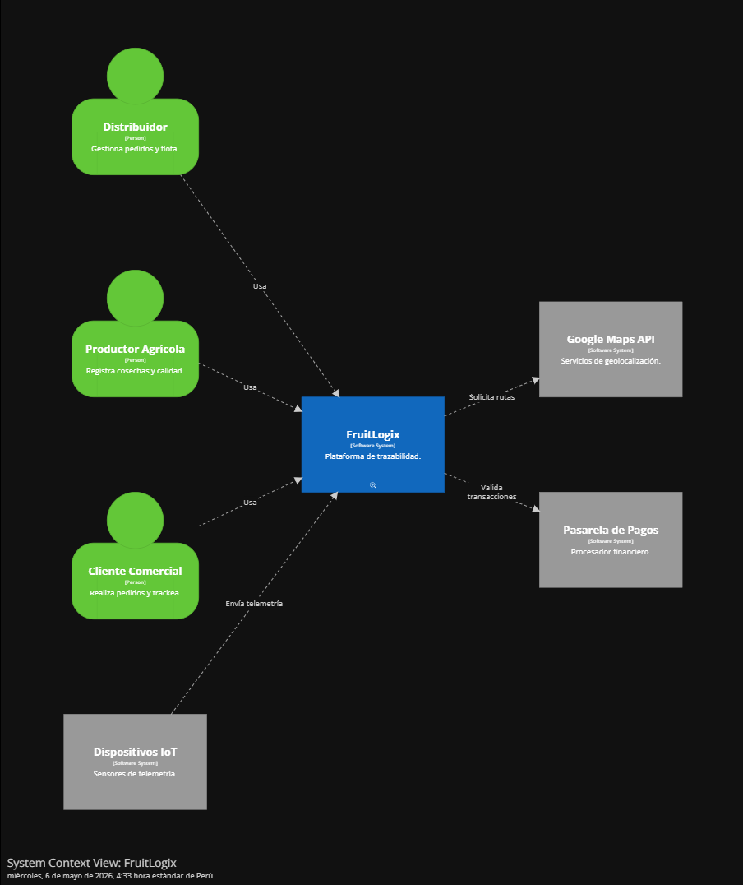
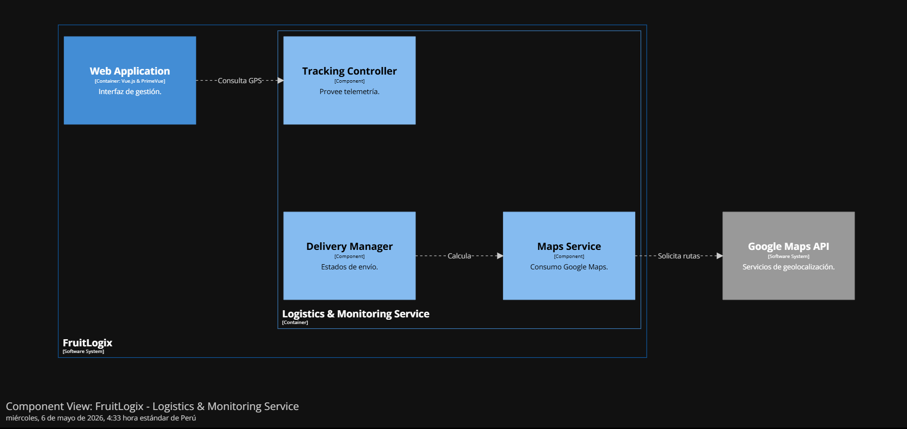

### 4.6. Domain-Driven Software Architecture
#### 4.6.1. Design-Level EventStorming

The domain analysis for FruitLogix was conducted using the Event Storming methodology. This collaborative modeling technique allowed stakeholders and developers to explore the complex logistics domain by identifying significant events that occur within the business process. The primary goal was to bridge the gap between business requirements and technical implementation, establishing a Ubiquitous Language that persists throughout the entire development lifecycle.

#### 4.6.2. Software Architecture Context Diagram

**Nota:** Elaboración propia en Structurizr.

#### 4.6.3. Software Architecture Container Diagrams

**Nota:** Elaboración propia en Structurizr.

#### 4.6.4. Software Architecture Components Diagrams

* Diagrama de Componentes Logistics & Monitoring Service

**Nota:** Elaboración propia en Structurizr.