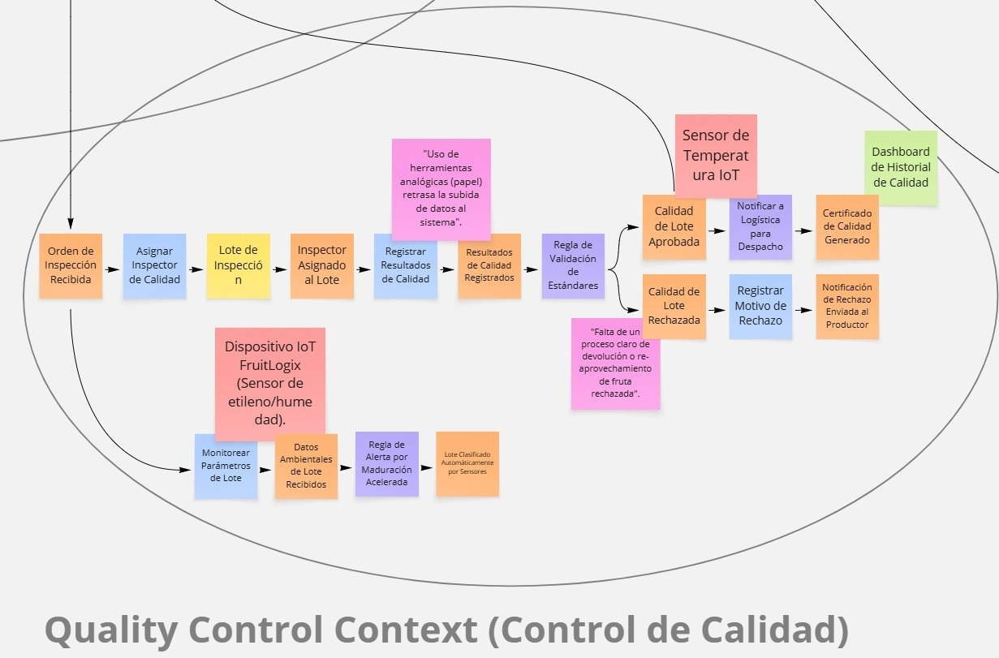

### 4.6. Domain-Driven Software Architecture
#### 4.6.1. Design-Level EventStorming

#### 4.6.2. Software Architecture Context Diagram

**Nota:** Elaboración propia en Lucidchart.

#### 4.6.3. Software Architecture Container Diagrams

**Nota:** Elaboración propia en Lucidchart.

#### 4.6.4. Software Architecture Components Diagrams

**Nota:** Elaboración propia en Lucidchart.

