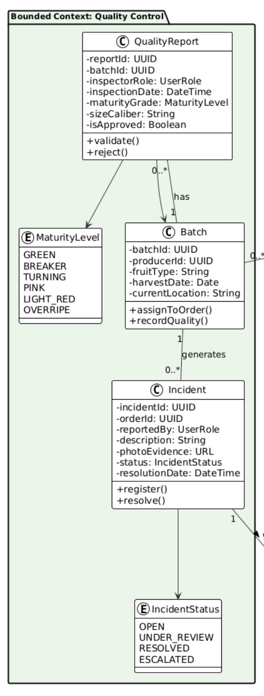
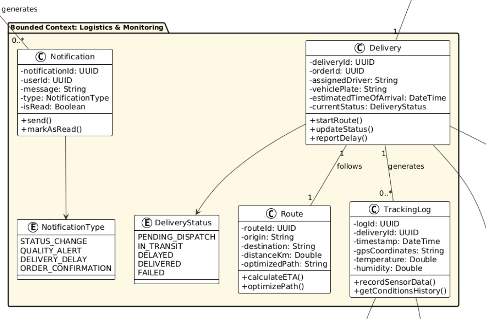
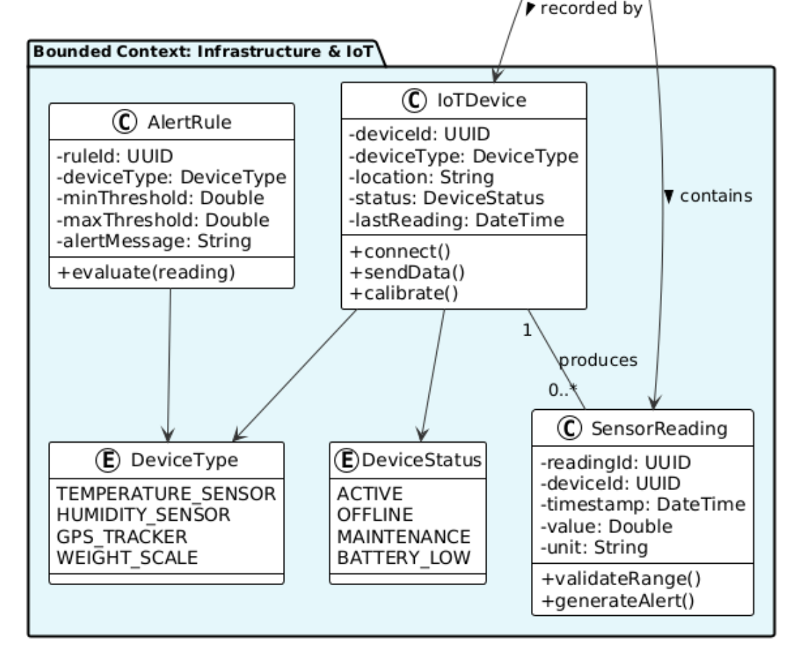
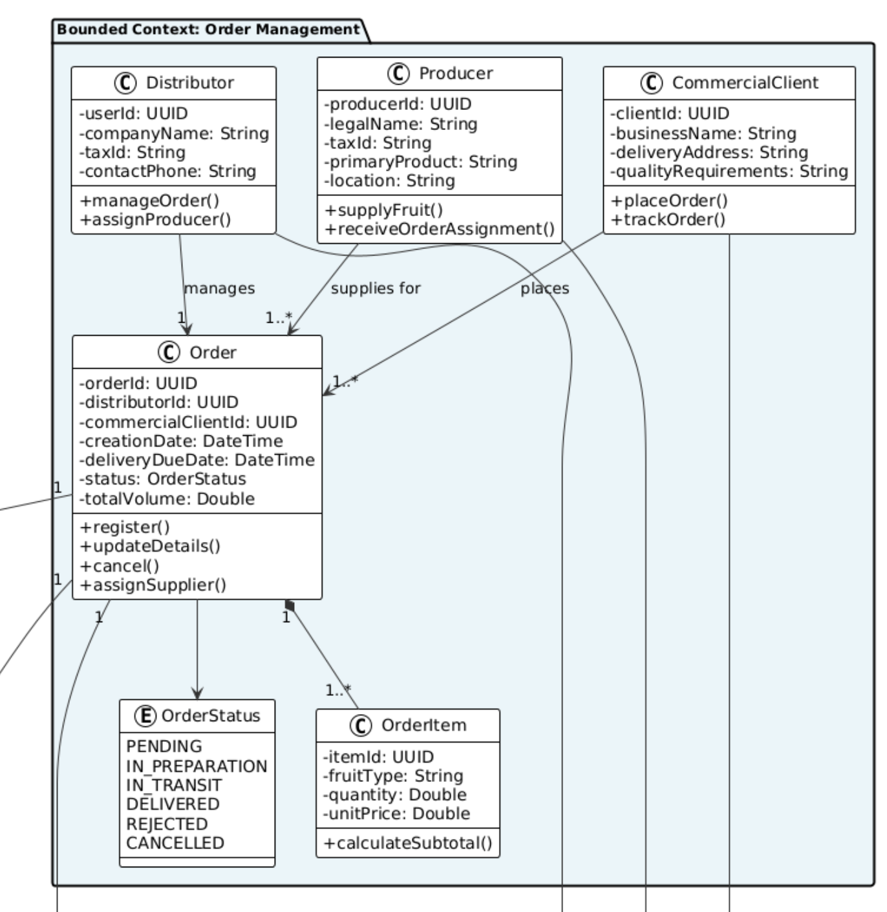
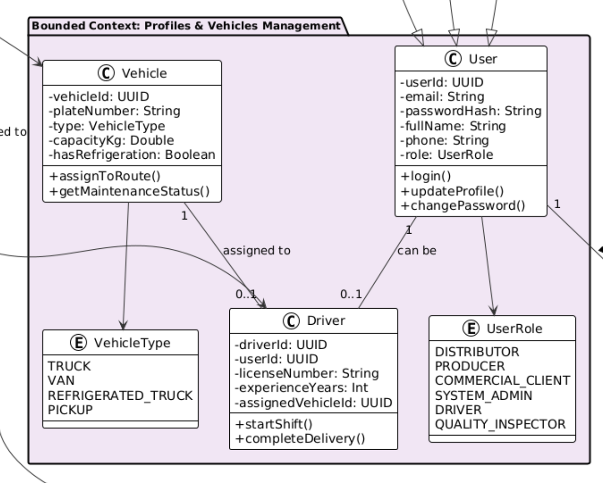
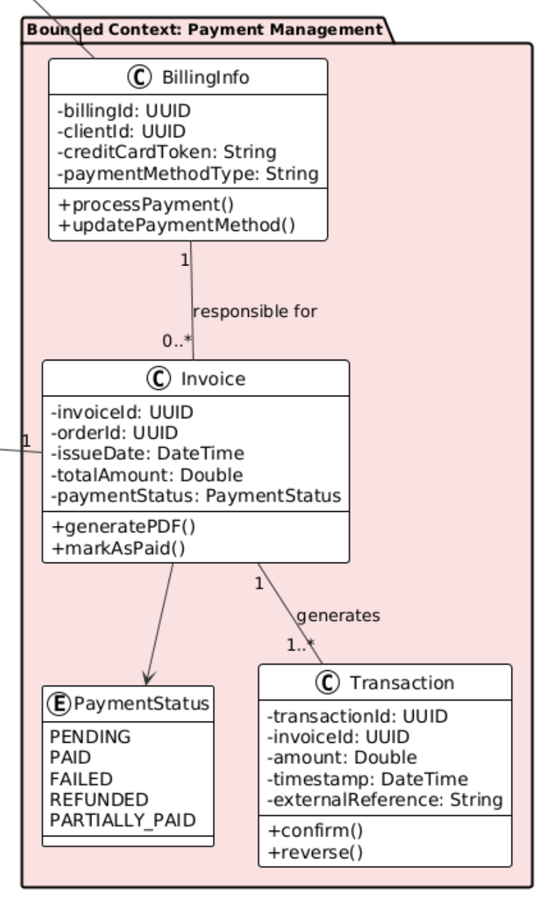
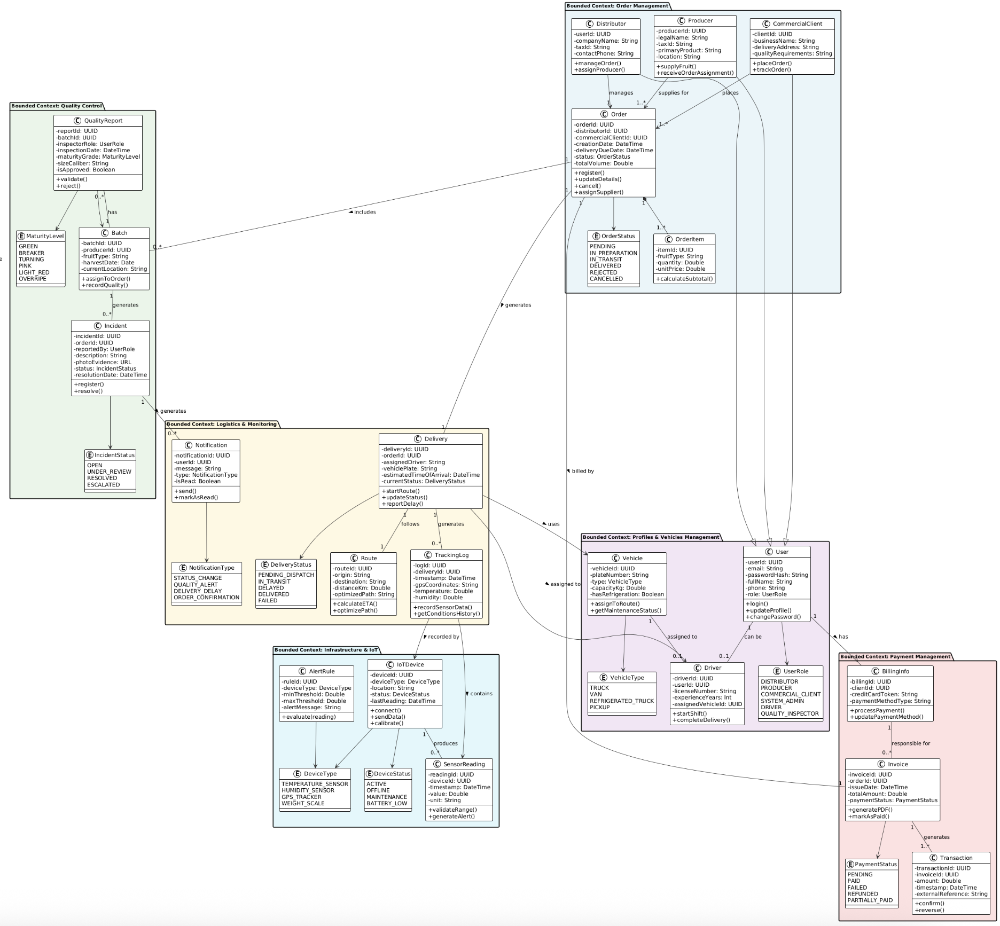

### 4.7. Software Object-Oriented Design
#### 4.7.1. Class Diagrams

#### Bounded Context: Quality Control
Supervisa la calidad de los lotes de fruta.
Se centra en Batch, evaluado mediante QualityReport y gestionado con Incident para registrar problemas y su resolución.

#### Bounded Context: Logistic & Monitoring
Gestiona entregas y monitoreo en tiempo real.
Incluye Delivery, rutas (Route) y registros de seguimiento (TrackingLog) con datos IoT. También maneja Notification para eventos clave.

#### Bounded Context: Infrastructure & IOT
Monitorea sensores y reglas de alerta.
Gestiona IoTDevice, lecturas (SensorReading) y reglas (AlertRule) para detectar condiciones fuera de rango y generar alertas automáticas.

#### Bounded Context: Order Management
Controla todo el ciclo de vida de los pedidos.
La entidad principal es Order, que conecta a clientes, distribuidores y productores. Incluye OrderItem para detallar productos y estados del pedido.

#### Bounded Context: Profiles & Vehicles Management
Gestiona usuarios, roles y transporte.
Incluye la entidad User (con credenciales y rol) y su especialización Driver. También administra Vehicle, que puede asignarse a conductores para operaciones logísticas.

#### Bounded Context: Payment Management
Administra facturación y pagos.
Se basa en Invoice y Transaction, permitiendo procesar, confirmar o revertir pagos. Incluye BillingInfo para datos de pago del usuario.

#### Resultado Diagrama de Clases

