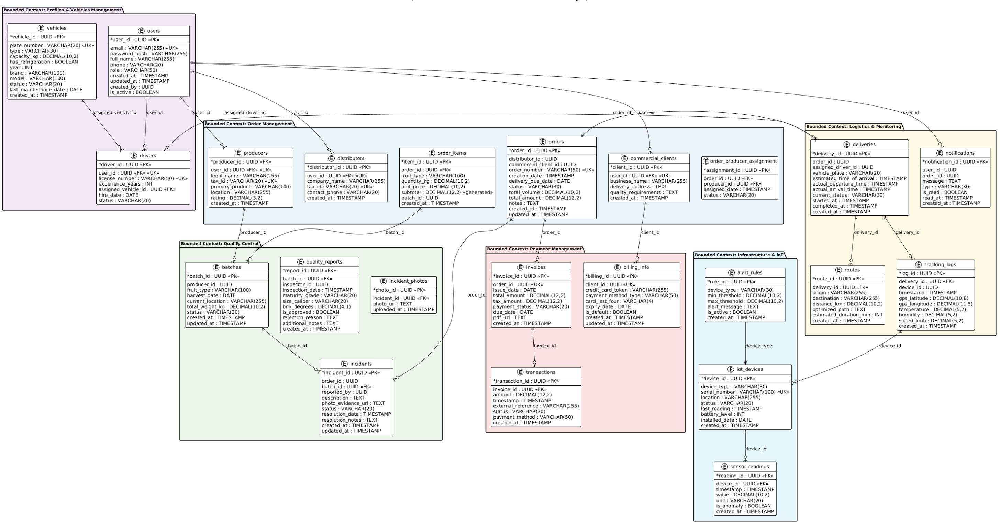

### 4.8. Database Design
#### 4.8.1. Database Diagrams
El diagrama de base de datos de FruitLogix está estructurado en 6 bounded contexts con 23 tablas, siguiendo Domain-Driven Design para asegurar modularidad, escalabilidad y mantenibilidad. Cada contexto (usuarios, pedidos, calidad, logística, pagos e IoT) gestiona una parte específica del sistema, pero todos están integrados mediante llaves foráneas que reflejan el flujo del negocio, desde la creación del pedido hasta su entrega, monitoreo y pago. Esto permite una arquitectura desacoplada pero conectada, garantizando trazabilidad completa, monitoreo en tiempo real y una gestión eficiente de toda la operación.

