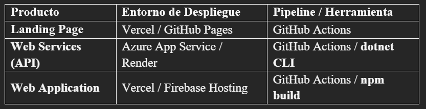

## Capítulo V: Product Implementation, Validation & Deployment
### 5.1. Software Configuration Management
#### 5.1.1. Software Development Environment Configuration

#### 5.1.2. Source Code Management
El control de versiones se realizará en GitHub bajo una organización pública. Se han implementado repositorios independientes para garantizar la modularidad y el despliegue continuo de cada componente:
* Landing Page Repository
  
Estrategia de Branching (GitFlow)
Se implementará el modelo GitFlow para asegurar un ciclo de vida de desarrollo robusto y ordenado:
* main branch: Contiene exclusivamente el código en producción. Cada cambio en esta rama debe estar etiquetado con una versión estable.
* develop branch: Rama principal de integración donde reside el código más reciente de desarrollo.
* feature branches: Ramas temporales para el desarrollo de nuevas User Stories.
* Convención: feature/short-description (ej. feature/order-registration).
  
#### Mensajes de Commit (Conventional Commits)

Para mantener un historial de cambios legible y facilitar la generación automática de changelogs, se utilizará el estándar de Conventional Commits:

#### 5.1.3. Source Code Style Guide & Conventions
#### Naming Conventions:
* Variables y Métodos: camelCase (ej. currentTemperature).
* Clases e Interfaces: PascalCase (ej. LaboratoryController).
* Constantes: UPPER_CASE (ej. MAX_GAS_LEVEL).
* Archivos CSS/HTML/Componentes: kebab-case (ej. dashboard-view.component.html).
#### Guías de Estilo por Lenguaje:
* Java: Google Java Style Guide.
* TypeScript/Angular: Angular Coding Style Guide y Google TypeScript Style Guide.
* HTML/CSS: Google HTML/CSS Style Guide.
#### 5.1.4. Software Deployment Configuration
En esta sección se especifica la configuración y los pasos necesarios para el despliegue de cada uno de los productos que conforman la solución FruitLogix. Se ha adoptado un enfoque de Continuous Deployment (CD) para asegurar que los cambios validados en los repositorios de GitHub se reflejen automáticamente en los entornos de producción mediante GitHub Actions.

#### Configuración por Componente:
#### Landing Page:
* Tecnología: HTML5, CSS3 y JavaScript. 
* Entorno de Desarrollo: JetBrains WebStorm. 
* Proceso: El despliegue se activa automáticamente al realizar un merge en la rama main. Se utiliza Vercel por su optimización para sitios estáticos y soporte nativo para HTTPS, garantizando un tiempo de carga mínimo para los usuarios interesados en el modelo de negocio.

#### Web Services (Backend):
* Tecnología: ASP.NET Core utilizando C# como lenguaje de programación. 
* Entorno de Desarrollo: JetBrains Rider. 
* Proceso: Se utiliza la interfaz de línea de comandos de .NET (dotnet CLI) para la gestión de dependencias y la construcción del artefacto mediante el comando dotnet publish. La aplicación se despliega en Azure App Service. Se han configurado variables de entorno para proteger las credenciales de la base de datos y las llaves de servicios externos. 
* Documentación: Una vez desplegado, el contrato de la API es accesible a través de Swagger UI (OpenAPI Specification) para facilitar la integración con el equipo de frontend. 

#### Frontend Web Application:
* Tecnología: Vue Framework con la biblioteca de componentes PrimeVue (basada en Material Design). 
* Entorno de Desarrollo: JetBrains WebStorm. 
* Proceso: Se ejecuta el comando npm run build para generar los archivos de distribución optimizados. Estos archivos son cargados en Vercel, aprovechando su red de entrega de contenidos (CDN) para asegurar que el dashboard logístico sea fluido y responsivo en cualquier dispositivo. 

#### Consideraciones de Seguridad e Integración:
* SSL/TLS: Todos los productos cuentan con certificados de seguridad para garantizar que la transmisión de datos en la cadena de suministro de FruitLogix sea cifrada. 
* CORS: La Web Application está configurada para consumir los servicios del RESTful API mediante el intercambio de recursos de origen cruzado, permitiendo únicamente peticiones desde los dominios autorizados de la solución. 
