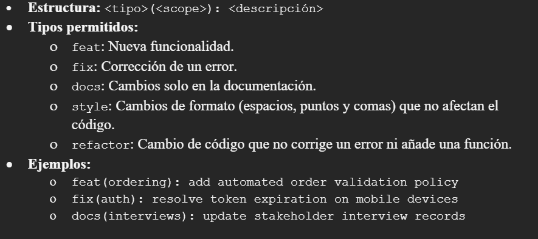

## Capítulo V: Product Implementation, Validation & Deployment
### 5.1. Software Configuration Management
#### 5.1.1. Software Development Environment Configuration

#### 5.1.2. Source Code Management
El control de versiones se realizará en GitHub bajo una organización pública. Se han implementado repositorios independientes para garantizar la modularidad y el despliegue continuo de cada componente:
* Landing Page Repository
  
Estrategia de Branching (GitFlow)
Se implementará el modelo GitFlow para asegurar un ciclo de vida de desarrollo robusto y ordenado:
* main branch: Contiene exclusivamente el código en producción. Cada cambio en esta rama debe estar etiquetado con una versión estable.
* develop branch: Rama principal de integración donde reside el código más reciente de desarrollo.
* feature branches: Ramas temporales para el desarrollo de nuevas User Stories.
* Convención: feature/short-description (ej. feature/order-registration).
  
#### Mensajes de Commit (Conventional Commits)

Para mantener un historial de cambios legible y facilitar la generación automática de changelogs, se utilizará el estándar de Conventional Commits:

#### 5.1.3. Source Code Style Guide & Conventions
#### 5.1.4. Software Deployment Configuration