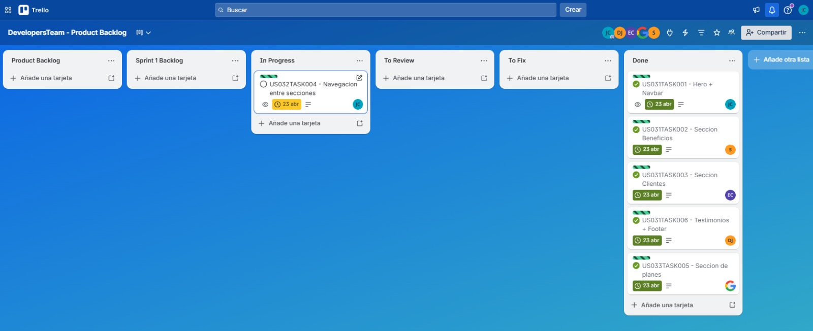
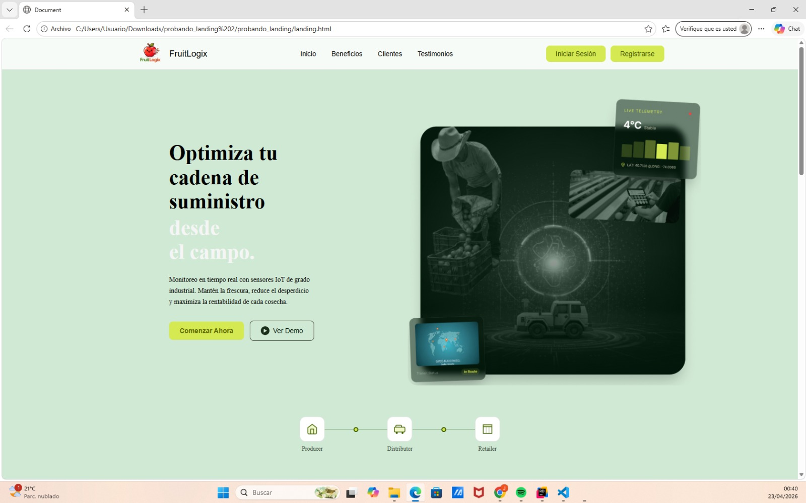
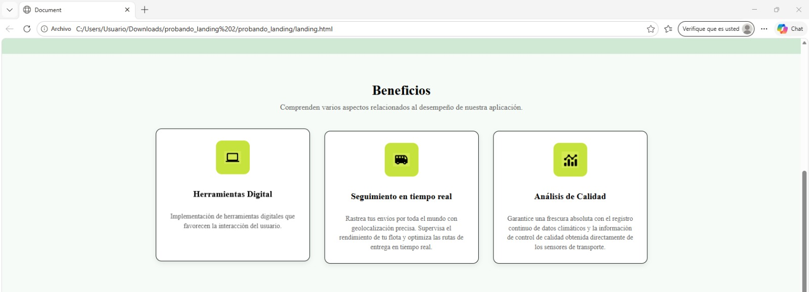
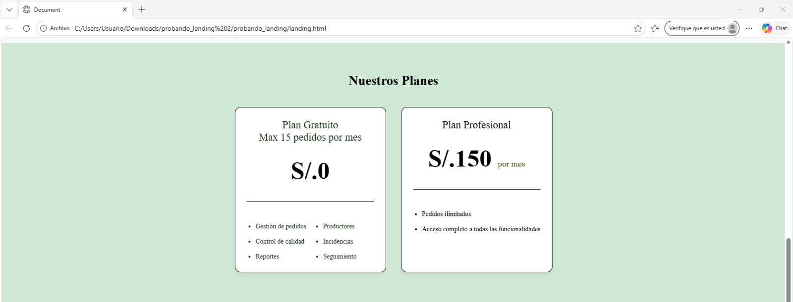
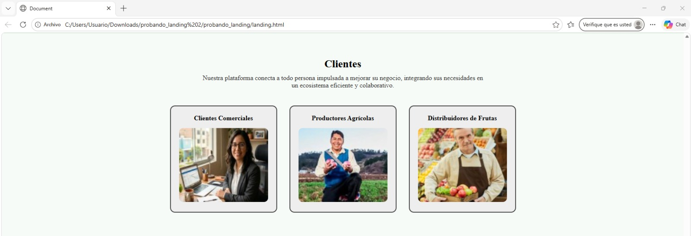
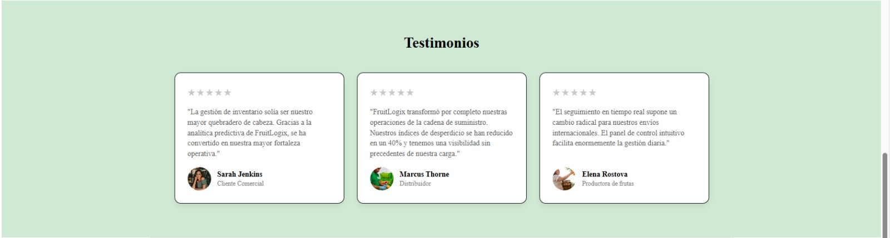
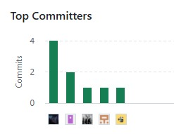
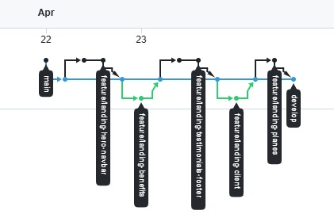
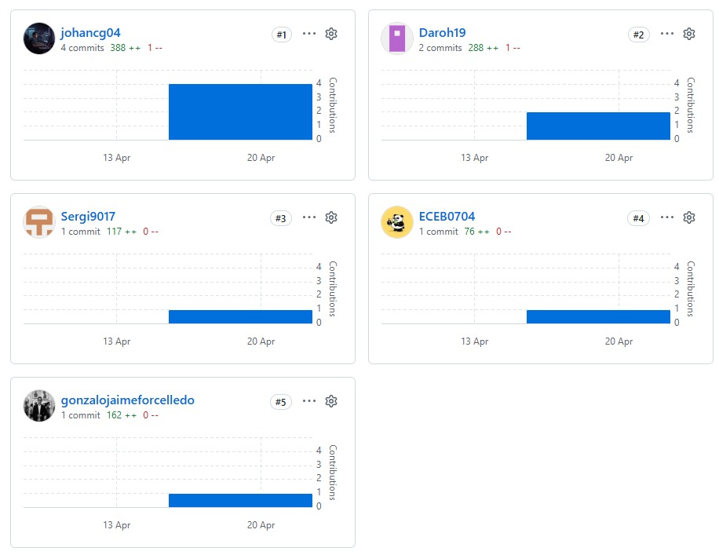

### 5.2. Landing Page, Services & Applications Implementation
En esta sección se describe el proceso de implementación del producto FruitLogix, incluyendo el desarrollo, pruebas, documentación y despliegue del Landing Page.

Para este avance, se implementó la primera versión del Landing Page, orientada a presentar la propuesta de valor del sistema. El desarrollo se realizó utilizando tecnologías web y GitHub como herramienta de control de versiones.
#### 5.2.1. Sprint 1
En esta sección se presenta el avance del Sprint 1 en términos de desarrollo del producto y trabajo colaborativo del equipo.

Durante este sprint se realizó la implementación de la primera versión del Landing Page de FruitLogix, enfocada en presentar la propuesta de valor del sistema.

Asimismo, se incluyen las evidencias relacionadas con la planificación del sprint, la organización del equipo, el backlog definido, el desarrollo realizado, así como los resultados obtenidos y la colaboración durante el proceso.
##### 5.2.1.1. Sprint Planning 1
En esta sección se describen los principales acuerdos y definiciones realizadas durante el Sprint Planning del Sprint 1, enfocado en la implementación del Landing Page de FruitLogix.

| Campo | Detalle |
|------|--------|
| **Sprint #** | Sprint 1 |
| **Sprint Planning Background** |  |
| Date | 2026-04-22 |
| Time | 17:30 |
| Location | Reunión virtual (Google Meet) |
| Prepared By | Contreras Granados, Johan Alexis |
| Attendees (to planning meeting) | Contreras Granados, Johan Alexis - Chavez Bardales, Esteban Eduardo - Evangelista Ygnacio, Sergio Joaquín - Jaime Forcelledo, Gonzalo Alexander - Palomino Vilcañaupa, Daril Johan |
| **Sprint 1 – 1 Review Summary** | Al tratarse del primer sprint del proyecto, no se cuenta con una iteración previa. Sin embargo, se tomó como base el Product Backlog definido y los diseños del Landing Page elaborados en etapas anteriores. |
| **Sprint 1 – 1 Retrospective Summary** | No aplica para este sprint. No obstante, el equipo acordó enfocarse en una correcta distribución de tareas y comunicación constante desde el inicio del desarrollo. |
| **Sprint Goal & User Stories** |  |
| Sprint 1 Goal | Our focus is on developing a functional and responsive landing page that presents the value proposition of FruitLogix. We believe it delivers clear understanding of the product to potential users. This will be confirmed when users can visualize the landing page, navigate between its sections, and correctly view it across different devices. |
| User Stories incluidas en el Sprint | US31: Visualizar Landing Page; US32: Navegar entre secciones del Landing Page; US33: Visualización responsive del Landing Page |
| **Sprint 1 Velocity** | 9 Story Points |
| **Sum of Story Points** | 9 Story Points |

##### 5.2.1.2. Aspect Leaders and Collaborators

En esta sección se define la matriz de liderazgo y colaboración (LACX) del Sprint 1, la cual permite identificar claramente las responsabilidades de cada integrante del equipo en los distintos aspectos del desarrollo.

Para este sprint, los principales aspectos considerados están relacionados con la implementación del Landing Page, incluyendo la estructura visual, navegación entre secciones y adaptación responsive.

Estos aspectos fueron definidos en base a las funcionalidades abordadas en el sprint y permiten organizar de manera eficiente el trabajo del equipo.

| Team Member (Last Name, First Name) | GitHub Username | Estructura del Landing Page | Navegación entre secciones | Diseño Responsive |
|------------------------------------|-----------------|-----------------------------|----------------------------|-------------------|
| Contreras Granados, Johan Alexis | johancg04 | L | C | C |
| Evangelista Ygnacio, Sergio Joaquín | Sergi9017 | C | L | C |
| Chavez Bardales, Esteban Eduardo | ECEB0704 | C | C | L |
| Jaime Forcelledo, Gonzalo Alexander | gonzalojaimeforcelledo | C | C | C |
| Palomino Vilcañaupa, Daril Johan | Daroh19 | C | C | C |

##### 5.2.1.3. Sprint Backlog 1

El Sprint 1 tuvo como objetivo principal la implementación del Landing Page de FruitLogix, permitiendo presentar la propuesta de valor del sistema mediante una interfaz clara, estructurada y accesible.

Para la gestión del Sprint Backlog, se utilizó una herramienta de control de tareas basada en tableros (Trello), donde se organizaron los User Stories y sus respectivos tasks en columnas según su estado de avance.

A continuación, se presenta el tablero correspondiente al Sprint 1 junto con su enlace:

https://trello.com/invite/b/69e8591bc5e24c8aae6fefb7/ATTI43de960425182289c279df7734d6424548D550DA/developersteam-product-backlog

| Sprint # | User Story | Work-Item / Task | Descripción | Estimation (Hours) | Assigned To | Status |
|----------|------------|------------------|-------------|--------------------|-------------|--------|
| Sprint 1 | **US31 - Visualizar Landing Page** | TASK01 - Hero + Navbar | Implementación de la sección principal del Landing Page incluyendo barra de navegación, título y botones de acción. | 4 | Johan | Done |
| Sprint 1 | **US31 - Visualizar Landing Page** | TASK02 - Sección Beneficios | Desarrollo de la sección de beneficios mostrando funcionalidades principales del sistema | 3 | Sergio | Done |
| Sprint 1 | **US31 - Visualizar Landing Page** | TASK03 - Sección Clientes | Implementación de la sección de clientes objetivo del sistema | 3 | Esteban | Done |
| Sprint 1 | **US31 - Visualizar Landing Page** | TASK06 - Testimonios + Footer | Desarrollo de la sección de testimonios y pie de página del Landing Page | 2 | Daril | Done |
| Sprint 1 | **US32 - Navegar entre secciones del Landing Page** | TASK04 - Navegación entre secciones | Implementación del desplazamiento entre secciones del Landing Page | 2 | Johan | In-Process |
| Sprint 1 | **US33 - Visualizar Landing Page** | TASK05 - Responsive Landing | Adaptación del Landing Page a dispositivos móviles y tablets | 4 | Gonzalo | In-Process |

##### 5.2.1.4. Development Evidence for Sprint Review

En este Sprint se logró la implementación del Landing Page de FruitLogix, desarrollando su estructura principal en HTML y CSS, así como la navegación entre secciones y avances en el diseño responsive.

El desarrollo se organizó mediante ramas de tipo feature en GitHub, permitiendo trabajar de manera paralela en las distintas secciones del Landing Page. Los commits reflejan la construcción progresiva de la interfaz, incluyendo la implementación del Hero, secciones informativas y estilos visuales.

A continuación, se presentan los commits más relevantes asociados al desarrollo del Sprint 1.

| Repository | Branch | Commit id | Commit Message | Commit Message Body | Committed on (Date) |
|------------|--------|-----------|----------------|---------------------|----------------------|
| johancg04/fruitlogix-website | feature/landing-hero-navbar | b35e1c4 | feat: add navbar section into landing page. | Se implementa la estructura HTML y estilos CSS del Hero y barra de navegación del Landing Page | 22/04/2026 |
| johancg04/fruitlogix-website | feature/landing-hero-navbar | 2df11db | feat: add hero section in landing page. | Se implementa la estructura HTML y estilos CSS del Hero y barra de navegación del Landing Page | 22/04/2026 |
| Sergi9017/fruitlogix-website | feature/landing-benefits | 01fe667 | feat: add benefits section | Se desarrolla la sección de beneficios mostrando las funcionalidades principales del sistema | 23/04/2026 |
| ECEB0704/fruitlogix-website | feature/landing-client | 0bc60c3 | feat: add clients section | Implementación de la sección de clientes objetivo del sistema | 23/04/2026 |
| Daroh19/fruitlogix-website | feature/landing-testimonials-footer | 3382d87 | feat: add testimonials and footer | Se implementa la sección de testimonios y el footer del Landing Page | 23/04/2026 |
| johancg04/fruitlogix-website | feature/landing-navigation | - | feat: implement navigation scroll | Se implementa la navegación entre secciones mediante scroll | In Progress |
| gonzalojaimeforcelledo/fruitlogix-website | feature/landing-planes | - | feat: add section planes | Se implementa la sección de planes para nuestros usuarios | 23/04/2026 |

##### 5.2.1.5. Execution Evidence for Sprint Review

En el **Sprint 1** se logró implementar el *Landing Page* de **FruitLogix**, permitiendo presentar la propuesta de valor del sistema a través de una interfaz clara, organizada y accesible.

Se desarrollaron las principales secciones del *Landing Page*, incluyendo el **Hero**, **beneficios**, **clientes** y **testimonios**, así como la navegación entre secciones mediante *scroll*. Asimismo, se realizaron avances en la adaptación *responsive* para distintos dispositivos.

A continuación, se presentan evidencias visuales de las principales vistas implementadas en este Sprint.

### Screenshots del Landing Page
### Vista general (Hero + Navbar)

### Seccion Beneficios

### Seccion Planes

### Seccion de Clientes

### Seccion de Testimonios

### Seccion de Footer

##### 5.2.1.6. Services Documentation Evidence for Sprint Review

En el presente Sprint no se implementaron Web Services ni endpoints funcionales, debido a que el alcance estuvo enfocado en el desarrollo del Landing Page como primera versión del producto.

Sin embargo, se definió como parte del análisis inicial la futura implementación de servicios RESTful correspondientes al Epic EP06, los cuales permitirán la integración entre el Landing Page y la Web Application en siguientes Sprints.

Estos servicios estarán orientados a funcionalidades como registro de usuarios, autenticación y gestión de pedidos, los cuales serán documentados utilizando el estándar OpenAPI en futuras iteraciones del proyecto.

https://github.com/upc-pre-202610-1asi0730-12242-DevsTeam/fruitlogix-platform

##### 5.2.1.7. Software Deployment Evidence for Sprint Review

Durante el Sprint 1 se realizó el despliegue exitoso del Landing Page de FruitLogix utilizando la plataforma Vercel, lo que permitió publicar la aplicación web y hacerla accesible mediante una URL pública.

El proceso de deployment incluyó la integración del repositorio de GitHub con Vercel, permitiendo automatizar el despliegue continuo (CI/CD) ante nuevos cambios en el código fuente. Esto facilita futuras iteraciones del producto, asegurando que cada actualización pueda ser publicada de manera rápida y eficiente.

https://fruitlogix-website-devteams.vercel.app/

##### 5.2.1.8. Team Collaboration Insights during Sprint

Durante el **Sprint 1**, el equipo trabajó de manera colaborativa en la implementación del *Landing Page* de **FruitLogix**, organizando las tareas por secciones de la interfaz para permitir el desarrollo en paralelo.

Cada integrante asumió la responsabilidad de una parte específica del *Landing Page* (como **Hero**, **beneficios**, **clientes** y **testimonios**), lo que permitió avanzar de forma eficiente y reducir conflictos en el código. Asimismo, se utilizó **GitHub** como herramienta principal de control de versiones, gestionando el trabajo mediante ramas (*feature branches*) y *commits* individuales.

La integración del trabajo se realizó de manera progresiva, consolidando las distintas secciones en una única versión funcional del *Landing Page*.

## Estrategia de colaboración

- División del trabajo por secciones del *Landing Page*
- Uso de ramas por funcionalidad (*feature branches*)
- Integración progresiva mediante *commits*
- Coordinación del equipo para evitar conflictos en el código

## Evidencia de colaboración

### Commits para landing page:

#### Análisis de colaboración

Se evidencia que todos los miembros del equipo participaron activamente en el desarrollo del Landing Page, realizando commits asociados a sus respectivas tareas. La distribución del trabajo permitió mantener un flujo constante de avances y facilitó la integración final del producto.

El uso de GitHub permitió mantener trazabilidad sobre los cambios realizados, así como identificar la contribución individual de cada integrante.