### 5.2. Landing Page, Services & Applications Implementation
En esta sección se describe el proceso de implementación del producto FruitLogix, incluyendo el desarrollo, pruebas, documentación y despliegue del Landing Page.

Para este avance, se implementó la primera versión del Landing Page, orientada a presentar la propuesta de valor del sistema. El desarrollo se realizó utilizando tecnologías web y GitHub como herramienta de control de versiones.
#### 5.2.1. Sprint 1
En esta sección se presenta el avance del Sprint 1 en términos de desarrollo del producto y trabajo colaborativo del equipo.

Durante este sprint se realizó la implementación de la primera versión del Landing Page de FruitLogix, enfocada en presentar la propuesta de valor del sistema.

Asimismo, se incluyen las evidencias relacionadas con la planificación del sprint, la organización del equipo, el backlog definido, el desarrollo realizado, así como los resultados obtenidos y la colaboración durante el proceso.
##### 5.2.1.1. Sprint Planning 1
En esta sección se describen los principales acuerdos y definiciones realizadas durante el Sprint Planning del Sprint 1, enfocado en la implementación del Landing Page de FruitLogix.

| Campo | Detalle |
|------|--------|
| **Sprint #** | Sprint 1 |
| **Sprint Planning Background** |  |
| Date | 2026-04-22 |
| Time | 17:30 |
| Location | Reunión virtual (Google Meet) |
| Prepared By | Contreras Granados, Johan Alexis |
| Attendees (to planning meeting) | Contreras Granados, Johan Alexis - Chavez Bardales, Esteban Eduardo - Evangelista Ygnacio, Sergio Joaquín - Jaime Forcelledo, Gonzalo Alexander - Palomino Vilcañaupa, Daril Johan |
| **Sprint 1 – 1 Review Summary** | Al tratarse del primer sprint del proyecto, no se cuenta con una iteración previa. Sin embargo, se tomó como base el Product Backlog definido y los diseños del Landing Page elaborados en etapas anteriores. |
| **Sprint 1 – 1 Retrospective Summary** | No aplica para este sprint. No obstante, el equipo acordó enfocarse en una correcta distribución de tareas y comunicación constante desde el inicio del desarrollo. |
| **Sprint Goal & User Stories** |  |
| Sprint 1 Goal | Our focus is on developing a functional and responsive landing page that presents the value proposition of FruitLogix. We believe it delivers clear understanding of the product to potential users. This will be confirmed when users can visualize the landing page, navigate between its sections, and correctly view it across different devices. |
| User Stories incluidas en el Sprint | US31: Visualizar Landing Page; US32: Navegar entre secciones del Landing Page; US33: Visualización responsive del Landing Page |
| **Sprint 1 Velocity** | 9 Story Points |
| **Sum of Story Points** | 9 Story Points |

##### 5.2.1.2. Aspect Leaders and Collaborators

En esta sección se define la matriz de liderazgo y colaboración (LACX) del Sprint 1, la cual permite identificar claramente las responsabilidades de cada integrante del equipo en los distintos aspectos del desarrollo.

Para este sprint, los principales aspectos considerados están relacionados con la implementación del Landing Page, incluyendo la estructura visual, navegación entre secciones y adaptación responsive.

Estos aspectos fueron definidos en base a las funcionalidades abordadas en el sprint y permiten organizar de manera eficiente el trabajo del equipo.

| Team Member (Last Name, First Name) | GitHub Username | Estructura del Landing Page | Navegación entre secciones | Diseño Responsive |
|------------------------------------|-----------------|-----------------------------|----------------------------|-------------------|
| Contreras Granados, Johan Alexis | johancg04 | L | C | C |
| Evangelista Ygnacio, Sergio Joaquín | Sergi9017 | C | L | C |
| Chavez Bardales, Esteban Eduardo | ECEB0704 | C | C | L |
| Jaime Forcelledo, Gonzalo Alexander | gonzalojaimeforcelledo | C | C | C |
| Palomino Vilcañaupa, Daril Johan | Daroh19 | C | C | C |

##### 5.2.1.3. Sprint Backlog 1

El Sprint 1 tuvo como objetivo principal la implementación del Landing Page de FruitLogix, permitiendo presentar la propuesta de valor del sistema mediante una interfaz clara, estructurada y accesible.

Para la gestión del Sprint Backlog, se utilizó una herramienta de control de tareas basada en tableros (Trello), donde se organizaron los User Stories y sus respectivos tasks en columnas según su estado de avance.

A continuación, se presenta el tablero correspondiente al Sprint 1 junto con su enlace:

https://trello.com/invite/b/69e8591bc5e24c8aae6fefb7/ATTI43de960425182289c279df7734d6424548D550DA/developersteam-product-backlog

| Sprint # | User Story | Work-Item / Task | Descripción | Estimation (Hours) | Assigned To | Status |
|----------|------------|------------------|-------------|--------------------|-------------|--------|
| Sprint 1 | **US31 - Visualizar Landing Page** | TASK01 - Hero + Navbar | Implementación de la sección principal del Landing Page incluyendo barra de navegación, título y botones de acción. | 4 | Johan | Done |
| Sprint 1 | **US31 - Visualizar Landing Page** | TASK02 - Sección Beneficios | Desarrollo de la sección de beneficios mostrando funcionalidades principales del sistema | 3 | Sergio | Done |
| Sprint 1 | **US31 - Visualizar Landing Page** | TASK03 - Sección Clientes | Implementación de la sección de clientes objetivo del sistema | 3 | Esteban | Done |
| Sprint 1 | **US31 - Visualizar Landing Page** | TASK06 - Testimonios + Footer | Desarrollo de la sección de testimonios y pie de página del Landing Page | 2 | Daril | Done |
| Sprint 1 | **US32 - Navegar entre secciones del Landing Page** | TASK04 - Navegación entre secciones | Implementación del desplazamiento entre secciones del Landing Page | 2 | Johan | In-Process |
| Sprint 1 | **US33 - Visualizar Landing Page** | TASK05 - Responsive Landing | Adaptación del Landing Page a dispositivos móviles y tablets | 4 | Gonzalo | In-Process |

##### 5.2.1.4. Development Evidence for Sprint Review

En este Sprint se logró la implementación del Landing Page de FruitLogix, desarrollando su estructura principal en HTML y CSS, así como la navegación entre secciones y avances en el diseño responsive.

El desarrollo se organizó mediante ramas de tipo feature en GitHub, permitiendo trabajar de manera paralela en las distintas secciones del Landing Page. Los commits reflejan la construcción progresiva de la interfaz, incluyendo la implementación del Hero, secciones informativas y estilos visuales.

A continuación, se presentan los commits más relevantes asociados al desarrollo del Sprint 1.

| Repository | Branch | Commit id | Commit Message | Commit Message Body | Committed on (Date) |
|------------|--------|-----------|----------------|---------------------|----------------------|
| johancg04/fruitlogix-website | feature/landing-hero-navbar | b35e1c4 | feat: add navbar section into landing page. | Se implementa la estructura HTML y estilos CSS del Hero y barra de navegación del Landing Page | 22/04/2026 |
| johancg04/fruitlogix-website | feature/landing-hero-navbar | 2df11db | feat: add hero section in landing page. | Se implementa la estructura HTML y estilos CSS del Hero y barra de navegación del Landing Page | 22/04/2026 |
| Sergi9017/fruitlogix-website | feature/landing-benefits | 01fe667 | feat: add benefits section | Se desarrolla la sección de beneficios mostrando las funcionalidades principales del sistema | 23/04/2026 |
| ECEB0704/fruitlogix-website | feature/landing-client | 0bc60c3 | feat: add clients section | Implementación de la sección de clientes objetivo del sistema | 23/04/2026 |
| Daroh19/fruitlogix-website | feature/landing-testimonials-footer | 3382d87 | feat: add testimonials and footer | Se implementa la sección de testimonios y el footer del Landing Page | 23/04/2026 |
| johancg04/fruitlogix-website | feature/landing-navigation | - | feat: implement navigation scroll | Se implementa la navegación entre secciones mediante scroll | In Progress |
| gonzalojaimeforcelledo/fruitlogix-website | feature/landing-planes | - | feat: add section planes | Se implementa la sección de planes para nuestros usuarios | 23/04/2026 |

##### 5.2.1.5. Execution Evidence for Sprint Review

En el **Sprint 1** se logró implementar el *Landing Page* de **FruitLogix**, permitiendo presentar la propuesta de valor del sistema a través de una interfaz clara, organizada y accesible.

Se desarrollaron las principales secciones del *Landing Page*, incluyendo el **Hero**, **beneficios**, **clientes** y **testimonios**, así como la navegación entre secciones mediante *scroll*. Asimismo, se realizaron avances en la adaptación *responsive* para distintos dispositivos.

A continuación, se presentan evidencias visuales de las principales vistas implementadas en este Sprint.

Video de Demostración de Navegación (Landing Page): https://goo.su/TAKKGp

### Screenshots del Landing Page
### Vista general (Hero + Navbar)

### Seccion Beneficios

### Seccion Planes

### Seccion de Clientes

### Seccion de About the Team
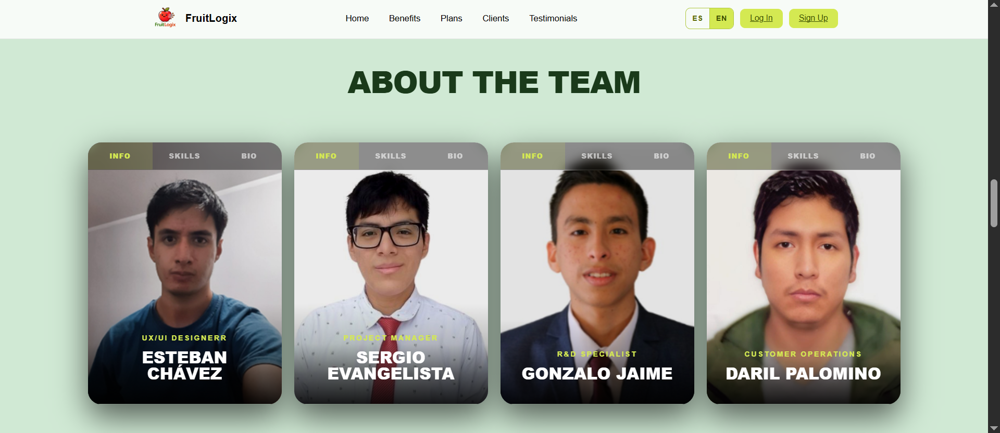

### Seccion de Meet the Team
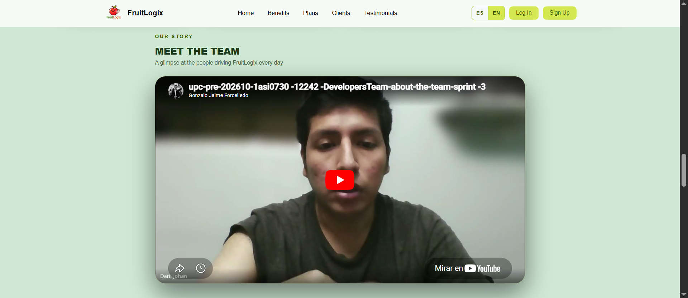

### Seccion de About the Product
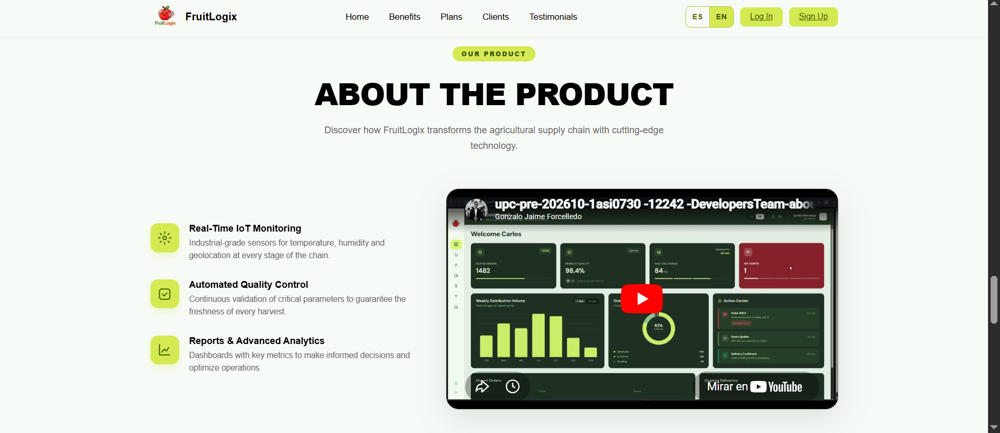

### Seccion de Testimonios

### Seccion Call-to-Action

### Seccion de Footer

##### 5.2.1.6. Services Documentation Evidence for Sprint Review

En el presente Sprint no se implementaron Web Services ni endpoints funcionales, debido a que el alcance estuvo enfocado en el desarrollo del Landing Page como primera versión del producto.

Sin embargo, se definió como parte del análisis inicial la futura implementación de servicios RESTful correspondientes al Epic EP06, los cuales permitirán la integración entre el Landing Page y la Web Application en siguientes Sprints.

Estos servicios estarán orientados a funcionalidades como registro de usuarios, autenticación y gestión de pedidos, los cuales serán documentados utilizando el estándar OpenAPI en futuras iteraciones del proyecto.

##### 5.2.1.7. Software Deployment Evidence for Sprint Review

#### Despliegue de la Landing Page
El despliegue de la Landing Page de FruitLogix se realizó utilizando GitHub Pages, aprovechando sus capacidades para publicar sitios web estáticos directamente desde un repositorio. Este enfoque permitió una implementación sencilla, automatizada y accesible sin necesidad de servicios externos adicionales.

#### Infraestructura de Despliegue

- **Repositorio de código fuente:** GitHub
- **Plataforma de despliegue:** GitHub Pages
- **Tipo de aplicación:** Landing Page estática (HTML, CSS, JavaScript)
- **Acceso:** URL pública generada por GitHub

#### Proceso de Despliegue

1. **Creación del repositorio**
    - Se creó un repositorio en GitHub que contiene todos los archivos de la Landing Page (HTML, CSS, imágenes y scripts).
    - Se organizó el proyecto asegurando que el archivo principal sea `index.html`, requerido por GitHub Pages.

   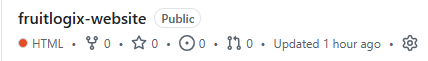

2. **Subida del código**
    - Se realizó el `push` del proyecto a la rama principal (`main`) del repositorio.
    - Se verificó que todos los recursos estén correctamente enlazados (rutas relativas).

   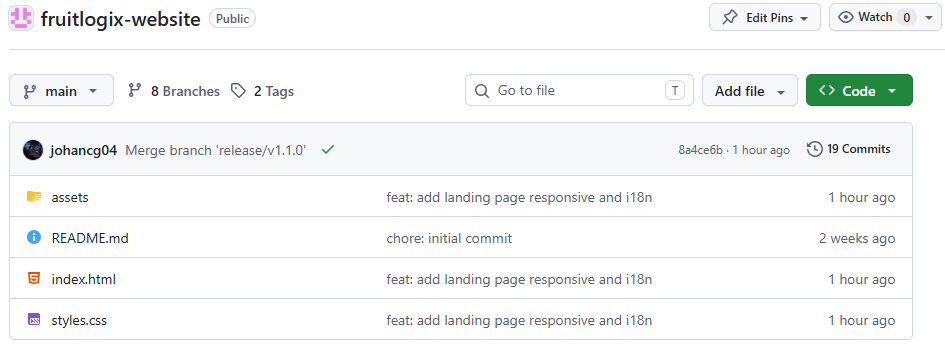

3. **Configuración de GitHub Pages**
    - En la sección *Settings* del repositorio, se habilitó **GitHub Pages**.
    - Se seleccionó la rama `main` como fuente de despliegue.
    - Se definió la carpeta raíz (`/root`) como directorio de publicación.

   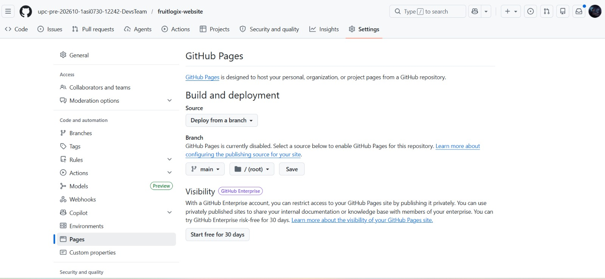

4. **Publicación automática**
    - GitHub Pages procesó automáticamente el contenido del repositorio.
    - En pocos minutos, generó una URL pública donde la Landing Page quedó disponible.

   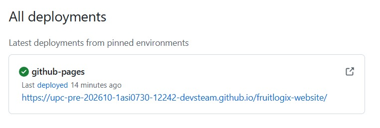

5. **Actualizaciones**
    - Cada vez que se realiza un nuevo `push` a la rama `main`, GitHub Pages actualiza automáticamente la página.
    - Esto permite mantener la Landing Page sincronizada con los cambios del repositorio sin intervención manual adicional.

#### Resultado
La Landing Page de FruitLogix fue desplegada exitosamente mediante GitHub Pages, permitiendo su acceso público a través de una URL estable. Esto facilita la presentación del producto a usuarios potenciales y valida la propuesta de valor del sistema de manera rápida y efectiva.

URL: https://upc-pre-202610-1asi0730-12242-devsteam.github.io/fruitlogix-website/

##### 5.2.1.8. Team Collaboration Insights during Sprint

Durante el **Sprint 1**, el equipo trabajó de manera colaborativa en la implementación del *Landing Page* de **FruitLogix**, organizando las tareas por secciones de la interfaz para permitir el desarrollo en paralelo.

Cada integrante asumió la responsabilidad de una parte específica del *Landing Page* (como **Hero**, **beneficios**, **clientes** y **testimonios**), lo que permitió avanzar de forma eficiente y reducir conflictos en el código. Asimismo, se utilizó **GitHub** como herramienta principal de control de versiones, gestionando el trabajo mediante ramas (*feature branches*) y *commits* individuales.

La integración del trabajo se realizó de manera progresiva, consolidando las distintas secciones en una única versión funcional del *Landing Page*.

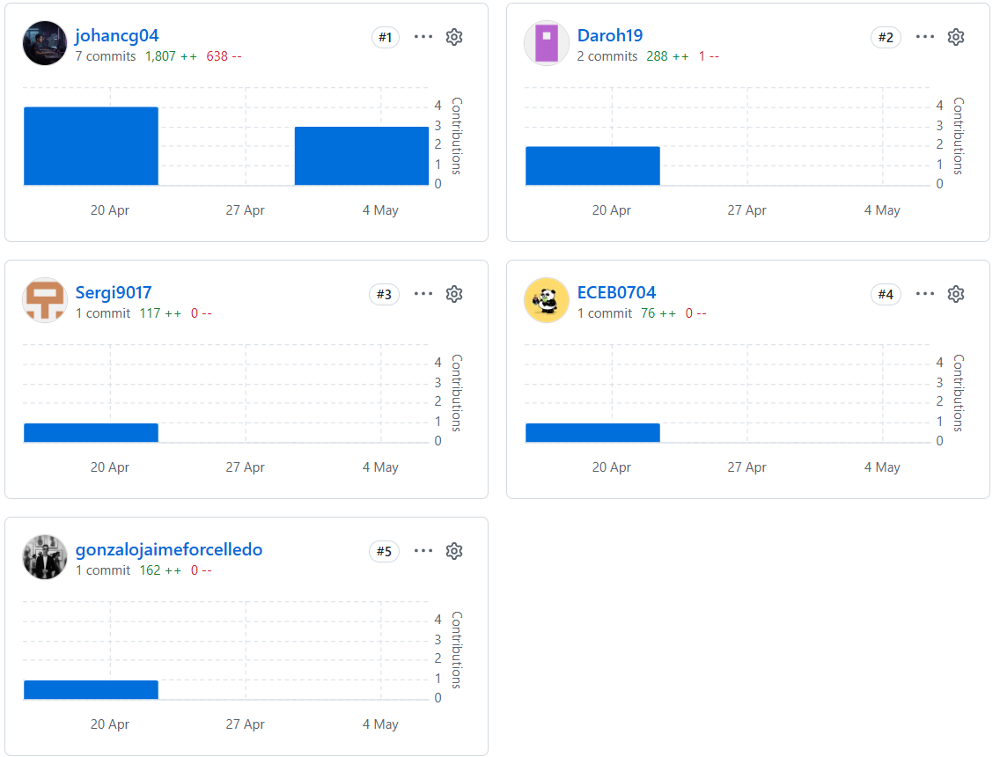

### 5.2.2. Sprint 2

#### 5.2.2.1 Sprint Planning 2
En esta sección se describen los principales acuerdos y definiciones realizadas durante el Sprint Planning del Sprint 2, enfocado en la implementación de los módulos de gestión de pedidos, productores y seguimiento logístico de FruitLogix.

| Sprint # | Sprint 2 |
|---|---|
| **Sprint Planning Background** | |
| Date | 2026-05-10 |
| Time | 19:00 |
| Location | Reunión virtual (Google Meet) |
| Prepared By | Evangelista Ygnacio, Sergio Joaquín |
| Attendees (to planning meeting) | Contreras Granados, Johan Alexis - Chavez Bardales, Esteban Eduardo - Evangelista Ygnacio, Sergio Joaquín - Jaime Forcelledo, Gonzalo Alexander - Palomino Vilcañaupa, Daril Johan |
| **Sprint 1 Review Summary** | Durante el Sprint 1 se logró implementar correctamente el Landing Page responsive de FruitLogix, incluyendo navegación entre secciones, adaptación móvil y soporte multilenguaje. Además, el equipo consolidó la estructura base del frontend y definió estándares iniciales de trabajo colaborativo utilizando GitFlow y Trello para la gestión de tareas. |
| **Sprint 1 Retrospective Summary** | El equipo identificó como principal fortaleza la buena distribución de tareas y la comunicación constante durante el desarrollo del Sprint 1. Sin embargo, se detectaron pequeños retrasos en la integración de componentes y validaciones responsive, por lo que para este sprint se acordó mejorar la coordinación durante los merges y aumentar la frecuencia de revisiones entre integrantes. |
| **Sprint 2 Goal** | Our focus is on developing the order and producer management modules, IoT infrastructure, logistics monitoring and payment processing for FruitLogix. We believe it delivers better logistics organization, real-time quality control and centralized operational control for distributors. This will be confirmed when users can register, edit, visualize and manage orders and producers correctly, IoT devices send and evaluate sensor readings, shipments are tracked in real time, and payments are processed and confirmed within the platform. |
| **Sprint 2 Velocity** | 38 Story Points |
| **Sum of Story Points** | 38 Story Points |

| Sprint # | Nano Sprint |
|---|---|
| **Sprint Planning Background** | |
| Date | 2026-05-11 |
| Time | 10:00 - 12:30 |
| Location | Reunión física en clase |
| Prepared By | Velasquez Nuñez, Angel Augusto |
| Attendees (to planning meeting) | Contreras Granados, Johan Alexis - Chavez Bardales, Esteban Eduardo - Evangelista Ygnacio, Sergio Joaquín - Palomino Vilcañaupa, Daril Johan |
| **Sprint 2 Review Summary** | Durante el Sprint 2 se logró implementar los módulos de gestión de pedidos y productores de FruitLogix, incluyendo el formulario de registro, validaciones, tabla de pedidos, edición, eliminación lógica y lista de productores. Además, el equipo avanzó en la integración de Vue Router para la navegación entre vistas y consolidó el uso del validador externo separado en la capa de aplicación. |
| **Sprint 2 Retrospective Summary** | El equipo identificó como principal fortaleza la correcta separación de responsabilidades entre capas (presentation, application) siguiendo la arquitectura DDD definida en el event storming. Sin embargo, se detectaron retrasos en la conexión entre componentes vía Vue Router y en la gestión de los emits entre vistas, por lo que para el Nano Sprint se acordó priorizar la integración completa del flujo de navegación y aumentar la frecuencia de revisiones entre integrantes antes de los merges. |
| **Nano Sprint Goal** | Our focus is on developing the order and producer management modules for FruitLogix. We believe it delivers better logistics organization and centralized operational control for distributors. This will be confirmed when users can register, edit, visualize and manage orders and producers correctly within the platform. |
| **Nano Sprint Velocity** | 9 Story Points |
| **Sum of Story Points** | 9 Story Points |

#### 5.2.2.2. Aspect Leaders and Collaborators.

En esta sección se define la matriz de liderazgo y colaboración (LACX) del Sprint 2, la cual permite identificar claramente las responsabilidades de cada integrante del equipo en los distintos aspectos del desarrollo.

| Team Member (Last Name, First Name) | GitHub Username | Gestión de Pedidos | Gestión de Productores | Seguimiento de Entregas y Estados |
|---|---|---|---|---|
| Contreras Granados, Johan Alexis | johancg04 | C | C | L |
| Evangelista Ygnacio, Sergio Joaquín | Sergi9017 | L | C | C |
| Chavez Bardales, Esteban Eduardo | ECEB0704 | C | L | C |
| Jaime Forcelledo, Gonzalo Alexander | gonzalojaimeforcelledo | C | C | C |
| Palomino Vilcañaupa, Daril Johan | Daroh19 | C | C | C |

#### 5.2.2.3. Sprint Backlog 2
El Sprint 2 tuvo como objetivo principal la implementación de las funcionalidades relacionadas con la gestión de pedidos y productores dentro de la plataforma FruitLogix, permitiendo centralizar la información logística y mejorar el seguimiento operativo de los pedidos en tiempo real.

A continuación, se presenta el tablero correspondiente al Sprint 2 junto con su enlace:

URL: https://goo.su/XA06

| User Story ID | User Story Title | Task ID | Task Title | Description | Estimation (Hours) | Assigned To |
|---|---|---|---|---|---|---|
| US01 | Formulario de registro de pedidos | TASK008 | Formulario registro de pedidos | Desarrollo de la interfaz para registrar nuevos pedidos en la plataforma. | 5 | Johan |
| US01 | Validaciones de pedido | TASK009 | Validaciones de pedido | Implementación de validaciones para campos obligatorios en pedidos. | 3 | Sergio |
| US04 | Listar pedidos | TASK010 | Tabla de pedidos | Creación de la vista para listar y visualizar pedidos registrados. | 4 | Esteban |
| US02 | Edición de pedidos | TASK011 | Edición de pedidos | Desarrollo de la funcionalidad para modificar información de pedidos existentes. | 4 | Gonzalo |
| US02 | Restricción de modificación | TASK022 | Restricción de modificación | Valida el pedido y en caso contrario muestra un mensaje de restricción al Distribuidor cuando intente editar el pedido. | 3 | Daril |
| US03 | Eliminación de pedidos | TASK012 | Eliminación de pedidos | Implementación de la eliminación lógica de pedidos dentro del sistema. | 3 | Johan |
| US04 | Tabla de pedidos | TASK010 | Tabla de pedidos | Creación de la vista para listar y visualizar pedidos registrados. | 5 | Sergio |
| US04 | Comprobación de registro de pedidos | TASK021 | Comprobación de registro de pedidos | Validar que el sistema muestre correctamente mensaje informativo cuando no existan datos registrados. | 2 | Esteban |
| US05 | Registro de productores | TASK013 | Registro de productores | Desarrollo del formulario para registrar productores en la plataforma. | 5 | Gonzalo |
| US05 | Validación de datos | TASK020 | Validación de datos | Desarrollo del registro del productor pero en caso falte algún dato, el sistema resalta los datos con error y muestra mensaje de validación. | 3 | Daril |
| US06 | Lista de productores | TASK014 | Lista de productores | Implementación de la visualización de productores registrados. | 4 | Johan |
| US013 | ID inválida | TASK023 | ID inválida | Implementación de la validación de códigos de pedido inexistentes al realizar una consulta de rastreo. | 2 | Sergio |
| US014 | Actualización de estados | TASK016 | Actualización de estados | Implementación de cambios manuales en el estado logístico de pedidos. | 4 | Sergio |
| TS004 | Crear endpoint registro de pedidos API | TASK017 | Crear endpoint registro de pedidos API | Desarrollo del endpoint REST para registrar pedidos desde el backend. | 5 | Johan |
| TS005 | Crear endpoint consulta de pedidos API | TASK018 | Crear endpoint consulta de pedidos API | Implementación del endpoint REST para consultar pedidos registrados. | 4 | Esteban |
| TS008 | Gestión de productores API | TASK019 | Gestión de productores API | Desarrollo de endpoints para registrar y consultar productores. | 5 | Daril |
| US015 | Endpoint de ubicación en tiempo real | TASK024 | Implementar endpoint de ubicación en tiempo real | Crear el endpoint que retorna la última lectura de ubicación registrada por el dispositivo GPS_TRACKER asociado a un pedido. | 6 | Sergio |
| US015 | Calibración de dispositivos IoT | TASK025 | Implementar calibración de dispositivos IoT | Desarrollar la funcionalidad calibrate() de la clase IoTDevice para permitir el ajuste de parámetros de los sensores desde la plataforma. | 5 | Johan |
| US017 | Notificación de retraso por GPS Tracker | TASK026 | Implementar notificación de retraso por GPS Tracker | Desarrollar el servicio que consume las lecturas del GPS_TRACKER para detectar retrasos y generar notificación al Cliente Comercial. | 6 | Esteban |
| US018 | Crear entidad IoTDevice | TASK027 | Crear entidad IoTDevice | Implementar la clase IoTDevice con atributos deviceId, deviceType, location, status y lastReading, incluyendo los métodos connect(), sendData() y calibrate(). | 4 | Daril |
| US018 | Crear entidad SensorReading | TASK028 | Crear entidad SensorReading | Implementar la clase SensorReading con atributos readingId, deviceId, timestamp, value y unit, incluyendo los métodos validateRange() y generateAlert(). | 4 | Sergio |
| US018 | Crear entidad AlertRule | TASK029 | Crear entidad AlertRule | Implementar la clase AlertRule con atributos ruleId, deviceType, minThreshold, maxThreshold y alertMessage, incluyendo el método evaluate(reading). | 3 | Johan |
| US018 | Crear enumeración DeviceType | TASK030 | Crear enumeración DeviceType | Implementar el enum DeviceType con los valores TEMPERATURE_SENSOR, HUMIDITY_SENSOR, GPS_TRACKER y WEIGHT_SCALE. | 2 | Esteban |
| US018 | Crear enumeración DeviceStatus | TASK031 | Crear enumeración DeviceStatus | Implementar el enum DeviceStatus con los valores ACTIVE, OFFLINE, MAINTENANCE y BATTERY_LOW. | 2 | Daril |
| US018 | Repositorio de dispositivos IoT | TASK032 | Implementar repositorio de dispositivos IoT | Crear el repositorio para la persistencia de IoTDevice, SensorReading y AlertRule, incluyendo operaciones de registro, consulta y actualización. | 5 | Sergio |
| US018 | Lógica de evaluación de alertas | TASK033 | Implementar lógica de evaluación de alertas de calidad | Desarrollar el servicio que ejecuta evaluate(reading) de AlertRule para comparar lecturas contra umbrales y generar alertas automáticas. | 5 | Johan |
| US018 | Endpoint de registro de lectura de sensor | TASK034 | Implementar endpoint de registro de lectura de sensor | Crear el endpoint que recibe lecturas de dispositivos IoT, las persiste como SensorReading y dispara la evaluación de AlertRule. | 5 | Esteban |
| US021 | Generación de Invoice en PDF | TASK035 | Generación de Invoice en PDF | Desarrollar la funcionalidad generatePDF() de la clase Invoice para exportar la factura en formato PDF con los datos del pedido y monto total. | 5 | Daril |
| US021 | Endpoint de consulta de facturas | TASK036 | Implementar endpoint de consulta de facturas | Crear el endpoint que retorna el historial de facturas generadas por rango de fechas para el módulo de reportes del Distribuidor. | 4 | Sergio |
| US030 | Crear entidad BillingInfo | TASK037 | Crear entidad BillingInfo | Implementar la clase BillingInfo con atributos billingId, clientId, creditCardToken y paymentMethodType, incluyendo processPayment() y updatePaymentMethod(). | 3 | Johan |
| US030 | Crear entidad Invoice | TASK038 | Crear entidad Invoice | Implementar la clase Invoice con atributos invoiceId, orderId, issueDate, totalAmount y paymentStatus, incluyendo generatePDF() y markAsPaid(). | 3 | Esteban |
| US030 | Crear entidad Transaction | TASK039 | Crear entidad Transaction | Implementar la clase Transaction con atributos transactionId, invoiceId, amount, timestamp y externalReference, incluyendo confirm() y reverse(). | 3 | Daril |
| US030 | Crear enumeración PaymentStatus | TASK040 | Crear enumeración PaymentStatus | Implementar el enum PaymentStatus con los valores PENDING, PAID, FAILED, REFUNDED y PARTIALLY_PAID. | 2 | Sergio |
| US030 | Repositorio de pagos | TASK041 | Implementar repositorio de pagos | Crear el repositorio para la persistencia de BillingInfo, Invoice y Transaction, incluyendo operaciones de creación y consulta. | 4 | Johan |
| US030 | Integración con pasarela externa | TASK042 | Integración con pasarela externa | Desarrollar el servicio de integración con Culqi o Izipay para procesar pagos y recibir confirmación o rechazo de la transacción. | 8 | Esteban |
| US030 | Endpoint de procesamiento de pago | TASK043 | Implementar endpoint de procesamiento de pago | Crear el endpoint que recibe la solicitud de pago, llama al servicio de la pasarela externa y actualiza el estado del pedido a "Pagado". | 5 | Daril |
| US030 | Manejo de pago rechazado | TASK044 | Implementar manejo de pago rechazado | Desarrollar la lógica que gestiona la respuesta negativa de la pasarela, mantiene el pedido en "Pendiente de pago" y retorna el mensaje de error. | 4 | Sergio |
| US030 | Confirmación de pago por correo | TASK045 | Enviar confirmación de pago por correo | Implementar el envío automático de correo de confirmación al cliente cuando la transacción es aprobada, incluyendo detalle del pedido y comprobante. | 4 | Johan |

#### 5.2.2.4. Development Evidence for Sprint Review

| Repository | Branch | Commit Id | Commit Message | Committed By | Committed On |
|---|---|--|---|---|---|
| fruitlogix-webapp | develop | e0c0c4a | Merge pull request #15 from feature/i18n | Daroh19 | 2026-05-12 |
| fruitlogix-webapp | feature/i18n | f1c3305 | feat(i18n): initialize i18n configuration with English and Spanish locales | Daroh19 | 2026-05-12 |
| fruitlogix-webapp | develop | b643f90 | Merge pull request #14 from feature/order-management | johancg04 | 2026-05-12 |
| fruitlogix-webapp | feature/order-management | 813a543 | refactor: rename order-management.js to order-management-api.js for clarity | johancg04 | 2026-05-12 |
| fruitlogix-webapp | develop | dc56b98 | Merge pull request #13 from feature/pinia | gonzalojaimeforcelledo | 2026-05-12 |
| fruitlogix-webapp | develop | b2b0278 | Merge pull request #12 from feature/locales | Daroh19 | 2026-05-12 |
| fruitlogix-webapp | feature/locales | 406d773 | feat(locales): add English and Spanish document json | Daroh19 | 2026-05-12 |
| fruitlogix-webapp | develop | 4554916 | Merge pull request #11 from feature/server | johancg04 | 2026-05-12 |
| fruitlogix-webapp | feature/server | 57bcf94 | feat: add initial database structure for orders, fruits, producers, clients, and deliveries | johancg04 | 2026-05-12 |
| fruitlogix-webapp | develop | 29079fc | Merge pull request #10 from feature/logistics-monitoring | Daroh19 | 2026-05-12 |
| fruitlogix-webapp | feature/pinia | d08df91 | docs(pinia): add .env.development | gonzalojaimeforcelledo | 2026-05-12 |
| fruitlogix-webapp | feature/pinia | 543b337 | docs(pinia): add .env.production | gonzalojaimeforcelledo | 2026-05-12 |
| fruitlogix-webapp | feature/logistics-monitoring | 45f3575 | feat(domain): add Alert entity for logistics monitoring alerts | Daroh19 | 2026-05-12 |
| fruitlogix-webapp | feature/logistics-monitoring | 7fdedc4 | feat(infrastructure): implement logistics monitoring API gateway for deliveries and alerts | Daroh19 | 2026-05-12 |
| fruitlogix-webapp | develop | 3b96a86 | Merge pull request #9 from feature/dashboard | johancg04 | 2026-05-12 |
| fruitlogix-webapp | feature/logistics-monitoring | 0261f4a | feat(presentation): add delivery card component | Daroh19 | 2026-05-12 |
| fruitlogix-webapp | develop | 9b872a1 | Merge pull request #2 from feature/pinia | johancg04 | 2026-05-12 |
| fruitlogix-webapp | feature/logistics-monitoring | a0e2d79 | feat(presentation): add analytics and incidents view for real-time monitoring | Daroh19 | 2026-05-12 |
| fruitlogix-webapp | develop | dd311cb | Merge pull request #5 from feature/payment-management | johancg04 | 2026-05-12 |
| fruitlogix-webapp | feature/logistics-monitoring | f907ac5 | feat(presentation): add delivery details view for real-time tracking and telemetry | Daroh19 | 2026-05-12 |
| fruitlogix-webapp | develop | 4e93fcf | Merge pull request #6 from feature/quality-control | johancg04 | 2026-05-12 |
| fruitlogix-webapp | feature/logistics-monitoring | f5d1b39 | feat(presentation): add logistics monitoring home page for real-time order tracking | Daroh19 | 2026-05-12 |
| fruitlogix-webapp | feature/logistics-monitoring | 510a014 | feat(presentation): add monitoring dashboard for real-time delivery tracking | Daroh19 | 2026-05-12 |
| fruitlogix-webapp | develop | 6bf366d | Merge pull request #8 from feature/shared | johancg04 | 2026-05-12 |
| fruitlogix-webapp | develop | 827149e | Merge pull request #7 from feature/order-management | johancg04 | 2026-05-12 |
| fruitlogix-webapp | feature/logistics-monitoring | 0118c6c | feat(presentation): add logistics monitoring routes for dashboard and tracking | Daroh19 | 2026-05-12 |
| fruitlogix-webapp | feature/logistics-monitoring | 0cc267c | feat(infrastructure): add TrackingLogAssembler for mapping TrackingLog entities | Daroh19 | 2026-05-12 |
| fruitlogix-webapp | develop | bb062c6 | Merge pull request #4 from feature/profiles-and-vehicles | ECEB0704 | 2026-05-12 |
| fruitlogix-webapp | feature/logistics-monitoring | 663b17b | feat(infrastructure): add DeliveryAssembler for mapping Delivery entities and API | Daroh19 | 2026-05-12 |
| fruitlogix-webapp | feature/quality-control | f23091a | feat: add routing for quality control home view | Sergi9017 | 2026-05-12 |
| fruitlogix-webapp | develop | 4bad8bd | Merge pull request #3 from feature/iot-infrastructure | ECEB0704 | 2026-05-12 |
| fruitlogix-webapp | feature/shared | 5ae5300 | feat: add 404 page not found component with styling and navigation | johancg04 | 2026-05-12 |
| fruitlogix-webapp | feature/quality-control | d3c14fe | feat: add placeholder view for quality control home | Sergi9017 | 2026-05-12 |
| fruitlogix-webapp | feature/shared | cc6594c | feat: implement main layout with sidebar and topbar components | johancg04 | 2026-05-12 |
| fruitlogix-webapp | feature/profiles-and-vehicles | 94d8d22 | feat: add Producer list view component for managing producers | ECEB0704 | 2026-05-12 |
| fruitlogix-webapp | feature/logistics-monitoring | 83b7222 | feat(domain): add logistics Service for delivery ETA calculation and route | Daroh19 | 2026-05-12 |
| fruitlogix-webapp | feature/profiles-and-vehicles | 8a67f1c | feat: add Producer registration form component | ECEB0704 | 2026-05-12 |
| fruitlogix-webapp | feature/quality-control | b729b17 | feat: implement QualityControlApi for batch and incident management | Sergi9017 | 2026-05-12 |
| fruitlogix-webapp | feature/profiles-and-vehicles | c1cf31f | feat: add lazy-loaded route definitions for Profiles & Vehicles context | ECEB0704 | 2026-05-12 |
| fruitlogix-webapp | feature/quality-control | e9c7ca5 | feat: add Incident entity for quality control context | Sergi9017 | 2026-05-12 |
| fruitlogix-webapp | feature/quality-control | f274e17 | feat: add HarvestBatch entity for quality control context | Sergi9017 | 2026-05-12 |
| fruitlogix-webapp | feature/logistics-monitoring | 04ad413 | feat(domain): add notification entity and type enumeration for alerts | Daroh19 | 2026-05-12 |
| fruitlogix-webapp | feature/profiles-and-vehicles | ccb200a | feat: implement ProfilesAndVehiclesApi for managing users, drivers, vehicles, and producers | ECEB0704 | 2026-05-12 |
| fruitlogix-webapp | feature/logistics-monitoring | 78df662 | feat(domain): add route entity for delivery path representation | Daroh19 | 2026-05-12 |
| fruitlogix-webapp | feature/profiles-and-vehicles | fe33df6 | feat: add ProducerAssembler for mapping Producer entity to API JSON | ECEB0704 | 2026-05-12 |
| fruitlogix-webapp | feature/logistics-monitoring | e0371af | feat(domain): add TrackingLog entity for sensor data recording | Daroh19 | 2026-05-12 |
| fruitlogix-webapp | feature/quality-control | e687e76 | feat: add quality control store with batch and incident fetching | Sergi9017 | 2026-05-12 |
| fruitlogix-webapp | feature/profiles-and-vehicles | 0dbf229 | feat: add Vehicle entity definition for Profiles & Vehicles context | ECEB0704 | 2026-05-12 |
| fruitlogix-webapp | feature/logistics-monitoring | e10904d | feat(domain): add Delivery entity and status enumeration for logistics | Daroh19 | 2026-05-12 |
| fruitlogix-webapp | feature/profiles-and-vehicles | 38fda5a | feat: add User entity definition for Profiles & Vehicles context | ECEB0704 | 2026-05-12 |
| fruitlogix-webapp | feature/i18n | 0a9b722 | feat: add language switcher component for locale selection | johancg04 | 2026-05-12 |
| fruitlogix-webapp | feature/profiles-and-vehicles | d66dcfe | feat: add Producer entity definition for Profiles & Vehicles context | ECEB0704 | 2026-05-12 |
| fruitlogix-webapp | feature/profiles-and-vehicles | 10defbd | feat: add Driver entity definition for Profiles & Vehicles context | ECEB0704 | 2026-05-12 |
| fruitlogix-webapp | feature/profiles-and-vehicles | eeda93f | feat: add entity definitions for Driver, Producer, User, and Vehicle | ECEB0704 | 2026-05-12 |
| fruitlogix-webapp | feature/shared | f39bdae | feat: add BaseEndpoint class for RESTful API interactions | johancg04 | 2026-05-12 |
| fruitlogix-webapp | feature/shared | f4d5ed1 | feat: add BaseApi class with pre-configured Axios instance | johancg04 | 2026-05-12 |
| fruitlogix-webapp | feature/profiles-and-vehicles | b88ccd4 | feat: implement Profiles & Vehicles store with CRUD operations for producers | ECEB0704 | 2026-05-12 |
| fruitlogix-webapp | feature/profiles-and-vehicles | 7458826 | feat: add producer form validation logic | ECEB0704 | 2026-05-12 |
| fruitlogix-webapp | feature/payment-management | c3e58b1 | feat: implement payment management views and entities | Sergi9017 | 2026-05-12 |
| fruitlogix-webapp | feature/iot-infrastructure | 095f843 | feat(routes): add IoT infrastructure routes for device management and calibration | ECEB0704 | 2026-05-12 |
| fruitlogix-webapp | feature/logistics-monitoring | f4d217c | feat(application): add logistics monitoring store for managing deliveries and tracking | Daroh19 | 2026-05-12 |
| fruitlogix-webapp | feature/iot-infrastructure | fc36c0a | feat(ui): create IoT device fleet management view with real-time tracking and calibration | ECEB0704 | 2026-05-12 |
| fruitlogix-webapp | feature/iot-infrastructure | 1cc581b | feat(ui): add placeholder view for IoT infrastructure overview | ECEB0704 | 2026-05-12 |
| fruitlogix-webapp | feature/iot-infrastructure | 44f1f19 | feat(ui): add IoT calibration view for device monitoring and rule configuration | ECEB0704 | 2026-05-12 |
| fruitlogix-webapp | feature/order-management | 65588a1 | feat: add lazy-loaded route definitions for order management | johancg04 | 2026-05-12 |
| fruitlogix-webapp | feature/iot-infrastructure | 6485700 | feat(ui): implement device-card component for IoT device display | ECEB0704 | 2026-05-12 |
| fruitlogix-webapp | feature/order-management | 8b139ff | feat: add ordering module with OrderList component for order management | johancg04 | 2026-05-12 |
| fruitlogix-webapp | feature/dashboard | 9bb52ac | docs(dashboard): add router.js | gonzalojaimeforcelledo | 2026-05-12 |
| fruitlogix-webapp | feature/order-management | a97456b | feat: add OrderSuccess component for displaying order confirmation in order management | johancg04 | 2026-05-12 |
| fruitlogix-webapp | feature/order-management | 89f897d9 | feat: add OrderStateDialog component for tracking order status in order management | johancg04 | 2026-05-12 |
| fruitlogix-webapp | feature/order-management | 062f2bc | feat: add OrderRegisterForm component for creating new orders in order management | johancg04 | 2026-05-12 |
| fruitlogix-webapp | feature/iot-infrastructure | 2a54e4d | feat(infra): implement SensorReading assembler for DTO transformation | ECEB0704 | 2026-05-12 |
| fruitlogix-webapp | feature/iot-infrastructure | 996b346 | feat(infra): add IoT infrastructure API service for external communication | ECEB0704 | 2026-05-12 |
| fruitlogix-webapp | feature/order-management | 4e8d46a | feat: enhance order management with order list component and PrimeVue integration | johancg04 | 2026-05-12 |
| fruitlogix-webapp | feature/iot-infrastructure | 0ea34bd | feat(infra): implement IoTDevice assembler for data mapping | ECEB0704 | 2026-05-12 |
| fruitlogix-webapp | feature/iot-infrastructure | cb5ee5d | feat(domain): create ThresholdRule entity for sensor limits | ECEB0704 | 2026-05-12 |
| fruitlogix-webapp | feature/order-management | 5c0afd9 | feat: add OrderEditDialog component for editing order details in order management | johancg04 | 2026-05-12 |
| fruitlogix-webapp | feature/order-management | 6ee5893 | feat: add FruitSelector component for selecting fruits in order management | johancg04 | 2026-05-12 |
| fruitlogix-webapp | feature/iot-infrastructure | a7eb430 | feat(domain): implement Sensor entity core structure define SensorReading entity for data collection | ECEB0704 | 2026-05-12 |
| fruitlogix-webapp | feature/dashboard | b4e0611 | docs(dashboard): add pinia.js | gonzalojaimeforcelledo | 2026-05-12 |
| fruitlogix-webapp | feature/order-management | ae914ed | feat: add AssignProducerDialog component for producer assignment in order management | johancg04 | 2026-05-12 |
| fruitlogix-webapp | feature/dashboard | 59b9f76 | docs(dashboard): add dashboard.store.js | gonzalojaimeforcelledo | 2026-05-12 |
| fruitlogix-webapp | feature/iot-infrastructure | a854d10 | feat(domain): add IoT enums for device states and types | ECEB0704 | 2026-05-12 |
| fruitlogix-webapp | feature/order-management | 418f1fc | feat: implement OrderManagementApi for CRUD operations on orders and related resources | johancg04 | 2026-05-12 |
| fruitlogix-webapp | feature/iot-infrastructure | 465256015 | feat(domain): create IoTDevice entity to represent physical hardware | ECEB0704 | 2026-05-12 |
| fruitlogix-webapp | feature/dashboard | efc4a7f | docs(dashboard): add dashboard-stats.entity.js | gonzalojaimeforcelledo | 2026-05-12 |
| fruitlogix-webapp | feature/iot-infrastructure | 323e2ca | feat(domain): define AlertRule entity for monitoring logic | ECEB0704 | 2026-05-12 |
| fruitlogix-webapp | feature/order-management | 6da92b3 | feat: add OrderAssembler for mapping Order entities to/from API payloads | johancg04 | 2026-05-12 |
| fruitlogix-webapp | feature/dashboard | 75806fa | docs(dashboard): add dashboard.assembler.js | gonzalojaimeforcelledo | 2026-05-12 |
| fruitlogix-webapp | feature/order-management | b40b473 | feat: implement order and fruit entities with order management store | johancg04 | 2026-05-12 |
| fruitlogix-webapp | feature/iot-infrastructure | 249b978 | feat(domain): define core models and business entities | ECEB0704 | 2026-05-12 |
| fruitlogix-webapp | feature/dashboard | 32c36ff | docs(dashboard): add dashboard-api.js | gonzalojaimeforcelledo | 2026-05-12 |
| fruitlogix-webapp | feature/iot-infrastructure | 35e27cd | chore: initial commit | ECEB0704 | 2026-05-12 |
| fruitlogix-webapp | feature/order-management | 55e162b | feat: add order form validation logic | johancg04 | 2026-05-12 |
| fruitlogix-webapp | feature/dashboard | b62605c | docs(dashboard): add dashboard-view.vue | gonzalojaimeforcelledo | 2026-05-12 |
| fruitlogix-webapp | develop | d08c2d8 | feat: initialize Vue.js project with basic structure and configuration | johancg04 | 2026-05-12 |
| fruitlogix-webapp | develop | 5b81dd5 | chore: initial commit | johancg04 | 2026-05-12 |

#### 5.2.2.5. Execution Evidence for Sprint Review.
En el Sprint 2 se logró implementar la primera versión funcional de la Web Application de FruitLogix, permitiendo gestionar pedidos, productores, monitoreo logístico, control de calidad y funcionalidades relacionadas con la infraestructura IoT dentro de una plataforma centralizada.
Durante este Sprint se desarrollaron los principales módulos de la aplicación, incluyendo la gestión de pedidos y productores, seguimiento logístico en tiempo real, monitoreo de entregas, control de calidad y procesamiento de pagos. Asimismo, se implementó la navegación entre vistas mediante Vue Router, integración de estados utilizando Pinia y soporte multilenguaje mediante i18n. Adicionalmente, se avanzó en la implementación de servicios RESTful, entidades de dominio y componentes reutilizables siguiendo la arquitectura definida para el proyecto.
A continuación, se presentan evidencias visuales de las principales vistas implementadas en este Sprint.

Video de Demostración de la Web Application: https://goo.su/NOt4

## Screenshots de la Web Application
#### Dashboard Principal

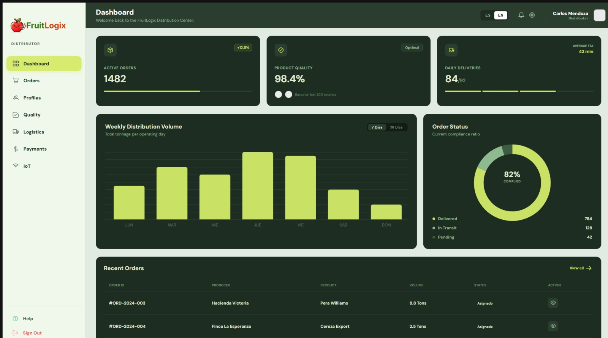

#### Seguimiento de Pedido

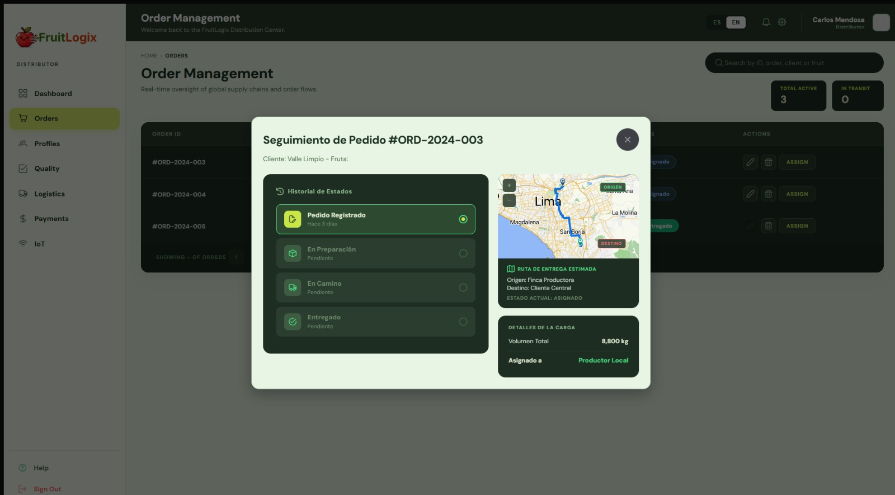

#### Eliminación de Pedido

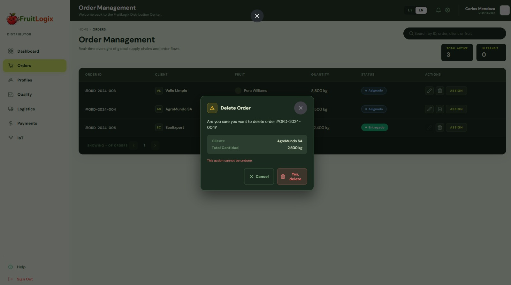

#### Gestión de Productores

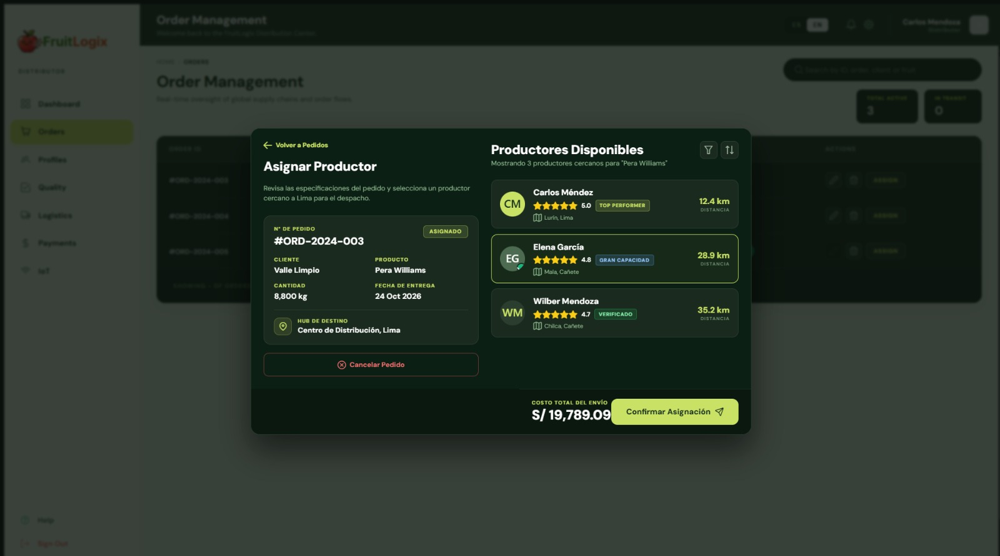

#### Gestion de pagos

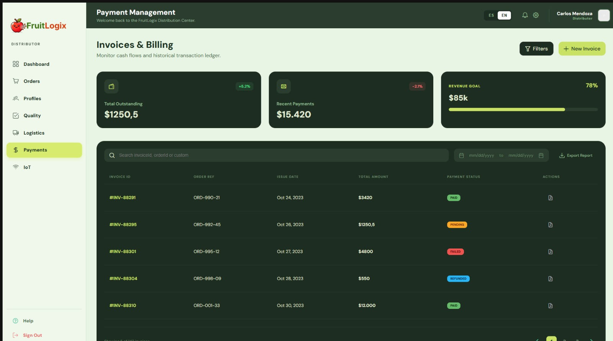

#### Infraestructura IoT

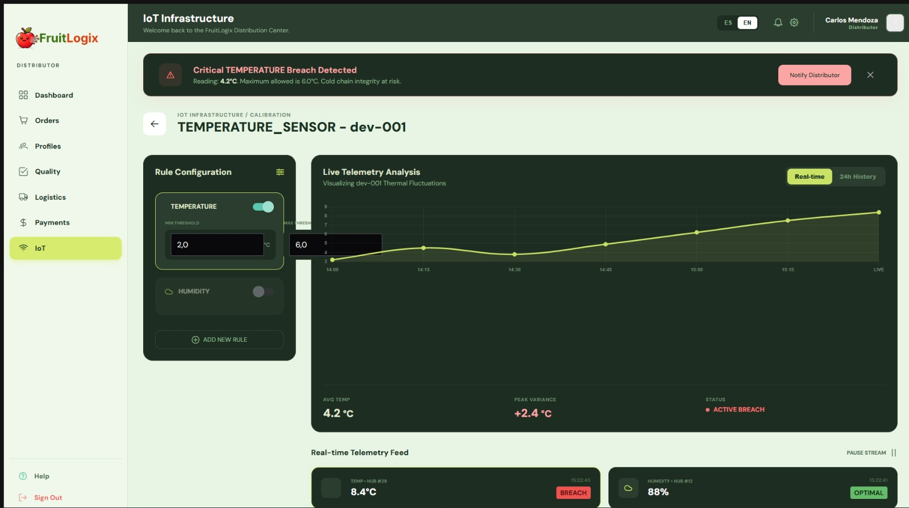

#### 5.2.2.6. Services Documentation Evidence for Sprint Review.

En esta sección se presenta la documentación de los principales Web Services implementados durante el Sprint 2 para la Web Application de FruitLogix. Los servicios fueron diseñados bajo el estilo arquitectónico RESTful y documentados utilizando el estándar OpenAPI, permitiendo definir de manera clara las operaciones disponibles, parámetros, estructuras de request y responses esperados.

Durante este Sprint se implementaron endpoints relacionados con la gestión de pedidos, productores, monitoreo logístico, infraestructura IoT, control de calidad, dashboard y procesamiento de pagos. Asimismo, los servicios fueron integrados utilizando APIs simuladas mediante MockAPI, facilitando las pruebas funcionales de la aplicación frontend.

A continuación, se presenta la relación de endpoints implementados y documentados para este Sprint.

| Contexto / Módulo | Endpoint Base | Acciones Implementadas |
|---|---|---|
| Orders | `https://6a02caf50d92f63dd2541a0a.mockapi.io/api/v1/orders` | GET, POST, PUT, DELETE |
| Fruits | `https://6a02caf50d92f63dd2541a0a.mockapi.io/api/v1/fruits` | GET |
| Producers | `https://69fb530388a7af0ecca8faec.mockapi.io/api/v1/producers` | GET, POST, PUT, DELETE |
| Clients | `https://69fb530388a7af0ecca8faec.mockapi.io/api/v1/clients` | GET |
| Sensor Readings | `https://6a02d3790d92f63dd25433f0.mockapi.io/api/v1/sensor-readings` | GET, POST |
| Payment Transactions | `https://6a02cf8d0d92f63dd254278f.mockapi.io/api/v1/payment-transactions` | GET, POST |
| Invoices | `https://6a02cf8d0d92f63dd254278f.mockapi.io/api/v1/invoices` | GET |
| Tracking Logs | `https://6a02d0920d92f63dd2542b1d.mockapi.io/api/v1/trackinglogs` | GET |
| Devices | `https://6a02d0920d92f63dd2542b1d.mockapi.io/api/v1/devices` | GET, POST, PUT |
| Alert Rules | `https://6a02d3790d92f63dd25433f0.mockapi.io/api/v1/alert-rules` | GET, POST |
| Dashboard | `https://6a0241850d92f63dd25375cb.mockapi.io/api/v1/dashboard` | GET |
| Deliveries | `https://6a0241850d92f63dd25375cb.mockapi.io/api/v1/deliveries` | GET, PUT |

---

### Ejemplo de Documentación de Endpoint

#### Orders Endpoint

**Base URL:** https://6a02caf50d92f63dd2541a0a.mockapi.io/api/v1/orders

#### http (get, post, put, delete, patch)

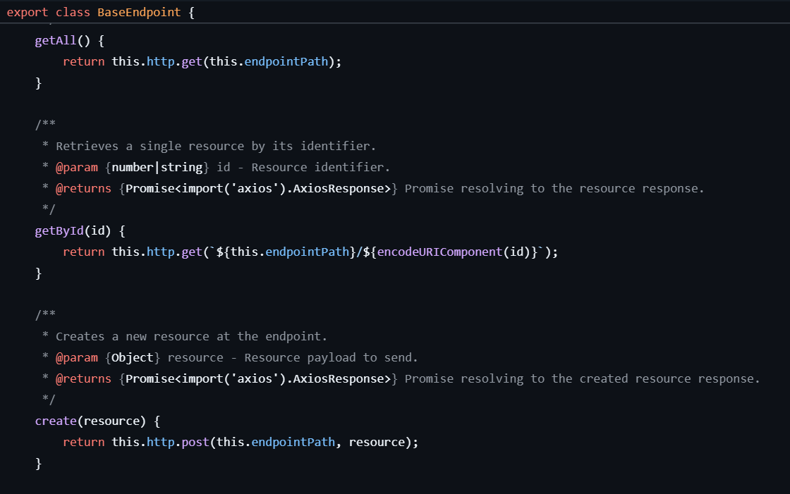

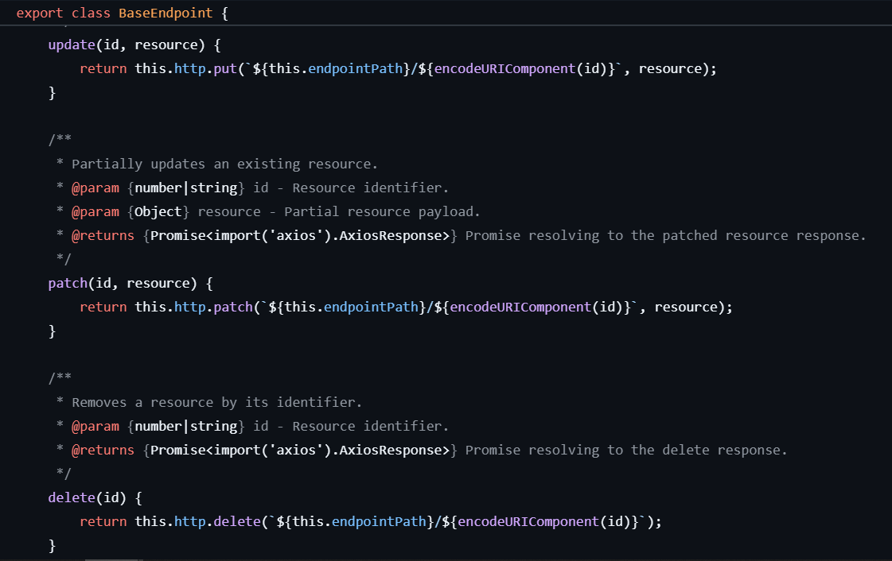

### Evidencias Visuales de la Interacción

Durante este Sprint, se ha logrado la definición y despliegue de los servicios web iniciales para la plataforma FruitLogix utilizando la plataforma MockAPI. Esta fase garantiza que el equipo de Front-end cuente con interfaces de datos consistentes antes de la migración definitiva a Spring Boot con OpenAPI.
### Fruits

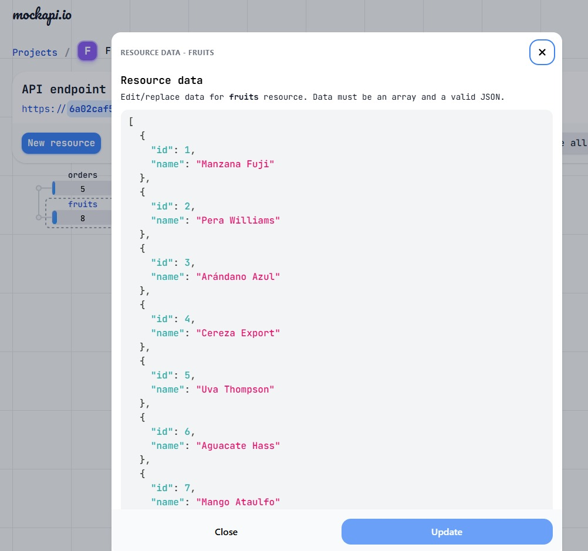
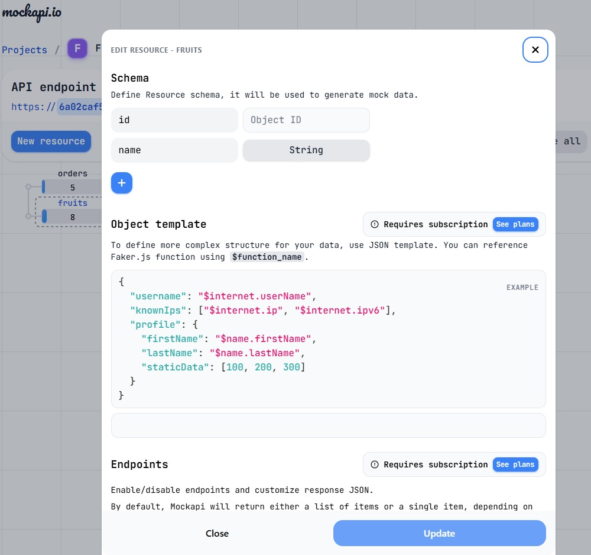
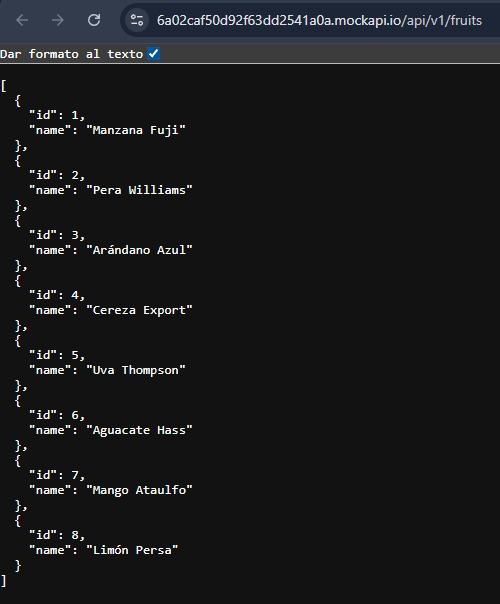

### Orders

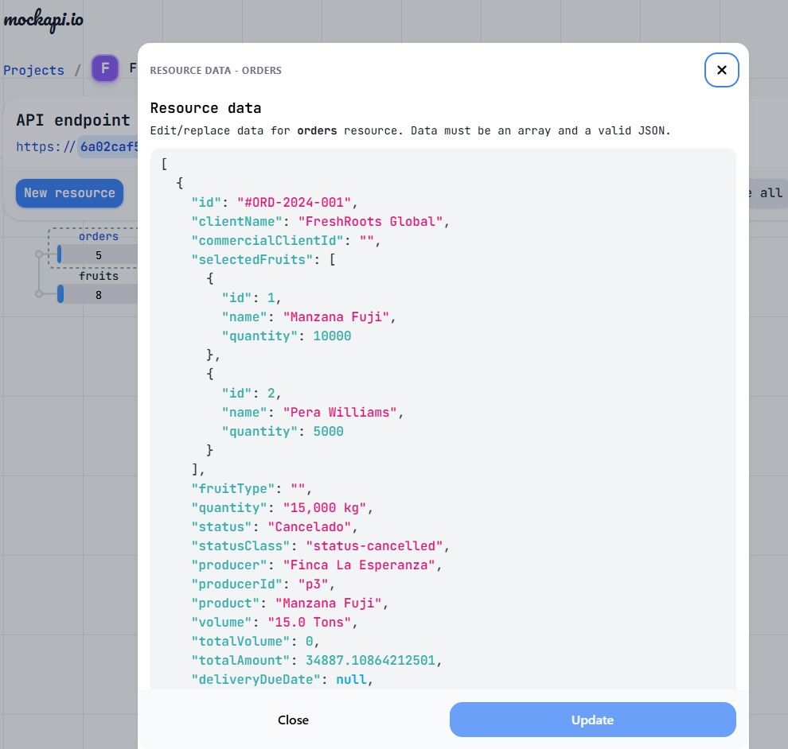
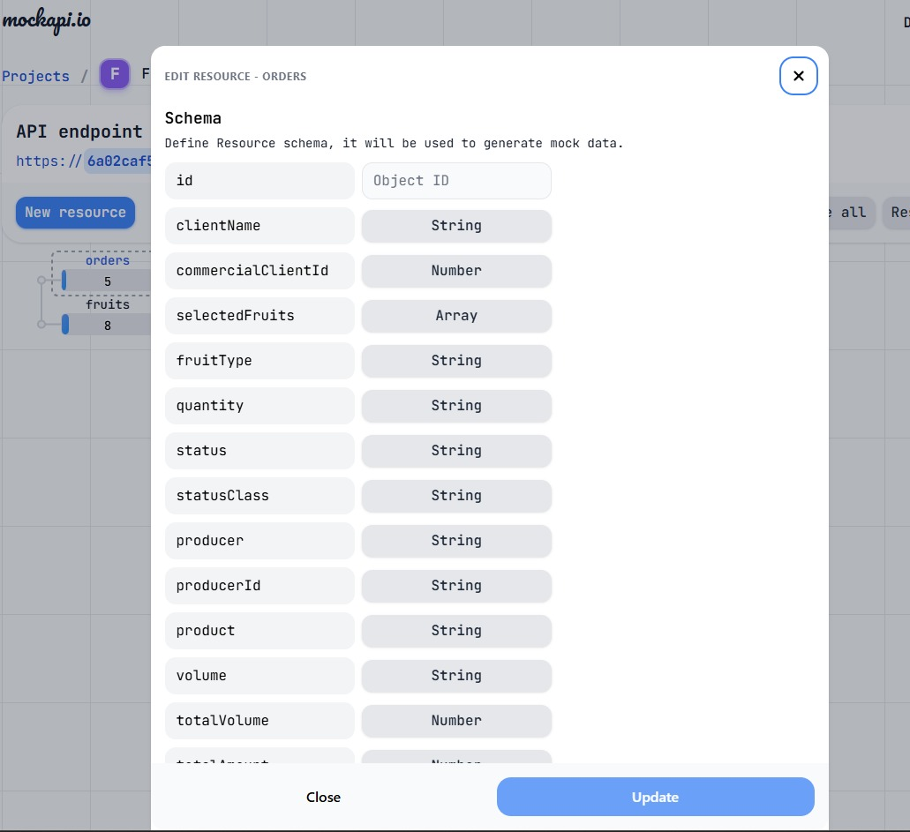
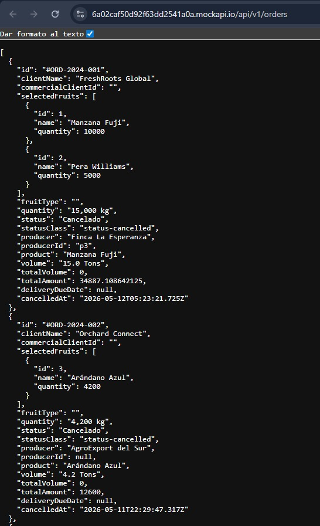

### Repositorio de Web Services

Repositorio:
https://github.com/upc-pre-202610-1asi0730-12242-devsteam/fruitlogix-webapp

### Commits Relacionados con Services Documentation

| Commit Id | Descripción |
|---|---|
| 418f1fc | Implementación de OrderManagementApi |
| ccb200a | Implementación de ProfilesAndVehiclesApi |
| 7fdedc4 | Implementación de Logistics Monitoring API |
| b729b17 | Implementación de QualityControlApi |
| 996b346 | Implementación de IoT Infrastructure API |
| f4d5ed1 | Implementación de BaseApi para consumo REST |
| f39bdae | Implementación de BaseEndpoint |

#### 5.2.2.7. Software Deployment Evidence for Sprint Review.

Durante el Sprint 2 se realizaron las actividades relacionadas con el despliegue de la Web Application y configuración de servicios utilizados por FruitLogix. Para ello, se utilizaron plataformas cloud y herramientas de integración que permitieron publicar la aplicación y conectar los servicios REST utilizados durante el desarrollo.

En este Sprint se trabajó principalmente en la configuración del proyecto frontend, despliegue de la aplicación web y consumo de APIs simuladas mediante MockAPI para pruebas funcionales.

### Infraestructura Utilizada

- GitHub como repositorio principal del proyecto.
- GitHub Pages para el despliegue del frontend.
- MockAPI para simulación de endpoints REST.
- Vue.js + Vite para la construcción de la Web Application.

### Proceso de Deployment

#### 1. Configuración del repositorio

Se creó y configuró el repositorio principal de la Web Application en GitHub, organizando la estructura del proyecto y ramas de desarrollo.

#### 2. Configuración de variables de entorno

Se configuraron las variables de entorno necesarias para conectar la aplicación con los servicios REST simulados mediante MockAPI.

#### 3. Build de producción

Se generó la versión de producción de la aplicación utilizando Vite.

#### 4. Configuración de Firebase

Se usó Firebase para alojar la aplicación web, configurando el hosting y conectando el repositorio de GitHub para despliegues automáticos.

#### 5. Publicación de la aplicación

La aplicación fue desplegada correctamente y quedó accesible mediante una URL pública

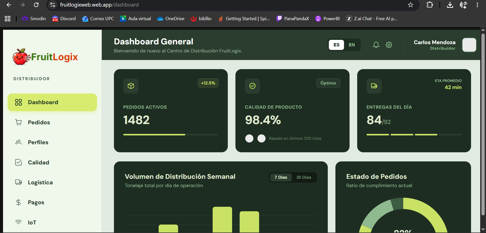

### Resultado

La Web Application de FruitLogix fue desplegada exitosamente, permitiendo acceder a los módulos implementados durante el Sprint 2, incluyendo gestión de pedidos, productores, monitoreo logístico e infraestructura IoT.

URL de despliegue: https://fruitlogixweb.web.app

#### 5.2.2.8. Team Collaboration Insights during Sprint. 
Durante el Sprint 2, el equipo desarrolló colaborativamente la primera versión de la Web Application de FruitLogix, distribuyendo tareas por módulos y bounded contexts para facilitar el trabajo paralelo. Cada integrante lideró un módulo específico de la plataforma, incluyendo gestión de pedidos, productores, calidad, trazabilidad, dashboard y servicios web. Además, se utilizó GitHub con GitFlow, ramas feature y pull requests revisados para mantener un desarrollo organizado y trazable.

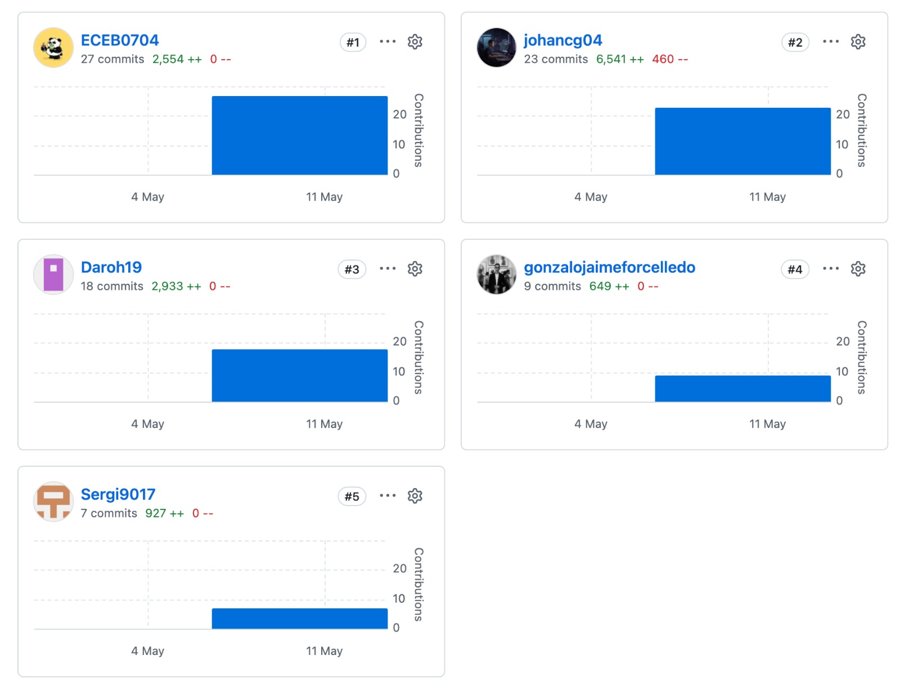

#### 5.2.3. Sprint 3
En esta sección se detalla la evolución del proyecto durante el Sprint 3, el cual marcó la transición crítica del uso de servicios simulados (MockAPI) hacia la integración de una arquitectura distribuida real y el enlace con el sitio web promocional. El alcance de esta iteración comprendió el desarrollo y despliegue de los servicios web internos (RESTful API) en C# utilizando ASP.NET Core (v1.0.0), la configuración de la persistencia de datos relacional, y la actualización de la aplicación web en Vue.js (v2.0.0) conectada de manera fluida con la Landing Page estática.

##### 5.2.3.1. Sprint Planning 3
En esta sección se describen los acuerdos, antecedentes y objetivos establecidos durante la reunión de planificación del Sprint 3[cite: 1].

| Campo | Detalle |
|------|--------|
| **Sprint #** | Sprint 3 |
| **Sprint Planning Background** | — |
| **Date** | 2026-06-05 |
| **Time** | 18:30 |
| **Location** | Reunión virtual (Google Meet) |
| **Prepared By** | Evangelista Ygnacio, Sergio Joaquín |
| **Attendees (Planning Meeting)** | Chavez Bardales, Esteban Eduardo   Evangelista Ygnacio, Sergio Joaquín   Jaime Forcelledo, Gonzalo Alexander   Palomino Vilcañaupa, Daril Johan |
| **Sprint 2 Review Summary** | Durante el Sprint 2 se consolidó la interfaz de usuario de la Web Application con datos simulados. Los componentes de presentación y la gestión de estados globales mediante Pinia quedaron funcionales para la futura integración con backend real. |
| **Sprint 2 Retrospective Summary** | Se identificó la necesidad de eliminar la dependencia de datos estáticos. Se acordó acelerar la capa de persistencia en C#, unificar la navegación entre Landing Page y Web Application y priorizar consumo de APIs reales. |
| **Sprint Goal** | Habilitar la gestión de pedidos, registro de productores y monitoreo IoT con datos persistentes, integrando acceso directo desde Landing Page hacia la plataforma. |
| **Value Proposition – Visitors** | Transición sin fricción desde Landing Page hacia registro y acceso al sistema. |
| **Value Proposition – Users** | Persistencia e integridad de datos en pedidos y telemetría IoT con base de datos real. |
| **Value Proposition – Developers** | Arquitectura cloud escalable (Firebase + Render) con APIs documentadas en OpenAPI. |
| **Sprint Completion Criteria** | Acceso desde Landing Page a login, persistencia en MySQL cloud, sin problemas CORS y consumo de Swagger UI en frontend. |
| **User Stories incluidas en el Sprint** | US01: Registro de pedidos (5)   US04: Listar pedidos (3)   US05: Registro de productores (5)   US06: Lista de productores (3)   US15: Ubicación en tiempo real (3)   TS01: Geolocalización + IoT sync (5)   US18: Gestión IoT (5)   TS02: Infraestructura cloud eventos/colas (5)   US30: Facturación (3)   TS03: Cálculo de montos y comprobantes (3) |
| **Sprint 3 Velocity** | 40 Story Points |
| **Sum of Story Points** | 40 Story Points |                                                                                                                                                                                                                                                                                                                                                                                                                                                                                                                                                                                                                                                                                                                                                                                                                                                                                                                                                                                                                                                                                                                                                                                                                                                                                                              |

##### 5.2.3.2. Aspect Leaders and Collaborators
En esta sección se presenta la matriz de liderazgo y colaboración (LACX) para el desarrollo de los componentes del Sprint 3.

| Team Member (Last Name, First Name) | GitHub Username | Web Services (C#) | Frontend & Landing Integration | DevOps & Deployment |
| :--- | :--- | :--- | :--- | :--- |
| Evangelista Ygnacio, Sergio Joaquín | Sergi9017 | L | C | C |
| Chavez Bardales, Esteban Eduardo | ECEB0704 | C | L | C |
| Jaime Forcelledo, Gonzalo Alexander | gonzalojaimeforcelledo | C | C | L |
| Palomino Vilcañaupa, Daril Johan | Daroh19 | L | C | C |

##### 5.2.3.3. Sprint Backlog 3
La descomposición de requerimientos en tareas técnicas asignadas a los miembros del equipo se detalla a continuación.

**URL del Board:** https://trello.com/b/rfDdJthM/developersteam-sprint-backlog-3
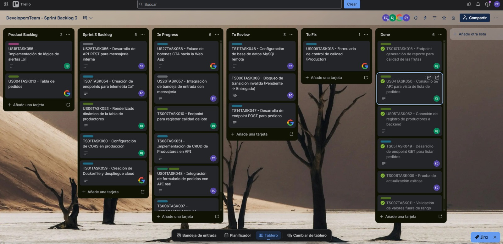
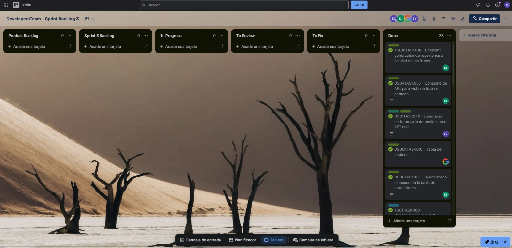

| User Story ID | User Story Title | Task ID | Task Title | Description | Estimation (Hours) | Assigned To | Status |
| :--- | :--- | :--- | :--- | :--- | :--- | :--- | :--- |
| US01 | Formulario de registro de pedidos | TASK046 | Endpoint Registro Pedidos | Implementación del controlador y servicio de aplicación para la persistencia de nuevos pedidos en C#. | 6 | Sergio | Done |
| US04 | Listar pedidos | TASK047 | Endpoint Consulta Pedidos | Desarrollo del endpoint GET para la recuperación de órdenes integrando filtrado por productor. | 5 | Sergio | Done |
| US05 | Registro de productores | TASK048 | Persistencia de Productores | Configuración de mapeos relacionales y endpoints de creación para el contexto de perfiles. | 5 | Daril | Done |
| US18 | Infraestructura IoT | TASK049 | Endpoints IoT Infrastructure | Creación de servicios web para el registro de dispositivos, alertas y lecturas de sensores en tiempo real. | 8 | Esteban | Done |
| US30 | Gestión de facturación | TASK050 | Endpoints de mensajería y pagos | Implementación de esquemas de base de datos y controladores para transacciones y mensajería interna. | 7 | Johan | Done |
| TS004 | Configuración de Entorno | TASK051 | Dockerización y CI/CD | Creación de Dockerfile y variables de entorno para el despliegue del backend en la nube. | 4 | Gonzalo | Done |
| TS005 | Integración Frontend | TASK052 | Enlaces Landing-App | Modificar los hipervínculos del Landing Page para apuntar a la URL de producción de la Web Application. | 2 | Johan | Done |

##### 5.2.3.4. Development Evidence for Sprint Review
El desarrollo se gestionó aplicando el flujo de trabajo GitFlow a través de repositorios organizados en GitHub, utilizando la nomenclatura obligatoria de commits convencionales.

| Commit Id | Date | Commit Message |
| :--- | :--- | :--- |
| bc72393 | 2026-06-17 | fix: program |
| cdfe23b | 2026-06-17 | fix: order cs |
| c695408 | 2026-06-17 | fix: new appdbcontext and deliverydue date |
| 029c8eb | 2026-06-17 | fix: new appdbcontext |
| db48945 | 2026-06-17 | fix: new appdbcontext and program |
| ceaf55b | 2026-06-17 | fix: new appdbcontext and programcs |
| 34f7cd2 | 2026-06-17 | fix(order-management): fix FindByProducerIdAsync using client-side filtering |
| 7553e3b | 2026-06-16 | fix(order-management): fix FindByProducerIdAsync LINQ translation |
| 72f52d6 | 2026-06-16 | feat(order-management): add get orders by producer endpoint |
| 209ad7c | 2026-06-16 | fix: producer id |
| db6012b | 2026-06-16 | fix(shared): add camelCase JSON serialization options |
| 5553bbe | 2026-06-16 | fix: include new files |
| 1a1bfca | 2026-06-16 | fix: include order items in ListAsync and FindByIdAsync |
| ef35603 | 2026-06-16 | fix(order-management): fix DateOnly to DateTime conversion for MySQL |
| 7e3f0e6 | 2026-06-15 | Merge branch 'develop' qa |
| b442f9e | 2026-06-15 | fix: esquema de base de datos de órdenes alineado con frontend |
| 08e80b0 | 2026-06-15 | Merge branch 'release/0.7.0' into main |
| e04a102 | 2026-06-15 | chore: add Dockerfile for Render deployment |
| 84112ae | 2026-06-13 | Merge pull request #49: chore(config): setup multi-environment appsettings |
| 9d45819 | 2026-06-13 | chore(config): setup multi-environment appsettings and cloud database connection |
| acb5eb6 | 2026-06-13 | Merge pull request #48: feat: add ep get conversations in bc messaging |
| df3f96e | 2026-06-13 | feat: add ep get conversations in bc messaging |
| 5f8fe8f | 2026-06-13 | Merge pull request #47: feat: add ep get messages in bc messaging |
| 3c86f6a | 2026-06-13 | feat: add ep get messages in bc messaging |
| e5be177 | 2026-06-13 | Merge pull request #46: feat: add ep send messages and migration messages table |
| 6bcf22b | 2026-06-13 | feat: add ep send messages and migration messages table |
| 8dba90d | 2026-06-13 | Merge pull request #45: feat: add ep create conversation |
| fc5bac7 | 2026-06-13 | feat: add ep create conversation and migration conversation table for bc messaging |
| 366e402 | 2026-06-13 | Merge pull request #44: feat: add ep get alerts rules bc iot |
| e3ff0bd | 2026-06-13 | feat: add ep get alerts rules bc iot |
| cedee01 | 2026-06-13 | Merge pull request #43: feat: add ep creat alert rule in bc iot |
| e570d02 | 2026-06-13 | feat: add ep creat alert rule in bc iot and migrations for alert rules table |
| 449e394 | 2026-06-13 | Merge pull request #42: feat: add ep get readings by device in bc iot |
| ecdd35d | 2026-06-13 | feat: add ep get readings by device in bc iot |
| 7507039 | 2026-06-13 | Merge pull request #41: feat: add ep get sensor readings in bbc iot |
| 3f121c9 | 2026-06-13 | feat: add ep get sensor readings in bbc iot |
| 10c85bb | 2026-06-13 | Merge pull request #40: feat: add ep create sensor reading bc iot |
| b90c401 | 2026-06-13 | feat: add ep create sensor reading bc iot and migrations |
| aab81ea | 2026-06-13 | Merge pull request #39: feat: add endpoint update device status |
| 2bacc42 | 2026-06-13 | feat: add endpoint update device status fot bc iot infrastructure |
| 0ce8218 | 2026-06-13 | Merge pull request #38: feat: add endpoint get device by id |
| b3a27d9 | 2026-06-13 | feat: add endpoint get device by id for bc iot infrastructure |

##### 5.2.3.5. Execution Evidence for Sprint Review
En esta iteración se consolidó la operatividad real de la plataforma. La Landing Page incluye botones de acción que ahora redireccionan con éxito al formulario de acceso de la Web App. A su vez, los componentes dinámicos de Vue.js reemplazaron los datos en duro (mocks) mediante peticiones asíncronas HTTP apuntando a la URL del backend en producción.

1. Captura de la Landing Page mostrando el botón "Registrarse".
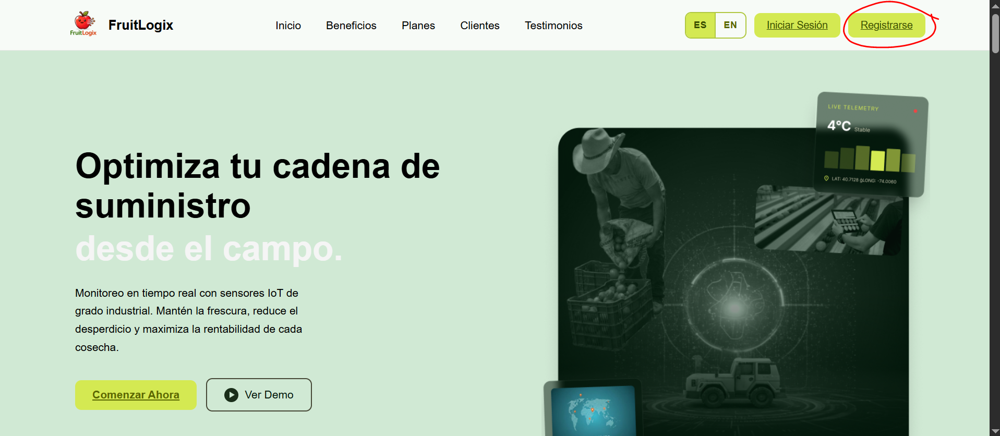
2. Captura de la Web App a donde te lleva el botón.
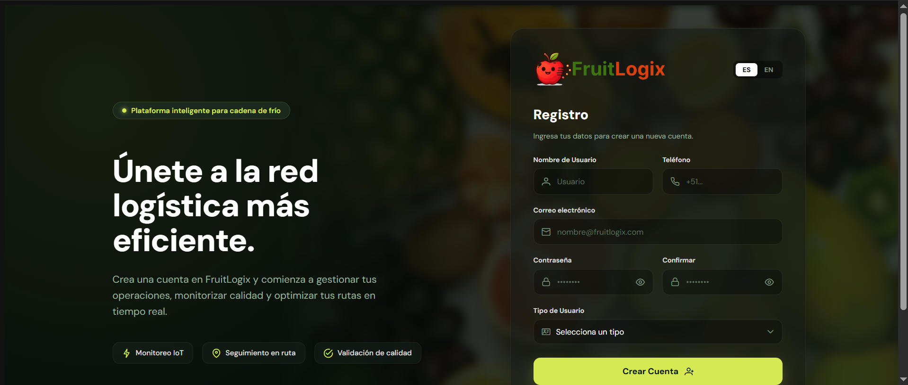
3. Captura de la Web App después de registrarse.
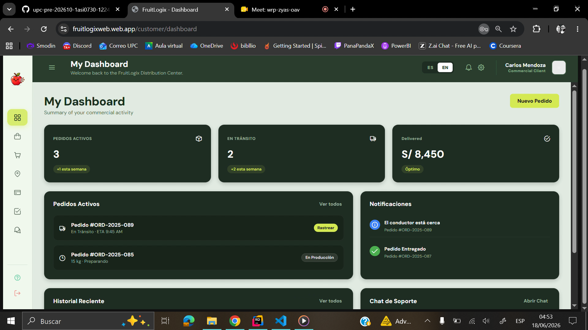
**Video de Demostración de Integración:** https://youtu.be/hNnI70gdq9w

##### 5.2.3.6. Services Documentation Evidence for Sprint Review
La documentación de las interfaces lógicas (Web Services) se estructuró bajo el estándar OpenAPI (Swagger UI). Esto provee un catálogo interactivo que estandariza los contratos de comunicación entre el frontend y el backend para este Sprint 3.

| Contexto / Módulo | Endpoint Base de Producción | Acciones Verificadas |
| :--- | :--- | :--- |
| Messaging / Conversations | `https://fruitlogix-platform.onrender.com/api/v1/conversations` | GET, POST |
| Orders | `https://fruitlogix-platform.onrender.com/api/v1/orders` | GET, POST, PUT, DELETE |
| Invoices | `https://fruitlogix-platform.onrender.com/api/v1/invoices` | GET, POST, PUT, DELETE |
| Payment Transactions | `https://fruitlogix-platform.onrender.com/api/v1/payment-transactions` | GET, POST, PUT, DELETE |
| Quality Inspections | `https://fruitlogix-platform.onrender.com/api/v1/quality-inspections` | GET, POST, PUT, DELETE |

##### 5.2.3.7. Software Deployment Evidence for Sprint Review
El despliegue de los artefactos de software se organizó de la siguiente manera:
*   **Landing Page (Estática):** Mantenida y automatizada mediante GitHub Pages. https://upc-pre-202610-1asi0730-12242-devsteam.github.io/fruitlogix-website/
*   **Web Application (SPA):** Desplegada en Firebase Hosting, comunicada vía configuración de variables de entorno hacia el backend. https://fruitlogixweb.web.app/login
*   **RESTful Web Services:** Empaquetado en un contenedor Docker y desplegado en la plataforma cloud Render, enlazado a una base de datos MySQL remota. https://fruitlogix-platform.onrender.com/
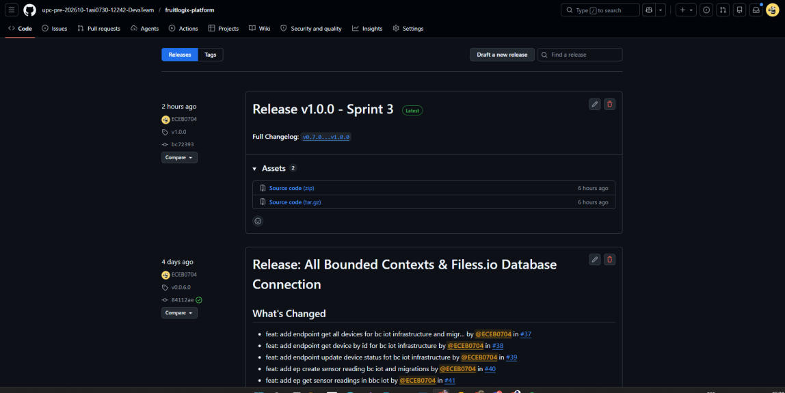
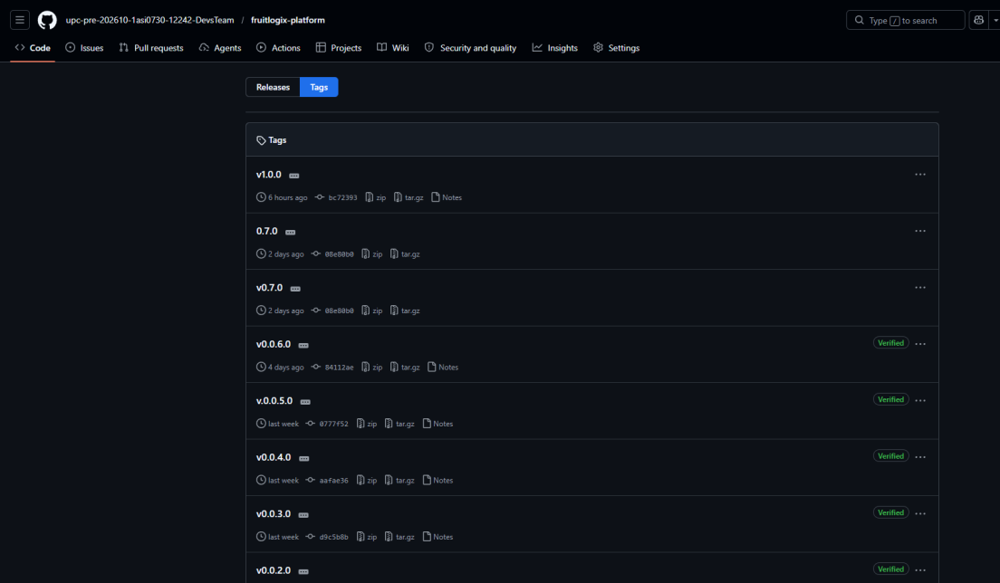
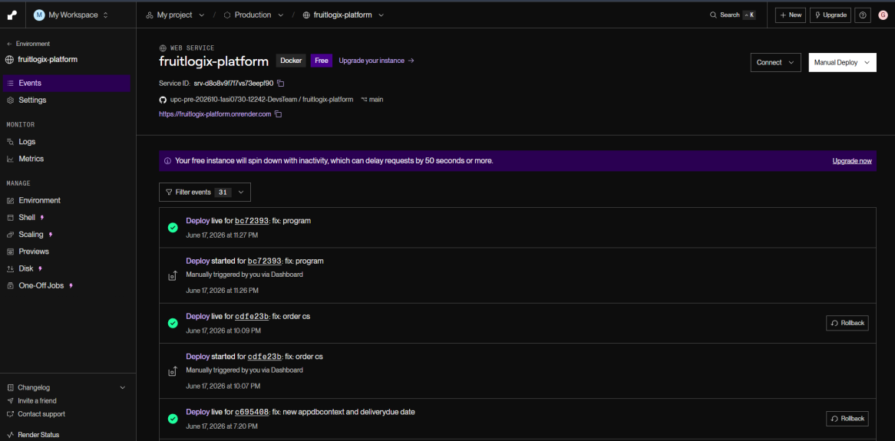
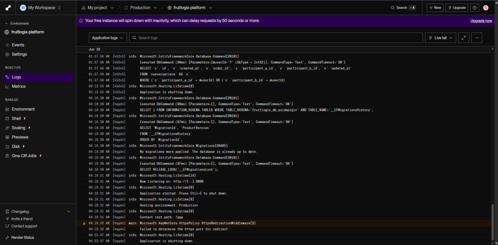

##### 5.2.3.8. Team Collaboration Insights during Sprint

La colaboración se centró en la adaptación de esquemas JSON. El uso riguroso de revisiones de *Pull Requests* antes de cada fusión a la rama `develop` permitió un trabajo continuo y libre de colisiones entre el equipo backend (C#) y el equipo frontend (Vue.js).

**Landing Page**

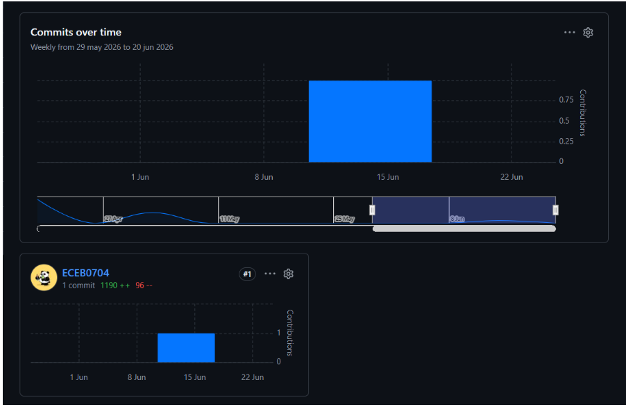

**Frontend**
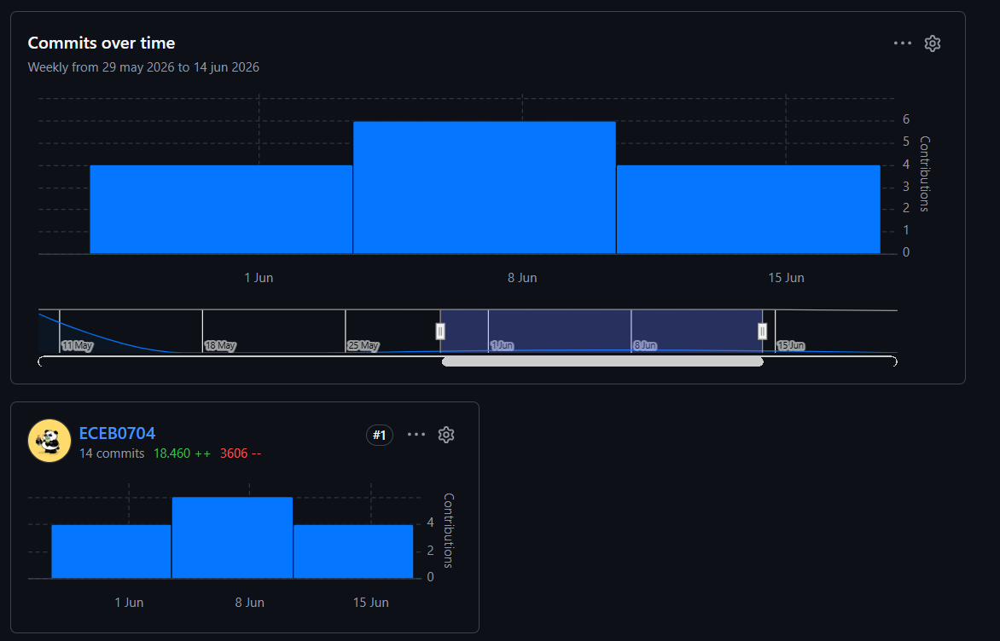

**Backend**

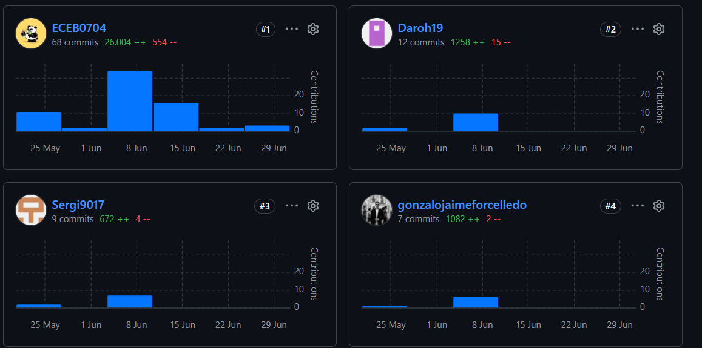

# 5.2.4. Sprint 4

El objetivo principal del Sprint 4 es entregar la versión final y completamente integrada de **FruitLogix**, cubriendo autenticación real con IAM, conexión completa entre frontend y backend desplegado, corrección de bugs detectados en las entrevistas de validación y la producción de los artefactos finales del proyecto.

---

## 5.2.4.1. Sprint Planning 4

En esta sección se describen los acuerdos, antecedentes y objetivos establecidos durante la reunión de planificación del Sprint 4.

| Campo | Detalle |
|------|--------|
| **Sprint #** | Sprint 4 |
| **Sprint Planning Background** | — |
| **Date** | 2026-06-27 |
| **Time** | 18:30 |
| **Location** | Reunión virtual (Google Meet) |
| **Prepared By** | Jaime Forcelledo, Gonzalo Alexander |
| **Attendees (Planning Meeting)** | Chavez Bardales, Esteban Eduardo   Jaime Forcelledo, Gonzalo Alexander   Palomino Vilcañaupa, Daril Johan |

---

## Sprint 3 Review Summary

Durante el Sprint 3 el equipo conectó exitosamente el Frontend (Firebase) con el Backend RESTful (Render), eliminando la dependencia de datos simulados. Se implementaron y documentaron con Swagger los endpoints de pedidos (US01, US04), productores (US05, US06), ubicación en tiempo real vía Google Maps (US15), infraestructura IoT (US18) y pago con pasarela externa (US30).

El Landing Page fue actualizado con *call-to-action* que redirigen a la Web Application. El docente destacó positivamente la arquitectura DDD y la calidad de la documentación OpenAPI.

---

## Sprint 3 Retrospective Summary

**Fortalezas:**
- Correcta separación de bounded contexts en C#
- Pipeline CI/CD funcional

**Oportunidades de mejora:**
- Cobertura de pruebas de integración insuficiente
- Ausencia de manejo de errores HTTP en el frontend
- Falta de autenticación real (IAM)

**Acuerdos para Sprint 4:**
- Implementar IAM con JWT como prioridad principal
- Agregar interceptores Axios para manejo global de errores
- Incluir pruebas de integración en endpoints críticos
- Realizar demo interna a mitad de sprint para detección temprana de bloqueos

---

## Sprint Goal & User Stories

### Sprint 4 Goal

Our focus is on delivering the final and fully integrated version of **FruitLogix**, consolidating identity & access management (IAM), real-time IoT fleet monitoring, in-app messaging, operations dashboards, billing management and analytics for all user segments.

We aim to deliver a complete, secure and production-ready end-to-end experience:

- Authenticated access per role (JWT)
- Persistent data management
- Real-time sensor telemetry
- Integrated payment processing
- Performance reporting

This will be confirmed when:
- Todos los roles pueden autenticarse con JWT y acceder solo a sus vistas autorizadas
- Distribuidores visualizan dashboards en tiempo real (flota, IoT, KPIs y alertas)
- Productores registran cosechas, reportes de calidad y dashboards de pedidos
- Clientes comerciales rastrean pedidos, califican entregas y pagan mediante pasarela integrada
- La API está documentada en Swagger
- CORS está restringido a dominios de producción
- Frontend, backend y landing page están desplegados correctamente

---

## User Stories incluidas en el Sprint

- US-IAM01 — Autenticación y control de acceso por rol (JWT) (4 SP)
- US14 — Actualizar estado de entrega (3 SP)
- US16 — Registrar entrega final (3 SP)
- US17 — Notificar retraso en entrega (3 SP)
- US19 — Ver dashboard de pedidos (Productor) (3 SP)
- US20 — Ver dashboard general de distribución (3 SP)
- US21 — Generar reportes de pedidos (3 SP)
- US22 — Gestionar perfil de usuario (3 SP)
- US24 — Ver métricas de desempeño (5 SP)
- US25 — Enviar mensaje interno (3 SP)
- US26 — Recibir mensajes internos (2 SP)
- US35 — Calificar servicio de entrega (3 SP)
- US36 — Visualizar historial de pagos (3 SP)
- US37 — Pagar con Yape (4 SP)
- US42 — Ver KPIs de gestión de productores (3 SP)
- US43 — Monitorear flota en tiempo real (4 SP)
- US44 — Gestionar incidencias operativas (3 SP)
- US45 — Monitorear sensores IoT (4 SP)
- US46 — Ver detalle de despacho con telemetría (3 SP)
- US47 — Gestionar facturación (3 SP)

---

## Sprint 4 Velocity

- **Velocity total:** 65 Story Points
- **Sum of Story Points:** 65 Story Points

---

## 5.2.4.2. Aspect Leaders and Collaborators (LACX)

Matriz de liderazgo y colaboración para el Sprint 4.

| Team Member | GitHub Username | IAM & Backend Security | IoT Monitoring & Fleet Tracking | Frontend Integration & UX Polish | DevOps, Docs & Videos | Frontend Guards & Status |
|------------|----------------|------------------------|---------------------------------|----------------------------------|------------------------|--------------------------|
| Chavez Bardales, Esteban Eduardo | ECEB0704 | C | C | L | L | L |
| Jaime Forcelledo, Gonzalo Alexander | gonzalojaimeforcelledo | C | L | C | C | C |
| Palomino Vilcañaupa, Daril Johan | Daroh19 | L | C | C | C | C |

---

## 5.2.4.3. Sprint Backlog 4

La descomposición de requerimientos en tareas técnicas asignadas al equipo se detalla en el Sprint Backlog.

**URL del Board:**  
https://trello.com/b/HCskh0Q8/developersteam-sprint-backlog-4

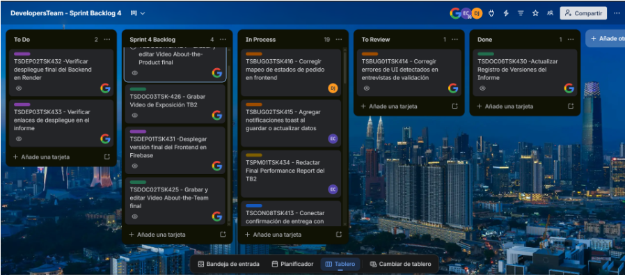
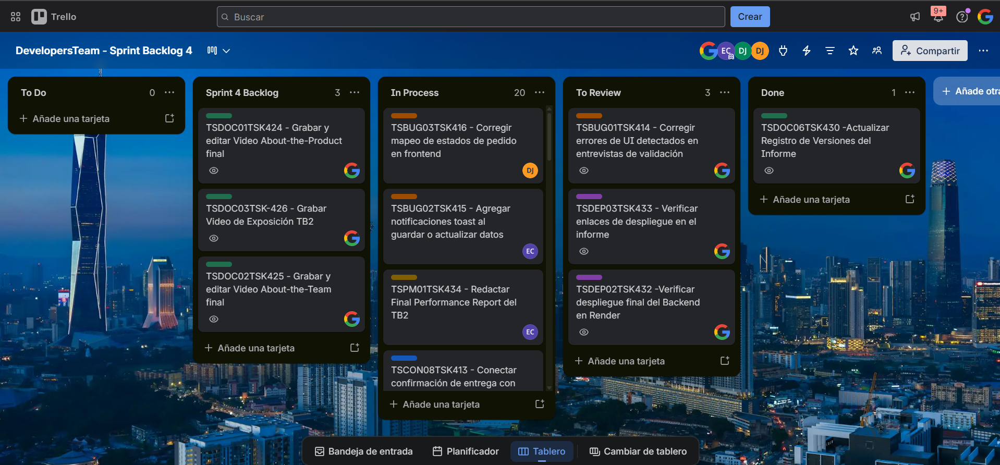
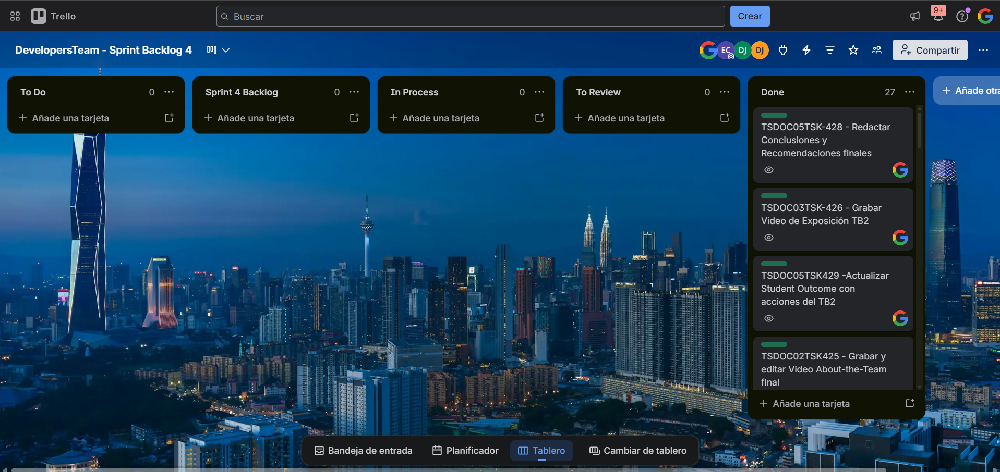

# 5.2.4.3. Sprint Backlog 4 – Development Evidence

A continuación se detalla el Sprint Backlog del Sprint 4, donde cada User Story se descompone en tareas técnicas (Tasks), incluyendo su descripción, esfuerzo estimado, responsable y estado de finalización.

---

## US-IAM01

| US / TS | Task ID | Título | Descripción | Hrs | Asignado | Status |
|--------|---------|--------|-------------|-----|----------|--------|
| US-IAM01 | TSK401 | Modelado User y UserRole en C# | Crear aggregate User con HashedPassword (BCrypt) y enum UserRole (Distributor, Producer, Customer) aplicando DDD | 4 | Esteban | Done |
| US-IAM01 | TSK402 | AuthController Register y Login | Implementar endpoints POST /api/v1/auth/register y /api/v1/auth/login con JWT | 5 | Esteban | Done |
| US-IAM01 | TSK403 | JwtTokenService para tokens | Generar y validar JWT con claims de userId, email y role | 4 | Esteban | Done |
| US-IAM01 | TSK404 | Login y Register con API real | Conectar vistas Vue con endpoints IAM para autenticación real | 5 | Daril | Done |
| US-IAM01 | TSK405 | Guards de rutas por rol en Vue Router | Configurar beforeEach para redirigir según rol autenticado | 4 | Daril | Done |

---

## TS-CON01 a TS-CON08

| US / TS | Task ID | Título | Descripción | Hrs | Asignado | Status |
|--------|---------|--------|-------------|-----|----------|--------|
| TS-CON01 | TSK406 | Conectar vista de facturas con API | Consumir GET /api/v1/invoices en frontend cliente | 4 | Daril & Esteban | Done |
| TS-CON02 | TSK407 | Conectar formulario de pago con API | Integrar POST /api/v1/payment-transactions en vista de pago | 5 | Gonzalo & Daril | Done |
| TS-CON03 | TSK408 | Conectar chat interno con API | Integrar endpoints de conversaciones y mensajes | 5 | Esteban | Done |
| TS-CON04 | TSK409 | Dashboard IoT con lecturas reales | Integrar sensor readings en dashboard del distribuidor | 4 | Esteban | Done |
| TS-CON05 | TSK410 | Alertas IoT en frontend | Mostrar alertas en tiempo real desde API | 4 | Esteban | Done |
| TS-CON06 | TSK411 | Tracking de entregas con API | Integrar endpoints de deliveries en logística | 5 | Daril | Done |
| TS-CON07 | TSK412 | Nombre real de productor en pedidos | Reemplazar producerId por nombre vía API | 4 | Daril | Done |
| TS-CON08 | TSK413 | Confirmación de entrega con API | PATCH /orders/{id}/status en vista distribuidor | 4 | Daril | Done |

---

## TS-BUG01 a TS-BUG03

| US / TS | Task ID | Título | Descripción | Hrs | Asignado | Status |
|--------|---------|--------|-------------|-----|----------|--------|
| TS-BUG01 | TSK414 | Corregir errores de UI (validación) | Solucionar navegación y estados hardcodeados | 5 | Gonzalo | Done |
| TS-BUG02 | TSK415 | Notificaciones toast en acciones API | Implementar toasts de éxito/error en llamadas API | 4 | Esteban | Done |
| TS-BUG03 | TSK416 | Corregir mapeo de estados de pedido | Sincronizar enums Vue con backend C# | 4 | Daril | Done |

---

## TS-DOC01 a TS-DOC07

| US / TS | Task ID | Título | Descripción | Hrs | Asignado | Status |
|--------|---------|--------|-------------|-----|----------|--------|
| TS-DOC01 | TSK417 | Video About-the-Product final | Video demo 1–3 min con app funcionando | 6 | Gonzalo | Done |
| TS-DOC02 | TSK418 | Video About-the-Team final | Video de retrospectiva del equipo | 6 | Gonzalo | Done |
| TS-DOC03 | TSK419 | Video de Exposición TB2 | Grabación final ≤ 30 min con slides | 6 | Gonzalo | Done |
| TS-DOC04 | TSK420 | Services Documentation Evidence Sprint 4 | Documentación de endpoints REST en Markdown | 5 | Gonzalo | Done |
| TS-DOC05 | TSK421 | Conclusiones y Recomendaciones finales | Análisis contra hipótesis Lean UX | 4 | Gonzalo | Done |
| TS-DOC06 | TSK422 | Actualizar Student Outcome TB2 | Evidencia ABET Student Outcome 5 | 4 | Gonzalo | Done |
| TS-DOC07 | TSK423 | Actualizar Registro de Versiones | Versión final V4.0.0 | 3 | Gonzalo | Done |

---

## TS-DEP01 a TS-DEP03

| US / TS | Task ID | Título | Descripción | Hrs | Asignado | Status |
|--------|---------|--------|-------------|-----|----------|--------|
| TS-DEP01 | TSK424 | Despliegue final Frontend en Firebase | Build Vue y deploy en Firebase Hosting | 4 | Gonzalo | Done |
| TS-DEP02 | TSK425 | Verificar Backend en producción (Render) | Validación de endpoints y migrations | 4 | Gonzalo | Done |
| TS-DEP03 | TSK426 | Verificar URLs de despliegue en informe | Validar links en informe final | 3 | Gonzalo | Done |

---

## TS-PM01

| US / TS | Task ID | Título | Descripción | Hrs | Asignado | Status |
|--------|---------|--------|-------------|-----|----------|--------|
| TS-PM01 | TSK427 | Final Performance Report TB2 | Evaluación final del equipo (nota 20/16/13/07/00) | 4 | Esteban | Done |

---

# 5.2.4.4. Development Evidence for Sprint Review

El desarrollo del Sprint 4 se gestionó aplicando el flujo de trabajo **GitFlow**, utilizando repositorios en GitHub y commits con nomenclatura de *conventional commits*.

Cada integración se validó mediante:
- Pull Requests revisados por el equipo
- Deploy continuo en entorno de producción (Render + Firebase)
- Verificación de endpoints activos en Swagger
- Pruebas funcionales sobre vistas integradas con API real

Esto permitió asegurar la trazabilidad entre tareas técnicas, user stories y entregables finales del sistema FruitLogix.

| Repository | Branch | Commit Id | Date | Commit Message |
|---|---|---|---|---|
| fruitlogix-webapp | feature/iam-auth | 6f08fb9 | 2026-06-27 | feat(orders): connect delete modal with real DELETE endpoint via Axios |
| fruitlogix-webapp | feature/iam-auth | f582678 | 2026-06-27 | fix: merge single constructor in DeliveriesController |
| fruitlogix-webapp | feature/iam-auth | 353d344 | 2026-06-27 | feat(logistics): add assign fleet modal and connect to delivery API |
| fruitlogix-webapp | feature/iam-auth | 52a8ce2 | 2026-06-27 | feat(logistics): connect delivery details view with deliveries and orders API |
| fruitlogix-webapp | feature/iam-auth | 6882862 | 2026-06-27 | feat: add delivery details view |
| fruitlogix-webapp | feature/iam-auth | d0faa66 | 2026-06-28 | feat(logistics): connect customer tracking view with deliveries API |
| fruitlogix-webapp | feature/iam-auth | dc22715 | 2026-06-28 | feat(iot): connect IoT Device Fleet view to Swagger endpoints |
| fruitlogix-webapp | feature/iam-auth | 38c642e | 2026-06-30 | feat(messaging): implement lazy initialization for order-specific chats |
| fruitlogix-webapp | feature/iam-auth | bae1cd8 | 2026-07-01 | feat(auth): integrate real IAM login, add Axios interceptor for JWT and connect dashboards |

### 5.2.4.5. Execution Evidence for Sprint Review

Durante el Sprint 4 se logró la integración completa del Frontend Web Application con los servicios reales del backend, reemplazando los datos simulados (mock) utilizados en sprints anteriores. Las principales vistas implementadas y conectadas a la API incluyen la gestión de pedidos con eliminación real vía DELETE, el módulo de logística con asignación de flota y seguimiento de entregas para el cliente, el panel de monitoreo de dispositivos IoT conectado a los endpoints documentados en Swagger, el sistema de mensajería con inicialización diferida (lazy loading) de chats por pedido, y finalmente la autenticación real mediante IAM con interceptor de Axios para el manejo de JWT en los dashboards.

A continuación, se presentan las evidencias visuales de las principales vistas implementadas en este Sprint.

#### Screenshots de las vistas implementadas

**Gestión de Pedidos — Eliminación de pedido**

**Logística — Asignación de flota y detalle de entrega**

**Logística — Seguimiento de entregas (vista cliente)**

**Monitoreo de Dispositivos IoT**

**Mensajería — Chat por pedido**

**Autenticación — Login IAM integrado**

### 5.2.4.6 Team Collaboration Insights during Sprint 

Las siguientes capturas muestran los analíticos de colaboración del repositorio `fruitlogix-webapp` en GitHub para la ventana del Sprint 4 (26 de junio al 4 de julio de 2026). El gráfico de "Commits over time" evidencia una concentración de actividad entre el 26 de junio y el 1 de julio, con un total de 5 commits registrados por el contribuidor durante este periodo, incluyendo 2,786 líneas añadidas y 1,348 líneas eliminadas, correspondientes a la integración final del frontend con los servicios reales del backend.

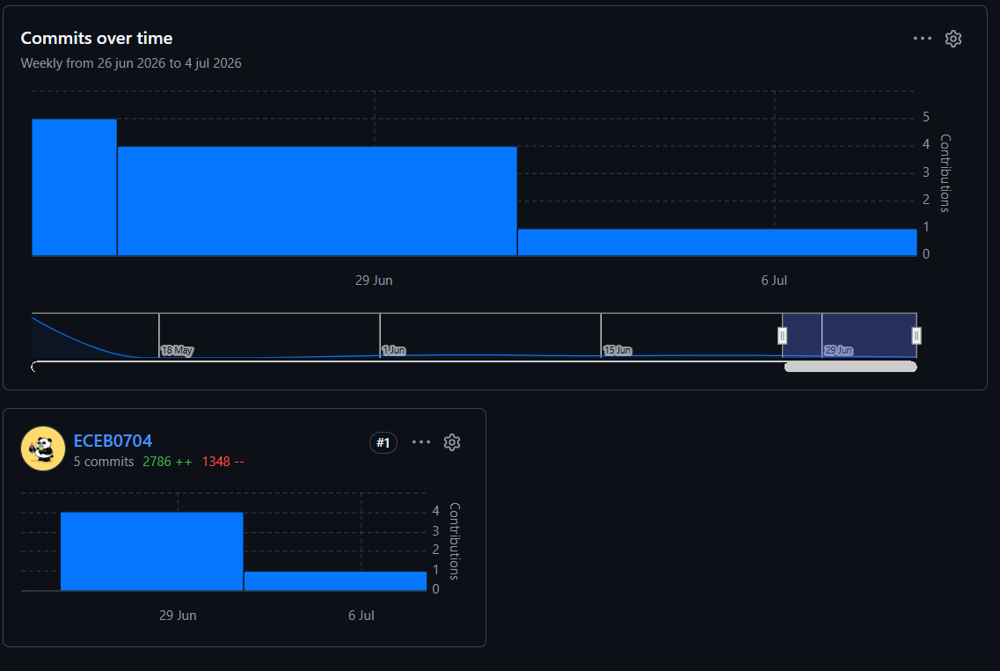
