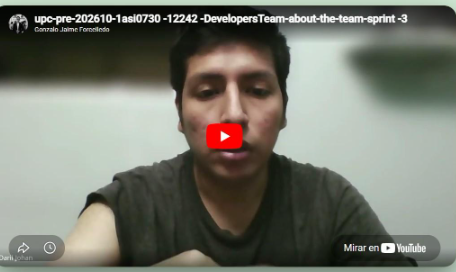

## Conclusiones
### Conclusiones y recomendaciones

Existe una clara necesidad en el sector logístico y agrícola de contar con una plataforma digital confiable que permita gestionar de manera eficiente los pedidos, controlar la calidad de los productos y realizar el seguimiento en tiempo real de las entregas. Los distintos actores involucrados, como distribuidores, productores y clientes comerciales, requieren herramientas que centralicen la información y reduzcan los errores operativos.

El análisis de requerimientos y las funcionalidades definidas evidencian que los usuarios no solo buscan registrar pedidos, sino también contar con un sistema integral que les permita monitorear la calidad de los productos, recibir notificaciones ante incidencias, visualizar rutas de entrega y acceder a reportes que faciliten la toma de decisiones. Esto posiciona a **FruitLogix** como una solución completa para la gestión logística frutícola.

El sistema no se limita a ser una herramienta operativa, sino que también busca optimizar procesos, mejorar la trazabilidad y fortalecer la comunicación entre los actores involucrados. De esta manera, contribuye a una gestión más eficiente, transparente y orientada a resultados dentro del entorno agrícola.

Los resultados obtenidos a partir del análisis funcional, la definición de *User Stories* y la aplicación de técnicas como *Impact Mapping*, muestran que **FruitLogix** tiene el potencial de consolidarse como una solución tecnológica innovadora, escalable y adaptable a diferentes contextos logísticos y empresariales.

Durante el desarrollo del proyecto, se utilizaron herramientas de diseño y modelado que permitieron estructurar de manera clara las funcionalidades del sistema. La elaboración de diagramas (clases, arquitectura y componentes) facilitó la comprensión de la lógica del sistema y la relación entre sus elementos, permitiendo tomar decisiones más acertadas en el diseño.

Asimismo, el planteamiento de la arquitectura del sistema, basada en un enfoque por capas (*frontend*, *backend* y base de datos), permitió definir una estructura organizada, mantenible y preparada para futuras integraciones, incluyendo servicios externos como APIs de geolocalización, pasarelas de pago y sensores IoT para monitoreo de condiciones ambientales.

Además, se trabajó en la definición de criterios de aceptación mediante escenarios tipo Gherkin (*Dado, Cuando, Entonces*), lo cual permitió validar las funcionalidades desde la perspectiva del usuario y asegurar la calidad del sistema. La organización del trabajo mediante backlog y priorización de historias facilitó una mejor gestión del desarrollo y distribución de tareas dentro del equipo.

Finalmente, se concluye que **FruitLogix** no solo responde a una necesidad real del sector, sino que también representa una oportunidad para mejorar significativamente la eficiencia logística, reducir pérdidas y optimizar la toma de decisiones mediante el uso de tecnología. Se recomienda continuar con el desarrollo del sistema incorporando mejoras como análisis predictivo, optimización de rutas y fortalecimiento de la seguridad, con el fin de garantizar su sostenibilidad y crecimiento a largo plazo.

# About the Team

El video **About-The-Team** es una retrospectiva del equipo: muestra el proceso real de trabajo colaborativo del grupo y el testimonio de cada integrante ante cámara, contando qué hizo y qué aprendió.

Este video sirve como evidencia de que el equipo trabajó en conjunto y logró el *Student Outcome* del curso, a diferencia del **About-The-Product**, que es un video de marketing enfocado en presentar y “vender” el producto.

---

**Link del video:**  
https://www.youtube.com/watch?v=v3uZFR6qzbU

---
## Bibliografía

Career Foundry. (s.f.). *What are user flows in User Experience (UX) Design?* CareerFoundry. https://careerfoundry.com/en/blog/ux-design/what-are-user-flows/

Conventional Commits. (s.f.). *Conventional Commits 1.0.0*. https://www.conventionalcommits.org/

Dittrich, J. (s.f.). *A beginner's guide to finding user needs*. https://jdittrich.github.io/userNeedResearchBook/

Domain Storytelling. (s.f.). *Domain storytelling and requirements*. https://domainstorytelling.org/#dst-requirements

Driessen, V. (2010). *A successful Git branching model*. nvie.com. https://nvie.com/posts/a-successful-git-branching-model/

DZone. (s.f.). *Acceptance criteria in Scrum: Explanation, examples, and template*. https://dzone.com/articles/acceptance-criteria-in-software-explanation-exampl

Google. (s.f.-a). *Google HTML/CSS style guide*. https://google.github.io/styleguide/htmlcssguide.html

Google. (s.f.-b). *Google JavaScript style guide*. https://google.github.io/styleguide/jsguide.html

HubSpot. (s.f.). *Full list of meta tags, why they matter for SEO & how to write them*. https://blog.hubspot.com/marketing/meta-tags

IBM. (s.f.-a). *As-is scenario map: Build a better understanding of your users' current experience*. https://www.ibm.com/design/thinking/page/toolkit/activity/as-is-scenario-map

IBM. (s.f.-b). *Empathy map: Build empathy for your users through a conversation informed by your team's observations*. https://www.ibm.com/design/thinking/page/toolkit/activity/empathy-map

IBM. (s.f.-c). *To-be scenario map: Draft a vision of your user's future experience to show how your ideas address their current needs*. https://www.ibm.com/design/thinking/page/toolkit/activity/to-be-scenario-map

Mendel, J. (s.f.). *Seriously, what's your (startup's) problem?* Medium. https://medium.com/@jakemendel/seriously-whats-your-startup-s-problem-b3a884c54ab4

Microsoft. (s.f.-a). *C# coding conventions*. Microsoft Docs. https://docs.microsoft.com/en-us/dotnet/csharp/fundamentals/coding-style/coding-conventions

Microsoft. (s.f.-b). *Microsoft ASP.NET Core coding guidelines*. GitHub. https://github.com/dotnet/aspnetcore/wiki/Engineering-guidelines#coding-guidelines

Mountain Goat Software. (s.f.). *User stories articles*. https://www.mountaingoatsoftware.com/blog/tag/user-stories

Nielsen Norman Group. (s.f.-a). *Design systems 101*. https://www.nngroup.com/articles/design-systems-101/

Nielsen Norman Group. (s.f.-b). *Empathy mapping: The first step in design thinking*. https://www.nngroup.com/articles/empathy-mapping/

Nielsen Norman Group. (s.f.-c). *Front-end style-guides: Definition, requirements, component checklist*. https://www.nngroup.com/articles/front-end-style-guides/

Nielsen Norman Group. (s.f.-d). *The four dimensions of tone of voice*. https://www.nngroup.com/articles/tone-of-voice-dimensions/

Open Practice Library. (s.f.-a). *Domain-driven design: Tackling complexity in the heart of software*. https://openpracticelibrary.com/perspective/domain-driven-design/

Open Practice Library. (s.f.-b). *Ubiquitous language: Unambiguously define the terms and concepts of a business domain*. https://openpracticelibrary.com/practice/ubiquitous-language/

Otiscole. (s.f.). *Otiscole customer portfolio – What's cookin'*. http://otiscole.com

Progresa Lean. (s.f.). *5W+2H: Técnica de análisis de problemas*. https://www.progressalean.com/5w2h-tecnica-de-analisis-de-problemas/

Sameera17w. (s.f.). *How to write a user story for an API product*. Medium. https://sameera17w.medium.com/how-to-write-a-user-story-for-an-api-product-7af6abd4ad2e

Scribd. (s.f.). *Lean UX – Chapter 3*. https://www.scribd.com/document/655516553/Leanux-Sampler

Semantic Versioning. (s.f.). *Semantic Versioning 2.0.0*. https://semver.org/

SpecFlow. (s.f.). *Gherkin conventions for readable specifications*. https://specflow.org/gherkin/gherkin-conventions-for-readable-specifications/

Structurizr. (s.f.). *Embedding diagrams*. https://docs.structurizr.com/cloud/embed

The DDD by Examples Community. (s.f.-a). *Big Picture EventStorming*. GitHub. https://github.com/ddd-by-examples/library/blob/master/docs/big-picture.md

The DDD by Examples Community. (s.f.-b). *Design-level EventStorming*. GitHub. https://github.com/ddd-by-examples/library/blob/master/docs/design-level.md

The Markdown Guide. (s.f.). *The Markdown Guide*. https://www.markdownguide.org/

Tune, N. (s.f.). *Domain-driven architecture diagrams*. Medium. https://medium.com/nick-tune-tech-strategy-blog/domain-driven-architecture-diagrams-139a75acb578

UXforTheMasses. (s.f.). *A step-by-step guide to scenario mapping*. http://www.uxforthemasses.com/scenario-mapping/

UXPressia. (s.f.-a). *How to create an Impact Map in 4 easy steps?* https://uxpressia.com/blog/build-impact-map-4-easy-steps

UXPressia. (s.f.-b). *User vs. buyer persona: Differences and free template*. https://uxpressia.com/blog/user-persona-vs-buyer-persona-difference

Vue.js. (s.f.). *Vue style guide*. https://vuejs.org/v2/style-guide/

W3Schools. (s.f.-a). *HTML style guide and coding conventions*. https://www.w3schools.com/html/html5_syntax.asp

W3Schools. (s.f.-b). *JS style guide and coding conventions*. https://www.w3schools.com/js/js_conventions.asp

Zhurb, A. [connect2grp]. (s.f.). *Using PlantUML for creating clear and concise diagrams*. Medium. https://connect2grp.medium.com/using-plantuml-for-creating-clear-and-concise-diagrams-2fc621529560

noamtamim. (s.f.). *How to use PlantUML with Markdown* [Gist]. GitHub. https://gist.github.com/noamtamim/f11982b28602bd7e604c233fbe9d910f
